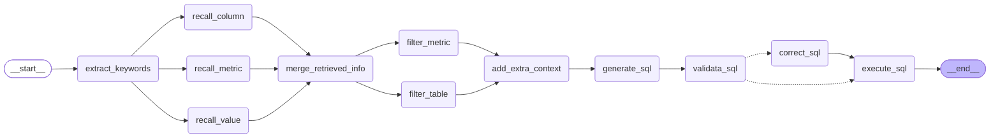
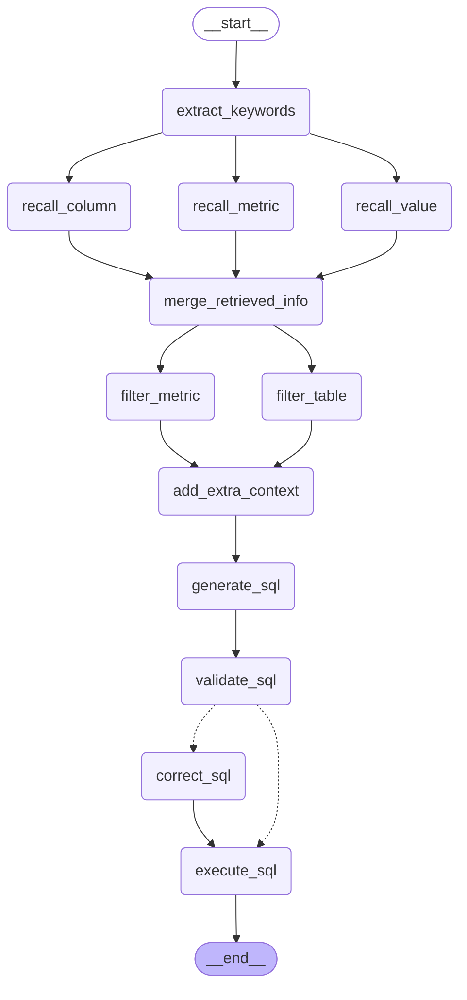

# 尚硅谷大模型项目之<<掌柜问数>>

# 1. 运行项目测试

## 1.1. 项目代码说明

- `docker`：后端支撑服务（mysql数据库、qdrant向量索引库和es全文索引库）
- `data-agent`：后端项目
- `data-agent_frontend`：前端项目

## 1.2. 通过docker安装中间件启动服务

- 启动`windows版本docker`（docker desktop）

- 加载安装本地镜像

  ```
  ...\3.代码\docker> docker load -i all-images.tar
  ```

  

- 启动容器服务

  ```
  ...\3.代码\docker>  docker compose up -d
  ```

  
  
  

> 注意：
>
> 1. mysql服务可能无法启动，原因：windows中已经启动了mysql的服务，需要先停止已有的mysql服务

## 1.3. 构建知识库

- 进入后端项目目录data-agent，运行构建脚本`app/scripts/build_meta_knowledge.py`

- 先删除项目中的.venv和.idea

  ```
  ...\3.代码\data-agent> uv sync
  ...\3.代码\data-agent>   .venv\Scripts\python -m app.scripts.build_meta_knowledge
  ```

## 1.4. 运行后端项目

- 进入后端项目目录data-agent，运行启动脚本`main.py`

  ```
  ...\3.代码\data-agent>   .venv\Scripts\python -m main
  ```

  

## 1.5. 运行前端项目

- 进入前端项目目录data-agent_frontend，执行启动命令

  ```
  ...\3.代码\data-agent_frontend>   npm run dev
  ```

  

## 1.6. 访问测试

- 浏览器上访问： http://127.0.0.1:5173/
- 搜索相关问题
  - 华北地区销售总额
  - 2025年各地区平均销售额
  - 各个地区iPhone去年卖了多少钱

## 1.7. 运行效果展示

### 1.7.1. 测试一：华北地区销售总额 


生成的sql:

~~~sql
select sum(`dw2`.`fo`.`order_amount`) AS `GMV`
from `dw2`.`fact_order` `fo`
         join `dw2`.`dim_region` `dr`
where ((`dw2`.`fo`.`region_id` = `dw2`.`dr`.`region_id`) and (`dw2`.`dr`.`region_name` = '华北'))
~~~

### 1.7.2. 测试二：2025年各地区平均销售额


生成的sql:

~~~sql
SELECT d.region_name, AVG(f.order_amount) AS avg_sales
FROM fact_order f
JOIN dim_region d ON f.region_id = d.region_id
JOIN dim_date dt ON f.date_id = dt.date_id
WHERE dt.year = 2025
GROUP BY d.region_name;
~~~

### 1.7.3. 测试三：各个地区iPhone去年卖了多少钱？


生成的sql语句：

~~~sql
SELECT
    r.region_name AS 地区,
    SUM(f.order_amount) AS 销售额
FROM fact_order f
JOIN dim_region r ON f.region_id = r.region_id
JOIN dim_product p ON f.product_id = p.product_id
JOIN dim_date d ON f.date_id = d.date_id
WHERE p.product_name LIKE '%iPhone%'
  AND d.date_id BETWEEN 20250101 AND 20251231
GROUP BY r.region_name;
~~~


# 2. 项目概述与架构

2.1. 项目概述

掌柜问数是一个基于**自然语言处理**与**数据分析**技术的智能数据服务系统，面向**数据仓库**（Data Warehouse）的应用场景，旨在帮助用户（后台工作人员）通过**对话方式高效获取数据仓库中的数据**。用户无需掌握复杂的查询SQL语法，即可用自然语言提出问题，系统自动完成对数据仓库数据的理解、计算分析与结果可视化，大幅提升数据使用效率，降低数据分析门槛，助力业务决策智能化。  

掌柜问数核心实现：**NL2SQL**（自然语言转 SQL，也称**Text2SQL**）,它是自然语言处理（NLP）的一个细分方向，目标是**将用户用自然语言描述的查询需求，自动转换成语法正确、可直接执行的 SQL查询语句**.

> 前置问题1：区别数据仓库与业务仓库
>
> 前置问题2：区别掌柜问数与掌柜智库
>

## 2.2. 项目架构概述

本项目以数据仓库的元数据为核心，使用 **MySQL** 存储结构化元数据信息，结合 **Qdrant** 构建语义向量索引、**Elasticsearch** 构建全文索引，形成统一的元数据知识库。查询过程中，系统首先根据用户自然语言问题进行多路召回，筛选相关表、字段及指标定义，再将元数据信息与用户问题共同输入大模型生成 SQL，最终完成自动查询与结果返回，确保生成结果的准确性与可控性。

> 简单理解：掌柜问数本质上就是实现一个db RAG的过程,它包含2个部分
>
> 1. **索引**：对数据仓库的元数据信息进行数据库结构化存储，并创建多种方式的索引存储，如：向量索引、全文索引
> 1. **检索**：结合用户的问题和相关的元数据，进行处理后，将处理后的数据交给大模型进行处理，最终生成sql并执行后返回结果。

 

## 2.3 元数据知识库

元数据知识库作为数据仓库的语义基础设施，用于集中管理和高效检索表结构、字段定义、字段取值示例及复杂指标说明等元数据信息，支撑后续的智能检索与 SQL 生成。

元数据信息主要来源于两部分：一部分数据仓库自动采集，另一部分由人工进行补充与配置。完整的元数据统一存储于 MySQL 数据库中，并对其中部分关键信息构建**向量索引**和**全文索引**，以提升**语义召回**与**关键词召回**的效果。

### 2.3.1 数据仓库(dw)

dim_customer：客户维度表

dim_date：日期维度表

dim_product：商品维度表

dim_region：区域维度表

fact_order：订单事实表

类型说明：

**（1）以`dim_`开头的是维度(dimension)表**：用于描述业务的 “维度属性”，比如客户信息、商品信息、时间维度、区域信息，是分析的 “上下文”，在实际使用中维度表主要用于分组和过滤操作

**（2）以`fact_`开头的是事实表**：存储核心业务的 “度量值”（如订单数量、订单金额），并通过外键关联各个维度表，是分析的 “核心数据”	，在实际使用中事实表主要用于聚合操作

特点：订单分析的星型模型**：fact_order（事实表）是中心，关联 4 张 dim_维度表，是数据仓库中最经典的建模方式。


`dim_date`（日期维度表）

| 字段名    | 类型         | 注释                                      |
| --------- | ------------ | ----------------------------------------- |
| `date_id` | `int`        | **日期 ID**（主键，唯一标识一条日期记录） |
| `year`    | `int`        | **年份**（如 2025）                       |
| `quarter` | `varchar(2)` | **季度**（如 Q1、Q2）                     |
| `month`   | `int`        | **月份**（1-12）                          |
| `day`     | `int`        | **日期**（1-31）                          |

`dim_region`（地区维度表）

| 字段名        | 类型          | 注释                                      |
| ------------- | ------------- | ----------------------------------------- |
| `region_id`   | `varchar(20)` | **地区 ID**（主键，唯一标识一条地区记录） |
| `province`    | `varchar(50)` | **省份**                                  |
| `region_name` | `varchar(50)` | **地区名称**                              |
| `country`     | `varchar(50)` | **国家**                                  |

`dim_customer`（客户维度表）

| 字段名          | 类型          | 注释                                  |
| --------------- | ------------- | ------------------------------------- |
| `customer_id`   | `varchar(20)` | **客户 ID**（主键，唯一标识一个客户） |
| `customer_name` | `varchar(50)` | **客户名称**                          |
| `gender`        | `varchar(10)` | **性别**                              |
| `member_level`  | `varchar(20)` | **会员等级**                          |

`dim_product`（商品维度表）

| 字段名         | 类型           | 注释                                  |
| -------------- | -------------- | ------------------------------------- |
| `product_id`   | `varchar(20)`  | **商品 ID**（主键，唯一标识一个商品） |
| `product_name` | `varchar(200)` | **商品名称**                          |
| `category`     | `varchar(50)`  | **商品类别**                          |
| `brand`        | `varchar(50)`  | **品牌**                              |

`fact_order`（订单事实表）

| 字段名           | 类型          | 注释                                                 |
| ---------------- | ------------- | ---------------------------------------------------- |
| `order_id`       | `varchar(30)` | **订单 ID**（主键，唯一标识一条订单记录）            |
| `customer_id`    | `varchar(20)` | **客户 ID**（外键，关联 `dim_customer.customer_id`） |
| `product_id`     | `varchar(20)` | **商品 ID**（外键，关联 `dim_product.product_id`）   |
| `date_id`        | `int`         | **日期 ID**（外键，关联 `dim_date.date_id`）         |
| `region_id`      | `varchar(20)` | **地区 ID**（外键，关联 `dim_region.region_id`）     |
| `order_quantity` | `int`         | **订单数量**（度量，本次订单购买的商品件数）         |
| `order_amount`   | `float`       | **订单金额**（度量，本次订单的总金额）               |

 

### 2.3.2 元数据库(meta)

元数据库共包含四张表，具体结构如下图所示：

​		table_info：表描述信息表

​		column_info：字段描述信息表 

​		metric_info：指标描述信息表

​		column_metric：字段指标关联表

列角色说明：

```
primary_key：主键
foreign_key：外键
measure：度量，可计算的数值，主要用于做统计，例如：卖了多少钱、买了几件、耗时多少
dimension：维度 分析的“角度”,主要用于来做筛选和分组，例如：按时间看、按区域看、按商品分类看
```


table_info（表信息表）

| 字段名        | 类型           | 注释                                         |
| ------------- | -------------- | -------------------------------------------- |
| `id`          | `varchar(64)`  | **表编号**（主键，唯一标识一个物理表）       |
| `name`        | `varchar(128)` | **表名称**（如 `fact_order`）                |
| `role`        | `varchar(32)`  | **表类型**（如 `fact` 事实表，`dim` 维度表） |
| `description` | `text`         | **表描述**（详细说明该表的业务含义）         |

column_info（列信息表）

| 字段名        | 类型           | 注释                                                   |
| ------------- | -------------- | ------------------------------------------------------ |
| `id`          | `varchar(64)`  | **列编号**（主键，唯一标识一个物理列）                 |
| `name`        | `varchar(128)` | **列名称**（如 `order_amount`）                        |
| `type`        | `varchar(64)`  | **数据类型**（如 `INT`, `VARCHAR`, `DATETIME`）        |
| `role`        | `varchar(32)`  | **列角色**（如 `primary key`, `dimension`, `measure`） |
| `examples`    | `json`         | **数据示例**（JSON 格式，记录该列的示例值）            |
| `description` | `text`         | **列描述**（详细说明该列的业务含义）                   |
| `alias`       | `json`         | **列别名**（JSON 格式，记录该列的别名）                |
| `table_id`    | `varchar(64)`  | **所属表编号**（外键，关联 `table_info.id`）           |

metric_info(指标信息表)

| 字段名             | 类型           | 注释                                                      |
| ------------------ | -------------- | --------------------------------------------------------- |
| `id`               | `varchar(64)`  | **指标编码**（主键，唯一标识一个指标）                    |
| `name`             | `varchar(128)` | **指标名称**（如 “销售总额”）                             |
| `description`      | `text`         | **指标描述**（详细说明指标的业务含义、计算口径）          |
| `relevant_columns` | `json`         | **关联列信息**（JSON 格式，记录该指标计算时依赖的物理列） |
| `alias`            | `json`         | **指标别名**（JSON 格式，记录指标的别名、简称等）         |

column_metric（列 - 指标关联表）

| 字段名      | 类型          | 注释                                        |
| ----------- | ------------- | ------------------------------------------- |
| `column_id` | `varchar(64)` | **列编号**（外键，关联 `column_info.id`）   |
| `metric_id` | `varchar(64)` | **指标编号**（外键，关联 `metric_info.id`） |

构建元知识库

~~~shell
python -m app.scripts.build_meta_knowledge
~~~


### 2.3.3 向量索引

本项目选用 [Qdrant](https://qdrant.tech/) 作为向量数据库，向量索引主要用于对**指标信息**和**字段信息**进行索引存储，用于**语义召回**。向量索引的构建内容具体如下：

[Qdrant_python_client](https://python-client.qdrant.tech/) 

- column_info 需要建立向量索引的字段如下图所示：

  
  
  具体示例如下图所示：
  
  
  
  
  
  - metric_info  需要建立向量索引的字段如下图所示：
  
  
  
  具体示例如下图所示：
  
   

### 2.3.4 全文索引

本项目使用 **Elasticsearch** 作为全文检索引擎，全文索引主要用于对**字段取值**进行检索与匹配，索引内容以各类**维度值**为主，具体如下：

针对字段取值的索引建立，主要选择维度表的维度角色字段，只有维度字段在召回时，用于过滤匹配


具体示例如下图所示：


## 2.4 问数智能体

本项目的智能体主体基于Langgraph构建，具体结构如下图所示：


后台项目构建元数据知识库：运行build_meta_knowledge.py

后端项目启动（data-agent）：运行 main.py

前端项目启动（data-agent-frontend）：npm run dev 

# 3. 项目开发环境

## 3.1 创建项目

本项目使用 [`uv`](https://docs.astral.sh/uv/getting-started/installation/)进行依赖管理与虚拟环境管理


> 1. 创建项目文件夹：data-agent_xxx
> 2. 使用uv初始化项目：uv init
> 3. 创建uv虚拟虚拟环境：uv venv
> 4. 使用pycharm打开项目

创建项目后目录结构：

~~~
data-agent/
├── .git/               # git本地仓库目录
├── .venv/              # UV 创建的虚拟环境目录
├── .gitignore          # git忽略配置文件
├── main.py              # 项目入口脚本
├── pyproject.toml       # 项目配置与依赖声明文件
├── .python-version     # 当前环境的python版本
└── README.md           # git项目的说明文档文件
~~~

## 3.2 安装项目依赖

UV（Unified Virtualenv ）是一款由 Astral 公司开发的**极速 Python 包管理与虚拟环境工具**它基于 Rust 语言开发，核心解决了传统 Python 包管理工具（如 pip）安装速度慢、依赖解析复杂、跨平台兼容性差等问题，同时整合了虚拟环境创建、包安装 / 卸载 / 更新、依赖锁定等全流程能力，是当前 Python 生态中最热门的新一代包管理工具,提供依赖管理、虚拟环境创建、Python 版本管理等一站式服务。


打开Windows PowerShell：


~~~shell
# 执行安装
PS C:\WINDOWS\system32> pip install uv
# 查看安装
PS C:\WINDOWS\system32> uv --version
uv 0.11.14

~~~

常用操作：

1.虚拟环境管理

| 操作                 | 命令示例                                                     | 说明                                                         |
| -------------------- | ------------------------------------------------------------ | ------------------------------------------------------------ |
| 创建虚拟环境         | `uv venv`                                                    | 在当前目录创建 `.venv` 虚拟环境（默认路径）；可指定路径：`uv venv ./myenv` |
| 指定 Python 版本创建 | `uv venv --python 3.12`                                      | 创建基于 Python 3.12 的虚拟环境（需系统已安装对应版本）      |
| 激活虚拟环境         | Windows：`.venv\Scripts\activate`  Linux/macOS：`source .venv/bin/activate` | 激活后终端前缀会显示 `(.venv)`，表示进入虚拟环境             |
| 删除虚拟环境         | `rm -rf .venv`（Linux/macOS） `rmdir /s .venv`（Windows）    | UV 无专门删除命令，直接删除环境目录即可                      |


2.依赖操作指令

| 指令场景                        | 指令示例                       | 说明                                                         |
| ------------------------------- | ------------------------------ | ------------------------------------------------------------ |
| 安装单个包                      | `uv add requests`              | 安装最新兼容版本，自动写入 `pyproject.toml` 的 `dependencies` |
| 安装指定版本                    | `uv add requests==2.31.0`      | 安装固定版本，避免自动升级                                   |
| 安装版本范围                    | `uv add "requests>=2.30,<3.0"` | 安装 2.30 及以上、3.0 以下版本（兼容写法）                   |
| 安装开发依赖                    | `uv add --dev pytest`          | 安装到 `[project.optional-dependencies].dev`，仅用于开发环境 |
| 批量安装（从 requirements.txt） | `uv add -r requirements.txt`   | 把 `requirements.txt` 中的依赖全部导入到 `pyproject.toml` 并安装 |
| 安装可选依赖组                  | `uv add fastapi[standard]`     | 安装包含可选依赖的包（如 fastapi 的 standard 扩展）          |
| 离线安装（仅用缓存）            | `uv add requests --offline`    | 不联网，仅从本地缓存安装（需提前下载过该包）                 |

默认缓存目录： C:\Users\用户名\AppData\Local\uv\cache


创建项目和创建环境

| 命令      | 核心作用                                                   | 适用场景                                                   |
| --------- | ---------------------------------------------------------- | ---------------------------------------------------------- |
| `uv init` | 初始化一个完整的 Python 项目                               | 新建一个基于uv的项目                                       |
| `uv venv` | 仅创建纯虚拟环境 (.env)                                    | 只想快速建一个空的虚拟环境，不需要项目配置（比如临时测试） |
| `uv sync` | 将项目的依赖同步到当前虚拟环境中，如果没有.env，先自动创建 | 根据依赖声明下载所有依赖                                   |


以下是项目所需的全部依赖


注意：在项目根目录执行一下依赖安装，必须是在初始化完成后，有pyproject.toml的情况。

```bash
uv add asyncmy cryptography "elasticsearch[async]>=8,<9" fastapi[standard] huggingface-hub jieba langchain langchain-deepseek langchain-huggingface langgraph loguru omegaconf qdrant-client sqlalchemy
```

版本变更后

~~~
uv add asyncmy==0.2.11 cryptography==46.0.4 "elasticsearch[async]>=8,<9" fastapi[standard]==0.128.0 huggingface-hub==0.36.0 jieba==0.42.1 langchain==1.2.7 langchain-deepseek==1.0.1 langchain-huggingface==1.2.1 langgraph==1.0.7 loguru==0.7.3 omegaconf==2.3.0 qdrant-client==1.16.2 sqlalchemy==2.0.46
~~~


依赖说明如下： 

- [fastapi](https://fastapi.org.cn/)：高性能异步 Web 框架，作为整个服务的 API 入口。

- [sqlalchemy](https://docs.sqlalchemy.org/en/20/orm/quickstart.html)：Python 最主流 ORM，用统一模型管理数据库读写与事务。

- [asyncmy](https://pypi.org/project/asyncmy/)：基于 asyncio 的异步 MySQL 驱动，配合 SQLAlchemy 实现全异步数据库访问。

- [qdrant-client](https://python-client.qdrant.tech/)：向量数据库客户端，用于 Embedding 向量存储与相似度检索。

- [elasticsearch](https://www.elastic.co/guide/en/elasticsearch/reference/8.19/elasticsearch-intro-what-is-es.html)[async]：异步 Elasticsearch 客户端，用于全文检索。

- [langchain](https://docs.langchain.com/oss/python/langchain/overview)：LLM 应用编排框架，用于构建 RAG、Tool 调用、Prompt 链路。

- [langchain-huggingface](https://docs.langchain.com/oss/python/integrations/text_embedding/huggingfacehub)：LangChain 与 HuggingFace 模型的桥接层（Embedding / LLM 加载）。

- [langgraph](https://docs.langchain.com/oss/python/langgraph/quickstart)：用图结构构建可控 Agent 流程。

- [jieba](https://github.com/fxsjy/jieba)：中文分词库。

- [omegaconf](https://omegaconf.readthedocs.io/en/2.3_branch/index.html)：加载yaml配置。

- [loguru](https://loguru.readthedocs.io/en/stable/)：更优雅的日志库，替代 logging，适合工程化项目。

  

## 3.3 搭建开发环境

本项目采用 Docker 管理开发环境，相关容器配置文件已提供于课程资料中的 `docker` 目录。将该目录拷贝至项目根目录后，进入 `docker` 目录并执行 `docker compose up -d`，即可一键启动项目所需的全部基础服务。


docker使用两种方式：

方式一：选择VMware中的环境安装docker

方式二：在Windows中直接安装[Docker desktop](https://docs.docker.com/desktop/)

注意：可以Docker desktop需要依赖运行环境wsl2，在安装过程中选择安装即可（网络原因可能失败率较高）

wsl2：Windows Subsystem for Linux 2， 在 Windows 里直接跑一个轻量 Linux 系统。

compose常用操作指令

| 指令场景                | 指令示例                         | 说明                                                         |
| ----------------------- | -------------------------------- | ------------------------------------------------------------ |
| 启动 / 创建容器（前台） | `docker compose up`              | 读取配置文件，创建并启动所有服务（前台运行，终端关闭则容器停止） |
| 启动 / 创建容器（后台） | `docker compose up -d`           | 后台运行容器（生产 / 开发环境首选），返回容器 ID             |
| 启动指定服务            | `docker compose up -d web mysql` | 只启动 `web` 和 `mysql` 服务，忽略其他服务                   |
| 停止容器（保留容器）    | `docker compose stop`            | 停止所有运行的服务容器，容器、数据卷、网络均保留，可再次启动 |
| 重启容器                | `docker compose restart`         | 重启所有服务容器；加 `-t 10` 指定等待时间（如 `restart -t 10`） |
| 重启指定服务            | `docker compose restart mysql`   | 只重启 `mysql` 服务                                          |
| 停止并删除容器          | `docker compose down`            | 停止并删除所有容器，默认保留数据卷和网络                     |
| 彻底清理（含数据卷）    | `docker compose down -v`         | 停止并删除容器 + 数据卷 + 网络（谨慎使用，会丢失持久化数据） |
| 查看启动的服务          | `docker ps`                      | 查看当前项目下正在运行的docker服务                           |

简单理解：Compose 的所有操作，本质都是 “按配置文件的规则，批量管理一组容器的生命周期”。


## 3.4 安装所需服务

### 3.4.1 服务说明

本项目所需的全部服务如下：

- MySQL

MySQL 用于存储数据仓库的元数据信息，包括表格信息、字段信息和指标信息，同时也充当业务数据仓库使用（模拟 Hive 场景）。

- Qdrant

Qdrant 作为向量数据库，用于存储字段信息、指标信息的向量表示，在用户提问时通过语义相似度检索出最相关的元数据，为生成SQL提供高相关性的上下文信息。

- ElasticSearch

Elasticsearch 对各维度字段的实际取值建立倒排索引。当用户问题中包含自然语言形式的维度描述时（例如“华北地区”、“数码品类”），可通过全文检索匹配到数据库中真实存在的字段取值，为生成 SQL 时的 WHERE 条件或者GROUP BY分组提供准确依据。

- Kibana

Kibana 是 Elasticsearch 的可视化管理与调试界面，用于索引管理、查询语句调试以及检索效果验证，方便开发过程中观察和优化检索行为。

- Text Embedding Inference

简称：TEI,Text Embedding Inference 用于部署 Embedding 模型推理服务，将元数据文本及用户问题转换为向量表示，为 Qdrant 提供向量数据来源，是语义检索能力的基础。当前服务运行bge-large-zh-v1.5 中文文本嵌入模型。实现中文文本的嵌入。

> bge-large-zh-v1.5 (简称：BGE)是智源研究院（BAAI）推出的中文专用、大参数量、高精度文本嵌入模型，主打强中文语义理解、高维向量、长文本支持、检索友好，是当前中文 RAG / 语义检索场景的工业级首选模型。
>
> TEL和BGE的关系：`TEI 负责高效运行 BGE，BGE 提供高质量语义向量能力`。

### 3.4.2 安装

​	本项目所需的全部基础服务通过 Docker Compose 统一部署。相关脚本与依赖文件已包含在项目资料中。进入 docker-compose.yaml 所在目录，执行以下命令即可完成所有服务的安装与启动：

```bash
docker compose up -d
```

# 4. 基础设施搭建

## 4.1 项目目录结构

```yaml
data-agent #根目录
├── app #代码目录
│   ├── agent #智能体
│   ├── api #接口
│   ├── clients #数据库客户端
│   ├── conf #配置类
│   ├── core #基础设施
│   ├── models #数据库实体类
│   ├── prompt #提示词工具
│   ├── repositories #Repo层——负责数据库底层查询
│   ├── scripts #脚本
│   └── services #Service层——负责具体的业务逻辑
├── conf #配置文件
└── prompts #提示词目录
```

## 4.2 项目配置管理

### 4.2.1 配置文件

本项目采用 YAML 文件管理配置参数，配置文件的路径为 `data-agent/conf/app_config.yaml` 。以下是本项目所需的全部参数。

~~~yaml
# 1. 对象结构
JSON对象结构：
    {
      "name": "张三",
      "age": 18,
      "height": 1.8
    }
yaml对象结构：
name: 张三
age: 18
height: 1.8

# 2. 数组/列表结构
json数组结构：
	["张三","李四","王五"]
yaml数组结构：
    -张三
    - 李四
    - 王五

# 3. 对象数组结构	
json对象数组结构：
    [
      {
        "name": "张三",
        "age": 18,
        "gender": "男"
      },
      {
        "name": "李四",
        "age": 20,
        "gender": "男"
      }
    ]
yaml对象数组结构：
    - name:  "张三"
      age: 18
      gender: "男"
    - name:  "李四"
      age: 20
      gender: "男"

~~~

```yaml
# 日志配置
logging:
  file:
    enable: true
    level: INFO
    path: logs
    rotation: "10 MB"
    retention: "7 days"
  console:
    enable: true
    level: INFO

# 数据库meta的配置
db_meta:
  host: localhost
  port: 3306
  user: atguigu
  password: Atguigu.123
  database: meta

# 数据库dw的配置
db_dw:
  host: localhost
  port: 3306
  user: atguigu
  password: Atguigu.123
  database: dw

# qdrant的配置
qdrant:
  host: localhost
  port: 6333
  embedding_size: 1024

# embedding的配置
embedding:
  host: localhost
  port: 8081
  model: BAAI/bge-large-zh-v1.5

# es的配置
es:
  host: localhost
  port: 9200
  index_name: data_agent

# llm的配置
llm:
  model_name: deepseek-chat
  api_key: <deepseek_api_key>
```

### 4.1.2 加载工具

**[OmegaConf](https://omegaconf.readthedocs.io/en/2.3_branch/index.html))** 是由 Facebook开源的Python 配置管理库，核心定位是为机器学习 / 深度学习项目（也适用于各类 Python 项目）提供灵活、强类型、易扩展的配置解决方案。它解决了传统配置文件（YAML/JSON）在动态配置、类型校验、参数合并等场景下的痛点

本项目使用的yaml配置文件加载工具为[OmegaConf](https://omegaconf.readthedocs.io/en/2.3_branch/index.html)，具体用法参考其官网即可。


入门案例：

步骤一：定义配置文件

创建配置文件/conf/test_config.yaml

~~~yaml
name: 张三
age: 18
height: 1.8
~~~

步骤二：读取配置文件

创建加载程序文件/app/conf/test_config.py

方式1：使用内置的yaml库

```python
import yaml
from pathlib import Path

# 得到yaml配置文件的绝对路径
yaml_file = Path(__file__).resolve().parents[0] / "conf" / "test_config.yaml"
# 打开yaml文件
with open(yaml_file, encoding="utf-8") as file:
    # 加载解析的yaml文件，得到对应的字典数据
    _yaml_data = yaml.safe_load(file)
    # 读取配置内容，并打印
    print(_yaml_data, type(_yaml_data))
	print(_yaml_data['name'])
```

> 问题：解析出的只能是字典，不能是约定好属性的对象，读取属性数据时不方便
>
> 解决：使用**OmegaConf**框架

方式二：使用OmegaConf库

参考官网：[OmegaConf Usage](https://omegaconf.readthedocs.io/en/2.3_branch/usage.html)


~~~python
from pathlib import Path
from omegaconf import OmegaConf

# 定义配置路径
config_file = Path(__file__).parents[2] / 'config' / 'test_config.yaml'
# 读取配置数据
config_dict = OmegaConf.load(config_file)
# 读取配置内容，并打印
print(config_dict)
print(config_dict['name'])
~~~

优化读取，定义封装类型，读取配置文件内容封装到对应实体中

~~~python
from pathlib import Path
import yaml
from omegaconf import OmegaConf
from pydantic.dataclasses import dataclass

# 定义数据模型
@dataclass
class Person:
    name: str
    age: int
    height: float

# 得到yaml配置文件的绝对路径
yaml_path = Path(__file__).parents[2] / "conf/test_config.yaml"

# 根据路径加载配置文件数据 =》DictConfig对象
yaml_data = OmegaConf.load(yaml_path)

# 将数据转换为Person类型的对象
# OmegaConf.to_object(_yaml_data)   # 不可以，生成的是字典
person: Person = OmegaConf.to_object(OmegaConf.merge(Person, yaml_data))

# 输出
print(person, type(person))
print(person.name)
~~~

### 4.1.3 加载配置文件

用于读取配置文件的代码放置在`data-agent/app/conf/app_config.py`文件中，具体内容如下：

```python
"""
解析conf/app_config.yaml文件, 生成指定类型的对象
"""
from pathlib import Path
from omegaconf import OmegaConf
from pydantic.dataclasses import dataclass

# ==================== 日志配置模型 ====================
@dataclass
class File:
    enable: bool
    level: str
    path: str
    rotation: str
    retention: str


@dataclass
class Console:
    enable: bool
    level: str

@dataclass
class LoggingConfig:
    file: File
    console: Console


# ==================== database配置模型 ====================

@dataclass
class DBConfig:
    host: str
    port: int
    user: str
    password: str
    database: str

# ==================== Qdrant 配置模型 ====================

@dataclass
class QdrantConfig:
    host: str
    port: int
    embedding_size: int


# ==================== Embedding 配置模型 ====================

@dataclass
class EmbeddingConfig:
    host: str
    port: int
    model: str


# ==================== ES 配置模型 ====================

@dataclass
class ESConfig:
    host: str
    port: int
    index_name: str


# ==================== LLM 配置模型 ====================

@dataclass
class LLMConfig:
    model_name: str
    api_key: str


# ==================== 应用总配置模型 ====================

@dataclass
class AppConfig:
    logging: LoggingConfig
    db_meta: DBConfig
    db_dw: DBConfig
    qdrant: QdrantConfig
    embedding: EmbeddingConfig
    es: ESConfig
    llm: LLMConfig

# 得到yaml配置文件的绝对路径
_yaml_path = Path(__file__).parents[2] / "conf" / "app_config.yaml"

# 根据路径加载配置文件数据 =》DictConfig对象
_yaml_data = OmegaConf.load(_yaml_path)

# 将数据转换为AppConfig类型的对象
app_config: AppConfig = OmegaConf.to_object(OmegaConf.merge(AppConfig, _yaml_data))


if __name__ == "__main__":
    print(app_config)
    print(app_config.logging.console.level)

```

## 4.3 MySQL库客户端管理

**[SQLAlchemy](https://www.sqlalchemy.org/)** 是 Python 生态中最主流的 ORM（Object Relational Mapper，对象关系映射）框架，也是 Python 官方推荐的数据库操作工具之一。它的核心定位是「数据库交互的抽象层」—— 让开发者用 Python 对象的方式操作数据库，无需直接编写原生 SQL，同时保留对原生 SQL 的灵活支持。

本项目中的MySQL客户端使用**SQLAlchemy**，具体用法参考官方文档。

### 4.3.1 基本使用

在`data-agent/app/clients/mysql_client_manager.py`中编写如下代码，用来管理MySQL客户端。

相关文档：

- [创建异步引擎](https://docs.sqlalchemy.org/en/20/dialects/mysql.html#module-sqlalchemy.dialects.mysql.asyncmy)

- [异步会话](https://docs.sqlalchemy.org/en/20/orm/extensions/asyncio.html#sqlalchemy.ext.asyncio.AsyncSession)

基础实现：

```python
"""
操作mysql数据库数据的客户端管理器模块
"""
import asyncio
from typing import Optional

from sqlalchemy import text
from sqlalchemy.ext.asyncio import AsyncEngine, create_async_engine, AsyncSession

from app.conf.app_config import app_config
from app.conf.app_config import DBConfig

class MysqlClientManager:
    def __init__(self, config: DBConfig):
        self.config = config
        self.client: Optional[AsyncEngine] = None   # AsyncEngine|None
    # 获取连接字符串
    def _get_url(self):
        return f"mysql+asyncmy://{self.config.user}:{self.config.password}@{self.config.host}/{self.config.database}?charset=utf8mb4"
    # 初始化
    def init_client(self):
        # 创建一个异步引擎
        self.client = create_async_engine(
            self._get_url()
        )
    # 释放资源
    async def close(self):
        await self.client.dispose()

# 创建操作dw库的客户端管理器
dwMysqlClientManager = MysqlClientManager(app_config.db_dw)
# 创建操作meta库的客户端管理器
metaMysqlClientManager = MysqlClientManager(app_config.db_meta)

if __name__  == "__main__":
    async def test():
        # 初始化dw客户端对象
        dwMysqlClientManager.init_client()

        # 创建异步会话
        async with AsyncSession(dwMysqlClientManager.engin) as session:
            # 执行查询sql
            sql = "select * from dim_customer limit 2"
            result = await session.execute(text(sql))

            # 读取数据
            """
            result.all()    返回 [row, row, row]  row是可迭代的对象
            result.mappings().all() 返回 [rowMapping, rowMapping, rowMapping]  rowMapping是包含一行数据的字段名和字段值的对象
            result.scalars().all() 所回 [val, val, val]  val是第一列值
            """

            # rows = result.all()  # 返回 [row, row, row]   row是可迭代的对象
            # for row in rows:
            #     for val in row:
            #         print(val)

            # rows = result.mappings().all() # 返回 [rowMapping, rowMapping, rowMapping]  rowMapping是包含一行数据的字段名和字段值的对象
            # for row in rows:
            #     for key, val in row.items():
            #         print(key, val)

            rows = result.scalars().all()  # 所回 [val, val, val]  val是第一列值
            for row in rows:
                print(row)

        # 释放资源
        await dwMysqlClientManager.close()

    asyncio.run(test())
```

### 4.3.2 优化配置编码

在创建引擎和创建会话时可以进行一些订制化的配置

参数说明1：[引擎创建参数](https://docs.sqlalchemy.org/en/20/core/engines.html#sqlalchemy.create_engine)

~~~python
pool_size=10：
	pool_size 用来指定内部维护的“常驻”连接的个数，默认是5。
    当需要连接时，默认就会取空闲的常驻连接使用。使用完了归还。
    
max_overflow=5
	当所有常驻连接都已经被使用时，会创建“临时”连接，使用完了关闭
    但当创建的临时连接数达到了max_overflow（默认是10）时，只能等待（直到有人归还或超时报错）
	
~~~

参数说明2: [Session创建的参数](https://docs.sqlalchemy.org/en/20/orm/session_api.html#sqlalchemy.orm.Session)

~~~python
1.autoflush：自动刷新
	默认值为 True
	控制执行查询前，是否自动将当前会话中未提交的修改到数据库的暂存区（未真正提交事务）
    查询时能查询到修改后的最新数据
    修改的数据只有在提交事务后才真正同步到数据库中
    
    插入  id=2   未提交
    查询  id=2

2.autobegin: 自动开启事务
    默认值为 True
	控制 Session 是否自动为首次数据库操作开启事务，无需开发者手动调用 session.begin()。

~~~


优化的关键代码


```python
self.client = create_async_engine(
    self._get_url(),
    pool_size=10, # 内部连接池中缓存的长久连接数   默认是5
    max_overflow=5, # 最大临时连接数， 默认是10
)


async with AsyncSession(
    dwMysqlClientManager.engin,
    autoflush = False, # 查询看不到前面未提交的修改
    autobegin = True, # 自动开启事务
) as session:
```


### 4.3.3 优化session对象的创建

优化：使用[AsyncSessionmaker](https://docs.sqlalchemy.org/en/20/orm/extensions/asyncio.html#sqlalchemy.ext.asyncio.async_sessionmaker)来优化AsyncSession对象的创建

~~~python
async_sessionmaker作用：
	async_sessionmaker 本质是一个异步会话工厂类，它接收一组会话配置
    调用它，返回一个“可执行”的工厂对象函数(内部有__call__方法)；
    执行这个工厂对象函数就能创建出配置完全一致的 AsyncSession实例。

self.session_factory = async_sessionmaker(
    bind=self.client, # 绑定异步引擎
    autoflush = False, # 查询看不到前面未提交的修改
    autobegin = True, # 自动开启事务
)
~~~

优化后的代码

~~~python
"""
操作mysql数据库数据的客户端管理器模块
"""
import asyncio
from typing import Optional, Generic

from sqlalchemy import text
from sqlalchemy.ext.asyncio import AsyncEngine, create_async_engine, AsyncSession, async_sessionmaker

from app.conf.app_config import app_config
from app.conf.app_config import DBConfig

class MysqlClientManager:
    def __init__(self, config: DBConfig):
        self.config = config
        self.client: Optional[AsyncEngine] = None
        self.session_factory: Optional[async_sessionmaker] = None

    # 获取连接字符串
    def _get_url(self):
        return f"mysql+asyncmy://{self.config.user}:{self.config.password}@{self.config.host}/{self.config.database}?charset=utf8mb4"
    # 初始化
    def init_client(self):
        # 创建一个异步引擎
        self.client = create_async_engine(
            self._get_url(),
            pool_size=10, # 内部连接池中缓存的长久连接数   默认是5
            max_overflow=5, # 最大临时连接数， 默认是10
        )
        # 创建一个异步会话工厂
        self.session_factory = async_sessionmaker(
            self.client,
            autoflush=False,  # 查询看不到前面未提交的修改
            autobegin=True,  # 自动开启事务
        )

    # 释放资源
    async def close(self):
        await self.client.dispose()

# 创建操作dw库的客户端管理器
dwMysqlClientManager = MysqlClientManager(app_config.db_dw)
# 创建操作meta库的客户端管理器
metaMysqlClientManager = MysqlClientManager(app_config.db_meta)

if __name__  == "__main__":

    async def test():
        # 初始化dw客户端对象
        dwMysqlClientManager.init_client()

        # if dwMysqlClientManager.session_factory is None:
        #     raise RuntimeError("session_factory not initialized")

        # 创建异步会话
        async with dwMysqlClientManager.session_factory() as session:
            session: AsyncSession # 声明类型方便后续使用

            # 执行查询sql
            sql = "select * from dim_customer limit 2"
            result = await session.execute(text(sql))

            # 读取数据
            """
            result.all()    返回 [row, row, row]  row是可迭代的对象
            result.mappings().all() 返回 [rowMapping, rowMapping, rowMapping]  rowMapping是包含一行数据的字段名和字段值的对象
            result.scalars().all() 所回 [val, val, val]  val是第一列值
            """

            # rows = result.all()  # 返回 [row, row, row]   row是可迭代的对象
            # for row in rows:
            #     for val in row:
            #         print(val)

            # rows = result.mappings().all() # 返回 [rowMapping, rowMapping, rowMapping]  rowMapping是包含一行数据的字段名和字段值的对象
            # for row in rows:
            #     for key, val in row.items():
            #         print(key, val)

            rows = result.scalars().all()  # 所回 [val, val, val]  val是第一列值
            for row in rows:
                print(row)

        # 释放资源
        await dwMysqlClientManager.close()

    asyncio.run(test())
~~~


### 4.3.4 ORM操作

​		SqlAichemy库最大的特点是我们不用写sql语句，进行表数据的CURD操作。

1. 定义表对应的实体类

SqlAichemy的[实体类](https://docs.sqlalchemy.org/en/20/orm/quickstart.html)创建：

**DeclarativeBase**是SQLAlchemy 2.0 官方推荐的唯一基类,是实现 SQLAlchemy ORM 的「基类」，所有数据库模型都必须继承它,

- ​	 统一管理所有表结构

- ​	 统一连接、元数据管理

- ​	 提供 ORM 映射能力

- ​	 SQLAlchemy 2.0 标准写法


- `data-agent/app/models/mysql/base.py`

  ```python
  from sqlalchemy.orm import DeclarativeBase
  
  class Base(DeclarativeBase):
      pass
  
  ```

- `data-agent/app/models/mysql/table_info_mysql.py`

  ```python
  from sqlalchemy import String, Text
  from sqlalchemy.orm import Mapped, mapped_column
  
  from app.models.mysql.base import Base
  
  class TableInfoMySQL(Base):
      __tablename__ = "table_info"
  
      id: Mapped[str] = mapped_column(
          String(64),
          primary_key=True,
          comment="表编号"
      )
      name: Mapped[str] = mapped_column(
          String(128),
          comment="表名称"
      )
      role: Mapped[str] = mapped_column(
          String(32),
          comment="表类型(fact/dim)"
      )
      description: Mapped[str] = mapped_column(
          Text,
          comment="表描述"
      )
  
  ```

- `data-agent/app/models/mysql/column_info_mysql.py`

  ```python
  from sqlalchemy import String, Text
  from sqlalchemy.types import JSON
  from sqlalchemy.orm import Mapped, mapped_column
  
  from app.models.mysql.base import Base
  
  
  class ColumnInfoMySQL(Base):
      __tablename__ = "column_info"
  
      id: Mapped[str] = mapped_column(
          String(64),
          primary_key=True,
          comment="列编号"
      )
      name: Mapped[str] = mapped_column(
          String(128),
          comment="列名称"
      )
      type: Mapped[str] = mapped_column(
          String(64),
          comment="数据类型"
      )
      role: Mapped[str] = mapped_column(
          String(32),
          comment="列类型(primary_key,foreign_key,measure,dimension)"
      )
      examples: Mapped[list] = mapped_column(
          JSON,
          comment="数据示例"
      )
      description: Mapped[str] = mapped_column(
          Text,
          comment="列描述"
      )
      alias: Mapped[list] = mapped_column(
          JSON,
          comment="列别名"
      )
      table_id: Mapped[str] = mapped_column(
          String(64),
          comment="所属表编号"
      )
  
  ```

- `data-agent/app/models/mysql/metric_info_mysql.py`

  ```python
  from sqlalchemy import String, Text
  from sqlalchemy.types import JSON
  from sqlalchemy.orm import Mapped, mapped_column
  
  from app.models.mysql.base import Base
  
  
  class MetricInfoMySQL(Base):
      __tablename__ = "metric_info"
  
      id: Mapped[str] = mapped_column(
          String(64),
          primary_key=True,
          comment="指标编码"
      )
      name: Mapped[str | None] = mapped_column(
          String(128),
          comment="指标名称"
      )
      description: Mapped[str | None] = mapped_column(
          Text,
          comment="指标描述"
      )
      relevant_columns: Mapped[dict | list | None] = mapped_column(
          JSON,
          comment="关联字段"
      )
      alias: Mapped[dict | list | None] = mapped_column(
          JSON,
          comment="指标别名"
      )
  
  ```

- `data-agent/app/models/column_metric_mysql.py`

  ```python
  from sqlalchemy import String
  from sqlalchemy.orm import Mapped, mapped_column
  
  from app.models.mysql.base import Base
  
  
  class ColumnMetricMySQL(Base):
      __tablename__ = "column_metric"
  
      column_id: Mapped[str] = mapped_column(
          String(64),
          primary_key=True,
          comment="列编号"
      )
      metric_id: Mapped[str] = mapped_column(
          String(64),
          primary_key=True,
          comment="指标编号"
      )
  ```

- 基于模型类，就可以方便的进行数据库的CRUD操作

  ```python
  """
  操作mysql数据库数据的客户端管理器模块
  """
  import asyncio
  from typing import Optional
  from sqlalchemy import text, Select
  from sqlalchemy.ext.asyncio import AsyncEngine, create_async_engine, AsyncSession, async_sessionmaker
  from app.conf.app_config import app_config
  from app.conf.app_config import DBConfig
  from app.models.mysql.table_info_mysql import TableInfoMySQL
  
  
  class MysqlClientManager:
      def __init__(self, config: DBConfig):
          self.config = config
          self.client: Optional[AsyncEngine] = None
          self.session_factory: Optional[async_sessionmaker] = None
  
      # 获取连接字符串
      def _get_url(self):
          return f"mysql+asyncmy://{self.config.user}:{self.config.password}@{self.config.host}/{self.config.database}?charset=utf8mb4"
      # 初始化
      def init_client(self):
          # 创建一个异步引擎
          self.client = create_async_engine(
              self._get_url(),
              pool_size=10, # 内部连接池中缓存的长久连接数   默认是5
              max_overflow=5, # 最大临时连接数， 默认是10
          )
          self.session_factory = async_sessionmaker(
              self.client,
              autoflush=False,  # 查询看不到前面未提交的修改
              autobegin=True,  # 自动开启事务
          )
      # 释放资源
      async def close(self):
          await self.client.dispose()
  
  # 创建操作dw库的客户端管理器
  dwMysqlClientManager = MysqlClientManager(app_config.db_dw)
  # 创建操作meta库的客户端管理器
  metaMysqlClientManager = MysqlClientManager(app_config.db_meta)
  
  if __name__  == "__main__":
      
      # 测试ORM的更新和删除
      async def test_orm2():
          # 初始化meta客户端对象
          metaMysqlClientManager.init_client()
  
          # 创建异步会话
          async with metaMysqlClientManager.session_factory() as session:
              session: AsyncSession
  
              # 查询一条数据
              table_info = await session.get(TableInfoMySQL, "dim_customer1")
              print(table_info.description)
  
              # 添加一条数据
              # table_info.description = "xxxx"
  
              # 删除一条数据
              await session.delete(table_info)
  
              # 提交事务
              await session.commit()
  
          # 释放资源
          await metaMysqlClientManager.close()
  
      # 测试orm的添加和查询
      async def test_orm():
          # 初始化meta客户端对象
          metaMysqlClientManager.init_client()
  
          # 创建异步会话
          async with metaMysqlClientManager.session_factory() as session:
              session: AsyncSession
              # 添加一条数据
              info1 = TableInfoMySQL(
                  id="dim_customer1",
                  name="dim_customer1",
                  role="dim",
                  description="客户信息维度表1"
              )
              session.add(info1)
              # 再添加一条数据
              info2 = TableInfoMySQL(
                  id="dim_customer2",
                  name="dim_customer2",
                  role="dim",
                  description="客户信息维度表2"
              )
              session.add(info2)
  
              # 提交事务
              await session.commit()
  
              # 查询一条数据
              table_info = await session.get(TableInfoMySQL, "dim_customer1")
              print(table_info.description)
  
              # 查询多条数据
              # result = await session.execute(Select(TableInfoMySQL).limit(2))
              result = await session.execute(Select(TableInfoMySQL).from_statement(text("select * from table_info limit 2")))
              rows: list[TableInfoMySQL] = result.scalars().all()
              print(rows)
              print(rows[0].description)
  
              # 看是否可以在提交事务后读取ORM对象的属性
              # print(info1.name)
  
          # 释放资源
          await metaMysqlClientManager.close()
  
      asyncio.run(test_orm())
  ```
  


## 4.4 Qdrant客户端管理

Qdrant 是一款**开源、高性能、云原生的向量数据库**，专门用于**高维向量存储 + 相似度检索**，是现在 AI 应用（RAG、推荐、搜索）的标配存储组件。

Qdrant 的作用（核心用途）

1. 存储向量

   保存大模型 /embedding 模型生成的高维向量。

2. 快速相似度检索

   给定一个向量，快速找出最相似的 Top-K 向量。

3. 支持过滤检索

   向量检索 + 元数据（Payload）条件过滤同时使用。

4. 支撑 AI 应用

   - RAG 知识库检索
   - 语义搜索、智能问答
   - 图片 / 音视频多模态检索
   - 推荐系统、用户匹配、去重

本项目中的Qdrant客户端使用[qdrant-client](https://python-client.qdrant.tech/)，具体用法参考官方文档。

在`data-agent/app/clients/qdrant_client_manager.py`中编写如下代码，用来管理Qdrant客户端。 

可能参考：[异步Qdrant客户端使用文档](https://qdrant.tech/documentation/tutorials-develop/async-api/)

```python
import asyncio
import random
from typing import Optional
from qdrant_client import AsyncQdrantClient, models

from app.conf.app_config import QdrantConfig, app_config


class QdrantClientManager:
    """
    Qdrant向量数据库异步客户端管理器：封装客户端的初始化、关闭逻辑
    """

    def __init__(self, config: QdrantConfig):
        self.config = config
        self.client: Optional[AsyncQdrantClient] = None

    def _get_url(self):
        return f"http://{self.config.host}:{self.config.port}"

    def init_client(self):
        self.client = AsyncQdrantClient(self._get_url())

    async def close(self):
        await self.client.close()

# 创建向量数据库客户端管理器
qdrant_client_manager = QdrantClientManager(app_config.qdrant)

if __name__ == "__main__":
    async def test():
        collection_name = "test_collection"
        # 初始化客户端对象
        qdrant_client_manager.init_client()
        client = qdrant_client_manager.client

        # 创建集合, 如果集合已存在，先删除集合再创建
        if await client.collection_exists(collection_name):
            await client.delete_collection(collection_name)
        await client.create_collection(
            collection_name=collection_name,
            vectors_config=models.VectorParams(size=10, distance=models.Distance.COSINE),
        )

        # 插入向量
        await client.upsert(
            collection_name=collection_name,
            points=[
                models.PointStruct(
                    id=i,  # 标识id
                    payload={
                        "color": "red" if i % 2 == 0 else "blue",
                    },
                    # 生成10维随机向量
                    vector=[random.random() for _ in range(10)],
                )
                for i in range(100)  # 创建100个向量
            ],
        )

        # 搜索向量： 查找最相似的10个向量
        result = await client.query_points(
            collection_name=collection_name,
            query=[random.random() for _ in range(10)],  # 生成一个10维随机向量 用于查询
            limit=9, # 返回的最相似的9个向量
            # query_filter=models.Filter(
            #     must=[models.FieldCondition(key="color", match=models.MatchValue(value="red"))]
            # ),
            score_threshold= 0.9 # 向量相似度阈值，低于该阈值的向量将被忽略
        )

        print(result.points)
        print(len(result.points))
        
        for point in result.points:
            print(f"reload={point.payload}")

        # 释放资源
        await qdrant_client_manager.close()


    asyncio.run(test())

```


`参数说明`:

~~~
# 设置向量数据库向量存储规则
vectors_config=models.VectorParams(size=10, distance=models.Distance.COSINE),
参数一：size=10 表示存储10个维度向量
    简单理解就是：你要存的每个向量是 10 个数字组成的数组
    一般跟着模型设置值，BGE-large → 1024 维，属于高维度模型
 
参数二：distance=models.Distance.COSINE 用余弦相似度做距离计算方式
	特点“它不看向量长度，只看方向，方向越接近，两个向量就越相似
	最适合文本、图像、语义、特征、推荐、RAG。

~~~


客户端地址：[UI | Qdrant](http://localhost:6333/dashboard#/collections)


## 4.5 Embedding客户端管理

Hugging Face 文本嵌入推理（Text Embeddings Inference，简称 TEI）是一套用于部署和提供开源文本嵌入与序列分类模型服务的工具包。TEI 可为当下最主流的各类模型实现高性能的特征提取。bedding Inference客户端使用HuggingFaceEndpointEmbeddings，具体用法参考[官方文档](https://docs.langchain.com/oss/python/integrations/text_embedding/text_embeddings_inference)。向量模型服务创建时使用的是bge-large-zh-v1.5模型

在`data-agent/app/clients/embedding_client_manager.py`中编写如下代码，用来管理Text Embedding Inference客户端。

TEI和bge的关系：

BGE 是嵌入向量模型，TEI 是跑模型的服务化引擎；你通过 TEI 调用 BGE 做向量化

```python
import asyncio

from typing import Optional
from langchain_huggingface import HuggingFaceEndpointEmbeddings
from app.conf.app_config import EmbeddingConfig, app_config


class EmbeddingClientManager:
    """
    嵌入式向量嵌入客户端管理器类
    用于管理 HuggingFaceEndpointEmbeddings 客户端的初始化和配置
    """

    def __init__(self, config: EmbeddingConfig):
        self.config = config
        self.client: Optional[HuggingFaceEndpointEmbeddings] = None

    def _get_url(self):
        return f"http://{self.config.host}:{self.config.port}"

    def init_client(self):
        """
       初始化 HuggingFaceEndpointEmbeddings 客户端
       将拼接好的服务 URL 作为模型地址传入客户端
       """
        self.client = HuggingFaceEndpointEmbeddings(model=self._get_url())

# 创建向量数据库客户端管理器
embedding_client_manager = EmbeddingClientManager(app_config.embedding)

if __name__ == '__main__':
    async def test():
        # 初始化客户端
        embedding_client_manager.init_client()

        # 对单个文本内容进行异步向量化
        result = await embedding_client_manager.client.aembed_query("hello")
        print(result)
        print(len(result))

        # 对多个文本内容进行异步批量向量化
        result2 = await embedding_client_manager.client.aembed_documents(["hello", "world"])
        print(result2)
        print(len(result2))

    asyncio.run(test())

```


## 4.6 ES客户端管理

Elasticsearch（简称 ES）是一个**开源、分布式、RESTful 风格的搜索引擎**，基于 Lucene 构建，主打**全文检索、结构化检索、日志分析、数据统计**。

本项目中的ES客户端使用[elasticsearch](https://www.elastic.co/docs/reference/elasticsearch/clients/python)，具体用法参考官方文档。

在`data-agent/app/clients/es_client_manager.py`中编写如下代码，用来管理ES客户端。

[参考文档编写](https://www.elastic.co/guide/en/elasticsearch/reference/8.19/getting-started.html#getting-started-explicit-mapping)

```python
import asyncio
from typing import Optional
from elasticsearch import AsyncElasticsearch
from app.conf.app_config import ESConfig, app_config


class ESClientManager:
    """
    ES异步客户端管理器：封装ES客户端的初始化、连接，关闭逻辑
    """

    def __init__(self, config: ESConfig):
        self.config = config
        self.client: Optional[AsyncElasticsearch] = None

    def _get_url(self):
        return f"http://{self.config.host}:{self.config.port}"

    def init_client(self):
        self.client = AsyncElasticsearch(
            hosts=[self._get_url()]
        )

    async def close(self):
        await self.client.close()

# 创建ES客户端管理器对象
es_client_manager = ESClientManager(app_config.es)

if __name__ == "__main__":
    async def test():
        es_client_manager.init_client()
        client = es_client_manager.client
        index_name = "my_index"
        # 创建索引
        if await client.indices.exists(index=index_name):
            await client.indices.delete(index=index_name)
        result = await client.indices.create(
            index=index_name,
            mappings={
                "dynamic": False,
                "properties": {
                    "name": {
                        "type": "text"
                    },
                    "author": {
                        "type": "text"
                    },
                    "release_date": {
                        "type": "date",
                        "format": "yyyy-MM-dd"
                    },
                    "page_count": {
                        "type": "integer"
                    }
                }
            },
        )
        # print(result)


        # 插入数据
        result = await client.bulk(
            operations=[
                {
                    "index": {
                        "_index": index_name
                    }
                },
                {
                    "name": "Revelation Space",
                    "author": "Alastair Reynolds",
                    "release_date": "2000-03-15",
                    "page_count": 585
                },
                {
                    "index": {
                        "_index": index_name
                    }
                },
                {
                    "name": "1984",
                    "author": "George Orwell",
                    "release_date": "1985-06-01",
                    "page_count": 328
                },
                {
                    "index": {
                        "_index": index_name
                    }
                },
                {
                    "name": "Fahrenheit 451",
                    "author": "Ray Bradbury",
                    "release_date": "1953-10-15",
                    "page_count": 227
                },
                {
                    "index": {
                        "_index": index_name
                    }
                },
                {
                    "name": "Brave New World",
                    "author": "Aldous Huxley",
                    "release_date": "1932-06-01",
                    "page_count": 268
                },
                {
                    "index": {
                        "_index": index_name
                    }
                },
                {
                    "name": "The Handmaids Tale",
                    "author": "Margaret Atwood",
                    "release_date": "1985-06-01",
                    "page_count": 311
                }
            ],
        )
        print(result)
        
        # 刷新保存索引数据
        await client.indices.refresh(index=index_name)

        # 全文搜索
        result = await client.search(
            index=index_name,
            query={ # 搜索条件
                "match": { # 匹配字段
                    "name": "Brave"
                }
            },
        )
        print(result)
        print(result["hits"]["hits"])

        # 关闭ES客户端
        await es_client_manager.close()

    asyncio.run(test())

```

> 问题：
> 	搜索不到前面bulk插入的数据？
>    
>    原因：
>    	查不到文档的原因只有一个：ES 默认不会在写入后立即可见
> 	ES 默认每秒刷新一次索引，新写入的文档在内存 buffer 里，在下一次 refresh 之前对搜索不可见	
>    
>    ​	如果bulk后立即search，查不到刚插入的数据
> 
>    解决：
>    	bulk后立即手动刷新：client.indices.refresh()

## 4.7 日志管理

### 4.7.1 ContextVar的理解和使用

- 需求：

  - 在做日志输出时需要记录当前请求id
  - 注意：不同请求在不同的协程中执行

- 基本思路：

  - 当接收到请求时，生成一个请求id（如：uuid）,并将其保存起来
  - 当前请求的后续所有处理函数中，读取保存的请求id，并在日志输出中显示

- 问题：如何实现请求id协程隔离级别的存取处理？

- 解决：使用ContextVar    => 协程安全的上下文变量

- 理解ContextVar:

  - 理解context对象：

    - 每个协程都有自己的上下文对象，互不干扰，可以向其中独立设置和获取不同变量名的数据

      => 协程1：context对象：{"aa": 数据1， "bb": 数据2}

      => 协程2：context对象：{"aa": 数据3， "bb": 数据4}

  - 理解ContextVar对象：

    -  我们可以通过ContextVar对象向当前协程的context对象中设置数据、获取数据和重置数据
    - context_var = ContextVar("aa", default="") => 协程1和协程2的context对象：{"aa": ""}
              => 协程1：context_var.set("1111")  => 协程1的context对象：{"aa": "1111"}
              => 协程2：context_var.set("2222")  => 协程2的context对象：{"aa": "2222"}
              => 协程1：context_var.get()  => "1111"
              => 协程2：context_var.get()  => "2222"
              => 协程1：context_var.reset() => 协程1的context对象: {}

- 注意：

  - ContextVar对象本身并不存储数据，数据存储在协程的context对象中
  - ContextVar对象是多个context对象的共享代理对象

在`data-agent/app/core/context.py`中编码如下，使用ContextVar来封装req_id的管理

```python

"""
ContextVar: 协程安全的上下文变量
    每个协程都有自己的上下文对象，互不干扰，可以向其中独立设置和获取不同变量名的数据
        =》协程1：context对象：{"aa": 数据1， "bb": 数据2}
        =》协程2：context对象：{"aa": 数据3， "bb": 数据4}
    我们可以通过ContextVar向当前协程的context对象中设置数据和获取数据
        context_var = ContextVar("aa", default="") => 协程1和协程2的context对象：{"aa": ""}
        => 协程1：context_var.set("1111")  => 协程1的context对象：{"aa": "1111"}
        => 协程2：context_var.set("2222")  => 协程2的context对象：{"aa": "2222"}
        => 协程1：context_var.get()  => "1111"
        => 协程2：context_var.get()  => "2222"
        => 协程1：context_var.reset() => 协程1的context对象: {}
    注意：ContextVar对象本身并不存储数据，数据存储在协程的context对象中 =》contextVar是context对象的代理对象
"""
import asyncio
from _contextvars import ContextVar, Token

# 创建用来管理请求id的上下文变量
_req_context_var = ContextVar("req_id", default="")

# 保存请求id
def set_req_id(request_id: str)->Token:
    return _req_context_var.set(request_id)

# 获取请求id
def get_req_id()->str:
    return _req_context_var.get()

# 重置请求id
def reset_req_id(token: Token):
    _req_context_var.reset(token)

if __name__ == '__main__':
    async def req1():
        print(f"before req1 req_id= {get_req_id()}")
        token = set_req_id("1111")
        await asyncio.sleep(1) # 模拟处理一定的时间
        print(f"after req1 req_id= {get_req_id()}")
        reset_req_id(token)
        print(f"after reset req1 req_id= {get_req_id()}")

    async def req2():
        print(f"before req2 req_id= {get_req_id()}")
        token = set_req_id("2222")
        await asyncio.sleep(1)  # 模拟处理一定的时间
        print(f"after req2 req_id= {get_req_id()}")
        reset_req_id(token)
        print(f"after reset req2 req_id= {get_req_id()}")

    async def test():
        await asyncio.gather(req1(), req2())

    asyncio.run(test())
```


### 4.7.2 日志模块封装

```
# 定制日志输出格式，控制输出级别
# 自动将日志内容保存到日志文件
# 指定日志文件的最大大小，一旦超过自动创建一个新的的文件
# 指定文件的有效期，过了自动删除
# 记录当前日志输出是哪个请求的，记录请求id
```


Loguru 是一个致力于为 Python 带来「愉悦式日志体验」的库。

你是否也曾懒得配置日志器（logger），转而用 print () 来代替？…… 我反正这么做过。但日志功能对于任何应用程序而言都是不可或缺的核心环节，它能极大简化调试过程。使用 Loguru，你再也没有理由从项目一开始就不用日志功能 —— 只需简单写下 `from loguru import logger` 即可上手。

此外，该库还旨在通过新增一系列实用功能来解决标准日志器的痛点，让 Python 日志使用体验不再「痛苦」。在应用程序中使用日志本应是一种自然而然的习惯，而 Loguru 正试图让这件事既顺手又强大。

本项目使用[loguru](https://loguru.readthedocs.io/en/stable/#readme)管理日志，具体用法参考官网。


在`data-agent/app/core/log.py`中编写如下代码，统一管理日志。

```python
import asyncio
import sys
from pathlib import Path
from loguru import logger
from app.conf.app_config import app_config
from app.core.context import get_req_id, set_req_id

# 配置日志格式
log_format = (
    "<green>{time:YYYY-MM-DD HH:mm:ss.SSS}</green> | "  # 绿色显示日志时间（精确到毫秒）
    "<level>{level: <8}</level> | "  # 按级别颜色显示日志级别（左对齐，占8个字符）
    "<magenta>request_id - {extra[request_id]}</magenta> | "  # 品红色显示request_id（从日志extra中获取）
    "<cyan>{name}</cyan>:<cyan>{function}</cyan>:<cyan>{line}</cyan> - "  # 青色显示日志所在文件、函数、行号
    "<level>{message}</level>"  # 按级别颜色显示日志正文
)


def inject_request_id(record):
   # 获取当前请求id
    request_id = get_req_id()
    # 将 request_id 存入日志记录的 extra 字段，供日志格式中 {extra[request_id]} 调用
    record["extra"]["request_id"] = request_id


# 移除Loguru默认的控制台输出（避免重复输出日志）
logger.remove()

# 给日志打补丁，使其在输出每条日志前执行inject_request_id函数，注入request_id
logger = logger.patch(inject_request_id)

# 如果配置中开启了控制台日志输出
if app_config.logging.console.enable:
    # 添加控制台日志输出器
    logger.add(sink=sys.stdout, level=app_config.logging.console.level, format=log_format)

# 如果配置中开启了文件日志输出
if app_config.logging.file.enable:
    # 解析日志文件存储路径
    path = Path(app_config.logging.file.path)
    # 递归创建日志目录（如果不存在），已存在则不报错
    path.mkdir(parents=True, exist_ok=True)
    # 添加文件日志输出器
    logger.add(
        sink= path / "app.log",  # 日志文件完整路径
        level=app_config.logging.file.level,  # 文件日志输出级别
        format=log_format,  # 使用自定义的日志格式
        rotation=app_config.logging.file.rotation,  # 日志文件分割规则（如按大小/时间）
        retention=app_config.logging.file.retention,  # 日志文件保留时长
        encoding="utf-8"  # 日志文件编码格式
    )
if __name__ == '__main__':

    async def req1():
        # 接收到请求
        set_req_id("111")
        # 模拟处理
        await asyncio.sleep(1)
        logger.info(get_req_id())


    async def req2():
        # 接收到请求
        set_req_id("222")
        # 模拟处理
        await asyncio.sleep(1)
        logger.info(get_req_id())


    async def test():
        await asyncio.gather(req1(), req2())

    asyncio.run(test())

```

配置说明：https://loguru.readthedocs.io/en/stable/api.html

~~~python
1.日志级别配置
    logger.trace("这是 TRACE 级别的调试信息")  # 不会输出到控制台（控制台是 INFO），但会输出到文件
    logger.debug("这是 DEBUG 级别的调试信息")    # 同上
    logger.info("服务启动成功")                 # 控制台+文件都输出
    logger.success("数据同步完成")              # Loguru 独有级别
    logger.warning("内存使用率超过 80%")
    logger.error("接口调用失败：超时")
    logger.critical("数据库连接中断，服务停止")
2.移除和添加配置
	移除：logger.remove()
	添加：logger.add()
logger.add(sink=sys.stdout, level=app_config.logging.console.level, format=log_format) 
	（1）sink=sys.stdout 将日志输出到标准输出（也就是控制台）
	    sink=“app.log”:日志会输出到指定文件
	（2）level=app_config.logging.console.level 指定日志输出的级别，值是从配置文件中读取的
    （3）format=log_format：自定义日志的输出格式，决定日志最终显示的样式

        log_format = (
            "<green>{time:YYYY-MM-DD HH:mm:ss.SSS}</green> | "
            "<level>{level: <8}</level> | "
            "<magenta>request_id - {extra[request_id]}</magenta> | "
            "<cyan>{name}</cyan>:<cyan>{function}</cyan>:<cyan>{line}</cyan> - "
            "<level>{message}</level>"
        )
		格式说明：
        {time:YYYY-MM-DD HH:mm:ss.SSS}：日志产生的时间，精确到毫秒；
        {level: <8}：日志级别，左对齐且占 8 个字符宽度；
        {extra[request_id]}：从日志的 extra 字段中获取注入的 request_id；
        {name}/{function}/{line}：分别表示日志所在的文件名、函数名、行号；
        {message}：日志的正文内容；
	（4）rotation: 定义日志文件的自动分割规则，避免单个日志文件过大或时间跨度太长，方便日志管理和归档。
	（5）retention定义日志文件的自动清理规则，指定日志文件的保留时长 / 数量，避免日志文件无限堆积占用磁盘空间。
3.给日志打补丁（每次输出日志前执行的函数），注入请求id
	logger = logger.patch(reject_request_id)
    def reject_request_id(record):
        record["extra"]["request_id"] = get_request_id()

~~~


# 5. 元数据知识库

## 5.1 需求说明

本章旨在开发一个用于构建元数据知识库的脚本。该脚本以一个 YAML 配置文件作为输入参数，配置文件中定义了需要同步至元数据知识库的表格信息与指标信息。脚本功能包括：

-  根据配置内容，将指定的表及指标信息同步至 Meta 数据库；

-  为字段信息和指标信息构建向量索引；

-  为字段取值建立全文索引。


## 5.2 代码组织规划

构建元数据知识库模块的核心代码采用分层设计，具体组织结构如下：

```bash
data-agent/
├── conf/
│   └── meta_config.yaml # 配置文件，用于指定待同步的表格和指标
└── app/
    ├── conf/
    │   └── meta_config.py # 用于定义meta_config.yaml的参数结构
    ├── scripts/
    │   └── build_meta_knowledge.py # 构建元数据知识库的入口脚本，负责解析命令行参数
    ├── services/
    │   └── meta_knowledge_service.py # 负责实现构建元数据知识库的核心逻辑
    ├── models/ 
        ├── mysql/
        │   ├── base.py # 所有模型类的基类
        │   ├── column_info_mysql.py # 与column_info表对应的模型类
        │   ├── column_metric_mysql.py # 与column_metric表对应的模型类
        │   ├── metric_info_mysql.py # 与metric_info表对应的模型类
        │   └── table_info_mysql.py # 与table_info表对应的模型类
        ├── qdrant/
        │   ├── column_info_qdrant.py # 字段信息的qdrant操作的模型类
        │   └── metric_info_qdrant.py # 指标信息的qdrant操作的模型类
        └── es/
            └── value_info_es.py # 字段取值的ES操作的模型类
    └── repositories/
        ├── mysql/
        │   ├── meta_mysql_repository.py # 负责实现meta数据库的读写操作
        │   └── dw_mysql_repository.py # 负责实现dw数据库的读写操作
        ├── qdrant/
        │   ├── column_qdrant_repository.py # 负责实现qdrant中column相关集合的读写操作
        │   └── metric_qdrant_repository.py # 负责实现qdrant中metric相关集合的读写操作
        └── es/
            └── value_es_repository.py # 负责实现es中value索引的读写操作
```

## 5.3 具体实现

### 5.3.1 配置文件

#### 5.3.1.1 结构说明

配置文件采用yaml格式，用于指定待同步的表格和指标信息，其结构要求如下

```yaml
tables: # 表格信息
    - name: <table_name> # 真实表名
      role: dim | fact # 表角色
      description: <table_description> # 表的业务含义说明
      columns:
          - name: <column_name> # 真实字段名
            role: primary_key | foreign_key | dimension | measure # 字段角色 
            description: <column_description> # 字段的业务含义
            alias: [<alias1>, <alias2>] # 字段同义词
            sync: true | false # 该字段取值是否需要同步到ES建立全文索引

metrics: # 指标信息
    - name: <metric_name> # 指标名称，如 GMV、AOV
      description: <metric_description> # 指标的业务含义与计算口径说明
      relevant_columns: [<table_name.column_name>] # 指标相关字段
      alias: [<alias1>, <alias2>] # 指标同义词
```

#### 5.3.1.2 具体配置

当前的数据仓库模拟环境（dw库）中共有 5 张表和 2 个指标需要同步到元数据知识库，具体配置如下。


**说明：**该配置文件应由脚本调用方提供，所以该文件在项目中的路径不做要求，现暂将其置于`data-agent/conf/meta_config.yaml`中。

```yaml
# 需要同步到meta数据库的表信息及表的字段信息
# 表信息 =》保存到table_info表
# 字段信息 =》保存到column_info表
tables:
  - name: dim_region
    role: dim
    description: 地区维度表，用于描述订单发生的地理区域信息。
    columns:
      - name: region_id
        role: primary_key
        description: 地区唯一标识。
        alias: [ 地区ID, 区域ID ]
        sync: false

      - name: province
        role: dimension
        description: 订单所属的省份名称。
        alias: [ 省份, 省, 所在省份 ]
        sync: true

      - name: region_name
        role: dimension
        description: 订单所属的大区名称，如华东、华南等。
        alias: [ 地区, 区域, 大区 ]
        sync: true

      - name: country
        role: dimension
        description: 地区所属国家名称。
        alias: [ 国家, 国家名称 ]
        sync: true


  - name: dim_customer
    role: dim
    description: 客户维度表，描述下单客户的基本属性。
    columns:
      - name: customer_id
        role: primary_key
        description: 客户唯一标识。
        alias: [ 客户ID, 用户ID ]
        sync: false

      - name: customer_name
        role: dimension
        description: 客户名称。
        alias: [ 客户名称, 用户名称 ]
        sync: true

      - name: gender
        role: dimension
        description: 客户性别。
        alias: [ 性别 ]
        sync: true

      - name: member_level
        role: dimension
        description: 客户会员等级。
        alias: [ 会员等级, 用户等级 ]
        sync: true


  - name: dim_product
    role: dim
    description: 商品维度表，描述商品的基本属性信息。
    columns:
      - name: product_id
        role: primary_key
        description: 商品唯一标识。
        alias: [ 商品ID, 产品ID ]
        sync: false

      - name: product_name
        role: dimension
        description: 商品名称。
        alias: [ 商品名称, 产品名称 ]
        sync: true

      - name: category
        role: dimension
        description: 商品所属品类。
        alias: [ 商品类别, 品类, 分类 ]
        sync: true

      - name: brand
        role: dimension
        description: 商品品牌名称。
        alias: [ 品牌, 品牌名称 ]
        sync: true


  - name: dim_date
    role: dim
    description: 时间维度表，用于多时间粒度分析。
    columns:
      - name: date_id
        role: primary_key
        description: 日期唯一标识，格式 yyyyMMdd。
        alias: [ 日期ID, 日期 ]
        sync: false

      - name: year
        role: dimension
        description: 年份。
        alias: [ 年, 年份 ]
        sync: true

      - name: quarter
        role: dimension
        description: 季度。
        alias: [ 季度 ]
        sync: true

      - name: month
        role: dimension
        description: 月份。
        alias: [ 月, 月份 ]
        sync: true

      - name: day
        role: dimension
        description: 日。
        alias: [ 日, 天 ]
        sync: true

  - name: fact_order
    role: fact
    description: 订单事实表，记录订单数量和金额等核心指标。
    columns:
      - name: order_id
        role: primary_key
        description: 订单唯一标识。
        alias: [ 订单ID ]
        sync: false

      - name: customer_id
        role: foreign_key
        description: 关联客户维度的外键。
        alias: [ 客户ID, 用户ID ]
        sync: false

      - name: product_id
        role: foreign_key
        description: 关联商品维度的外键。
        alias: [ 商品ID, 产品ID ]
        sync: false

      - name: date_id
        role: foreign_key
        description: 关联时间维度的外键。
        alias: [ 日期, 下单日期 ]
        sync: false

      - name: region_id
        role: foreign_key
        description: 关联地区维度的外键。
        alias: [ 地区ID, 区域ID ]
        sync: false

      - name: order_quantity
        role: measure
        description: 订单中商品的购买数量。
        alias: [ 销量, 购买数量, 件数 ]
        sync: false

      - name: order_amount
        role: measure
        description: 订单金额。
        alias: [ 销售额, 订单金额, 收入 ]
        sync: false

# 需要同步到meta库的指标信息
# 指标信息 =》保存到metric_info表
# metric_info的id和column_info的id => 保存到column_metric表中
metrics:
  - name: GMV
    description: 全称Gross Merchandise Value，表示所有订单的成交金额总和。
    relevant_columns:
      - fact_order.order_amount
    alias: [ 成交总额, 订单总额 ]
  - name: AOV
    description: 全称Average Order Value，表示所有订单的成交金额平均值。
    relevant_columns:
      - fact_order.order_amount
      - fact_order.order_quantity
    alias: [ 平均单价, 平均订单金额 ]

```

### 5.3.2 解析配置文件的模块

在`data-agent/app/conf/meta_config.py`中编写如下内容，用于定义上述配置参数的结构和解析。

```python
from dataclasses import dataclass
from pathlib import Path
from omegaconf import OmegaConf

# ==================== 字段信息配置模型 ====================
@dataclass
class ColumnConfig:
    name: str
    role: str
    description: str
    alias: list[str]
    sync: bool

# ==================== 表信息配置模型 ====================
@dataclass
class TableConfig:
    name: str
    role: str
    description: str
    columns: list[ColumnConfig]

# ==================== 指标信息配置模型 ====================
@dataclass
class MetricConfig:
    name: str
    description: str
    relevant_columns: list[str]
    alias: list[str]

# ==================== 元数据的总配置模型 ====================
@dataclass
class MetaConfig:
    tables: list[TableConfig]
    metrics: list[MetricConfig]

# 得到yaml配置文件的绝对路径
_yaml_path = Path(__file__).parents[2] / "conf" / "meta_config.yaml"

# 根据路径加载配置文件数据 =》DictConfig对象
_yaml_data = OmegaConf.load(_yaml_path)

# 将数据转换为MetaConfig类型的对象
meta_config: MetaConfig = OmegaConf.to_object(OmegaConf.merge(MetaConfig, _yaml_data))

if __name__ == "__main__":
    print(meta_config)
    print(meta_config.metrics[0].description)

```

### 5.3.3 入口脚本

入口脚本（`data-agent/app/scripts/build_meta_knowledge.py`）调用元知识库构建的业务模块`meta_knowledge_service`的build方法来启动元知识库构建的业务流程

~~~python
import asyncio

from sqlalchemy.ext.asyncio import AsyncSession

from app.clients.embedding_client_manager import embedding_client_manager
from app.clients.es_client_manager import es_client_manager
from app.clients.mysql_client_manager import dw_mysql_client_manager, meta_mysql_client_manager
from app.clients.qdrant_client_manager import qdrant_client_manager
from app.conf.meta_config import meta_config
from app.core.log import logger
from app.repositories.es.value_es_repository import ValueESRepository
from app.repositories.mysql.dw_mysql_repository import DWMysqlRepository
from app.repositories.mysql.meta_mysql_repository import MetaMysqlRepository
from app.repositories.qdrant.column_qdrant_repository import ColumnQdrantRepository
from app.repositories.qdrant.metric_qdrant_repository import MetricQdrantRepository
from app.services.meta_knowledge_service import MetaKnowledgeService

"""
1. 初始所有客户端管理器
2. 创建构建的业务对象,要准备
    创建依赖的所有持久层对象，传入依赖的session或client
    用来生成向量的客户端
3. 调用业务对象的构建方法来构建知识库
4. 如果成功了，提交事务
5。如果失败了，回滚事务
6. 最终都要关闭客户端管理器
"""
async def start_build():

    # 1. 初始所有客户端管理器
    embedding_client_manager.init_client()
    es_client_manager.init_client()
    dw_mysql_client_manager.init_client()
    meta_mysql_client_manager.init_client()
    qdrant_client_manager.init_client()

    try:
        # 2. 创建构建的业务对象
        async with (dw_mysql_client_manager.session_factory() as dw_session,
                    meta_mysql_client_manager.session_factory() as meta_session):
            dw_session: AsyncSession
            meta_session: AsyncSession

            service = MetaKnowledgeService(
                dw_mysql_repo=DWMysqlRepository(dw_session),
                meta_myql_repo=MetaMysqlRepository(meta_session),
                value_es_repo=ValueESRepository(es_client_manager.client),
                column_qdrant_repo=ColumnQdrantRepository(qdrant_client_manager.client),
                metric_qdrant_repo=MetricQdrantRepository(qdrant_client_manager.client),
                embedding_client=embedding_client_manager.client
            )
            # 3. 调用构建方法
            await service.build(meta_config)
            # 4. 如果成功了，提交事务
            await dw_session.commit()
            await meta_session.commit()
            logger.info("构建成功了")

    except Exception as e:
        # 5。如果失败了，回滚事务
        await dw_session.rollback()
        await meta_session.rollback()
        logger.error(f"构建知识库失败： {str(e)}")
        raise   # 方便查看异常具体情况
    finally:
        # 6. 最终都要关闭客户端管理器
        await es_client_manager.close()
        await dw_mysql_client_manager.close()
        await meta_mysql_client_manager.close()
        await qdrant_client_manager.close()

if __name__ == "__main__":
    asyncio.run(start_build())
~~~


### 5.3.4 核心业务模块

核心业务逻辑位于`data-agent/app/services/meta_knowledge_service.py`中，具体内容如下：

主要实现思路
~~~python
import uuid

from langchain_huggingface import HuggingFaceEndpointEmbeddings

from app.conf.meta_config import MetaConfig, TableConfig, MetricConfig
from app.core.log import logger
from app.models.es.value_info_es import ValueInfoES
from app.models.mysql.column_info_mysql import ColumnInfoMySQL
from app.models.mysql.column_metric_mysql import ColumnMetricMySQL
from app.models.mysql.metric_info_mysql import MetricInfoMySQL
from app.models.mysql.table_info_mysql import TableInfoMySQL
from app.models.qdrant.column_info_qdrant import ColumnInfoQdrant
from app.models.qdrant.metric_info_qdrant import MetricInfoQdrant
from app.repositories.es.value_es_repository import ValueESRepository
from app.repositories.mysql.dw_mysql_repository import DWMysqlRepository
from app.repositories.mysql.meta_mysql_repository import MetaMysqlRepository
from app.repositories.qdrant.column_qdrant_repository import ColumnQdrantRepository
from app.repositories.qdrant.metric_qdrant_repository import MetricQdrantRepository

"""
构建元数据知识库的业务类
"""
class MetaKnowledgeService:
    def __init__(self,
                 dw_mysql_repo: DWMysqlRepository,
                 meta_myql_repo: MetaMysqlRepository,
                 value_es_repo: ValueESRepository,
                 column_qdrant_repo: ColumnQdrantRepository,
                 metric_qdrant_repo: MetricQdrantRepository,
                 embedding_client: HuggingFaceEndpointEmbeddings):
        self.dw_mysql_repo = dw_mysql_repo
        self.meta_myql_repo = meta_myql_repo
        self.value_es_repo = value_es_repo
        self.column_qdrant_repo = column_qdrant_repo
        self.metric_qdrant_repo = metric_qdrant_repo
        self.embedding_client = embedding_client

    """
    # 1. 处理表相关的信息
    # 1.1 将表的信息和字段的信息保存到meta库（tableinfo和column_info表）
    # 1.2 对所有字段信息建立向量索引
    # 1.3 对象字段取值建立全文索引
    # 2. 处理指标信息
    # 2.1 将指标信息数据保存到meta库（metric_info和culumn_metric表）
    # 2.2 对指标信息建立向量索引
    """
    async def build(self, config: MetaConfig):
        logger.info("开始构建业务")
        # 1. 处理表相关的信息
        if config.tables:
            # 1.1 将表的信息和字段的信息保存到meta库（tableinfo和column_info表）
            column_infos:list[ColumnInfoMySQL] = await self._save_table_infos_to_meta_db(config.tables)
            logger.info("保存表信息和字段信息到meta库成功")

            # 1.2 对所有字段信息建立向量索引
            await self._save_column_infos_to_qdrant(column_infos)
            logger.info("保存字段信息到qdrant向量库成功")

            # 1.3 对象字段取值建立全文索引
            await self._save_column_values_to_es(column_infos, config.tables)
            logger.info("保存字段取值到es全文索引库成功")
        # 2. 处理指标信息
        if config.metrics:
            # 2.1 将指标信息数据保存到meta库（metric_info和culumn_metric表）
            metric_infos: list[MetricInfoMySQL] = self._save_metric_infos_to_meta_db(config.metrics)
            logger.info("保存指标信息到meta库成功")

            # 2.2 对指标信息建立向量索引
            await self._save_metric_infos_to_qdrant(metric_infos)
            logger.info("保存指标信息到qdrant向量库成功")

    """
    遍历tables中所有表的信息数据，封装成表信息对象的数组table_infos  调用持久层保存到table_info表
    遍历所有表中字段的信息数据，封装成字段信息对象的数组column_infos  调用持久层保存到column_info表
    """
    async def _save_table_infos_to_meta_db(self, tables: list[TableConfig])->list[ColumnInfoMySQL]:
        """将表的信息和字段的信息保存到meta库（tableinfo和column_info表）"""
        # 准备容器
        table_infos: list[TableInfoMySQL] = []
        column_infos:list[ColumnInfoMySQL] = []
        # 遍历, 创建对象，添加到列表
        for table in tables:
            table_info = TableInfoMySQL(
                id=table.name,
                name=table.name,
                role=table.role,
                description=table.description
            )
            table_infos.append(table_info)
            # 查询dw中指定表的所有字段类型 dict[字段名:字段类型]
            column_type_dict: dict[str,str] = await self.dw_mysql_repo.get_column_types(table_info.name)

            # 遍历字段信息, 创建ORM对象
            for column in table.columns:
                # 查询dw库，取出指定字段的前10条数据
                examples: list = await self.dw_mysql_repo.get_column_values(table_info.name, column.name)

                column_info = ColumnInfoMySQL(
                    id=f"{table.name}.{column.name}",
                    name=column.name,
                    type=column_type_dict[column.name],  # 需要检查表中字段类型
                    role=column.role,
                    examples=examples, # 需要查表
                    description=column.description,
                    alias=column.alias,
                    table_id=table_info.id
                )
                column_infos.append(column_info)

        # 保存到数据库
        self.meta_myql_repo.save_table_infos(table_infos)
        self.meta_myql_repo.save_column_infos(column_infos)
        # 返回column_infos
        return column_infos

    """
    遍历每个column_info,对其name,description,alias中每个alia生成向量
    为每个向量生成对应的id和payload(是包含所有column_info中所有数据的字典对象)
    调用持久层保存到向量库
    """
    async def _save_column_infos_to_qdrant(self, column_infos: list[ColumnInfoMySQL]):
        # 准备一个数组容器，存储一个字典对象（id, payload, 待向量化文本）
        data_dict_list: list[dict] = []
        # 遍历column_infos，创建一个字典对象，指定相应的属性，添加到数组中
        for column_info in column_infos:
            column_info_qdrant = ColumnInfoQdrant(
                id=column_info.id,
                name=column_info.name,
                type=column_info.type,
                role=column_info.role,
                examples=column_info.examples,
                description=column_info.description,
                alias=column_info.alias,
                table_id=column_info.table_id
            )
            # name
            data_dict_list.append({
                "id": uuid.uuid4(),
                "embedding_text": column_info.name,
                "payload": column_info_qdrant
            })
            # description
            data_dict_list.append({
                "id": uuid.uuid4(),
                "embedding_text": column_info.description,
                "payload": column_info_qdrant
            })
            # alias
            for alia in column_info.alias:
                data_dict_list.append({
                    "id": uuid.uuid4(),
                    "embedding_text": alia,
                    "payload": column_info_qdrant
                })

        # 取出所有待向量化的文本对其进行批量向量化（需要分处理），得到包含所有向量列表： vectors: list[list[float]]
        embeddint_texts = [data_dict["embedding_text"] for data_dict in data_dict_list]
        batch_size = 32
        vectors: list[list[float]] = []
        for i in range(0, len(embeddint_texts), batch_size):
            batch_embeddint_texts = embeddint_texts[i:i+batch_size]
            batch_vectors: list[list[float]] = await self.embedding_client.aembed_documents(batch_embeddint_texts)
            # vectors.append(batch_vectors)  # 不可以，多了一层嵌套
            vectors.extend(batch_vectors)

        # 从上面的数组容器中取出所有id组成数组：ids: list[str]
        ids: list[str] = [data_dict["id"] for data_dict in data_dict_list]

        # 从上面的数组容器中取出所有payload组成数组：payloads: list[dict]
        payloads: list[dict] = [data_dict["payload"] for data_dict in data_dict_list]

        # 调用持久层保存到向量库
        await self.column_qdrant_repo.upsert_column_vectors(vectors, payloads, ids)

    """
    从column_infos中遍历所有字段，只有配置为需要索引才进行下面的处理
        查询dw库得到字段的所有值，对每个值，创建一个ValueInfoES对象封装相关信息数据  value_infos:list[ValueInfoES]
    调用持久层保存数据到ES中
    """
    async def _save_column_values_to_es(self, column_infos: list[ColumnInfoMySQL], tables: list[TableConfig]):
        """对象字段取值建立全文索引"""

        # 收集配置中所有字段的sync: dict[column_id, bool]
        column_sync_dict: dict[str, bool] = {}
        for table in tables:
            for column in table.columns:
                column_sync_dict[f"{table.name}.{column.name}"] = column.sync

        # 遍历所有字段信息，只有sync为True的，才创建对应的ValueInfoES对象添加到列表中
        value_infos: list[ValueInfoES] = []
        for column_info in column_infos:
            sync = column_sync_dict[column_info.id]
            if sync:
                # 查询dw库得到字段的所有值，对每个值，创建一个ValueInfoES对象封装相关信息数据  value_infos:list[ValueInfoES]
                values = await self.dw_mysql_repo.get_column_values(column_info.table_id, column_info.name, 100000)
                for value in values:
                    value_infos.append(ValueInfoES(
                        id=f"{column_info.id}.{value}",
                        value=value,
                        type=column_info.type,
                        column_id=column_info.id,
                        column_name=column_info.name,
                        table_id=column_info.table_id,
                        table_name=column_info.table_id
                    ))
        # 调用持久层保存数据到ES中
        await self.value_es_repo.insert_values(value_infos)


    def _save_metric_infos_to_meta_db(self, metrics: list[MetricConfig])->list[MetricInfoMySQL]:
        """将指标信息数据保存到meta库（metric_info和culumn_metric表）"""
        metric_infos: list[MetricInfoMySQL] = []
        column_metrics: list[ColumnMetricMySQL] = []

        for metric in metrics:
            metric_infos.append(MetricInfoMySQL(
                id=metric.name,
                name=metric.name,
                description=metric.description,
                relevant_columns=metric.relevant_columns,
                alias=metric.alias
            ))
            for column_id in metric.relevant_columns:
                column_metrics.append(ColumnMetricMySQL(
                    column_id=column_id,
                    metric_id=metric.name
                ))
        self.meta_myql_repo.save_metric_infos(metric_infos)
        self.meta_myql_repo.save_column_metrics(column_metrics)

        return metric_infos


    async def _save_metric_infos_to_qdrant(self, metric_infos:list[MetricInfoMySQL]):
        """对指标信息建立向量索引"""
        # 准备一个数组容器，存储一个字典对象（id, payload, 待向量化文本）
        data_dict_list: list[dict] = []
        # 遍历column_infos，创建一个字典对象，指定相应的属性，添加到数组中
        for metric_info in metric_infos:
            metric_info_qdrant = MetricInfoQdrant(
                id=metric_info.id,
                name=metric_info.name,
                description=metric_info.description,
                alias=metric_info.alias,
                relevant_columns=metric_info.relevant_columns
            )
            # name
            data_dict_list.append({
                "id": uuid.uuid4(),
                "embedding_text": metric_info.name,
                "payload": metric_info_qdrant
            })
            # description
            data_dict_list.append({
                "id": uuid.uuid4(),
                "embedding_text": metric_info.description,
                "payload": metric_info_qdrant
            })
            # alias
            for alia in metric_info.alias:
                data_dict_list.append({
                    "id": uuid.uuid4(),
                    "embedding_text": alia,
                    "payload": metric_info_qdrant
                })

        # 取出所有待向量化的文本对其进行批量向量化（需要分处理），得到包含所有向量列表： vectors: list[list[float]]
        embeddint_texts = [data_dict["embedding_text"] for data_dict in data_dict_list]
        batch_size = 32
        vectors: list[list[float]] = []
        for i in range(0, len(embeddint_texts), batch_size):
            batch_embeddint_texts = embeddint_texts[i:i + batch_size]
            batch_vectors: list[list[float]] = await self.embedding_client.aembed_documents(batch_embeddint_texts)
            # vectors.append(batch_vectors)  # 不可以，多了一层嵌套
            vectors.extend(batch_vectors)

        # 从上面的数组容器中取出所有id组成数组：ids: list[str]
        ids: list[str] = [data_dict["id"] for data_dict in data_dict_list]

        # 从上面的数组容器中取出所有payload组成数组：payloads: list[dict]
        payloads: list[dict] = [data_dict["payload"] for data_dict in data_dict_list]

        # 调用持久层保存到向量库
        await self.metric_qdrant_repo.upsert_metric_vectors(vectors, payloads, ids)
~~~


业务逻辑实现：

```python
"""
构建元数据知识库的业务层类
接收的参数：
    dw_mysql_repo: 操作mysql的dw库的持久层对象
    meta_mysql_repo: 操作mysql的meta库的持久层对象
    value_es_repo: 操作es库的持久层对象
    column_qdrant_repo: 操作qdrant中的column集合的持久层对象
    metric_qdrant_repo：操作qdrant中的metric集合的持久层对象
    embedding_client: 生成向量数据的客户端对象
"""
import uuid

from langchain_huggingface import HuggingFaceEndpointEmbeddings

from app.conf.meta_config import MetaConfig, TableConfig, MetricConfig
from app.core.log import logger
from app.models.es.value_info_es import ValueInfoES
from app.models.mysql.column_info_mysql import ColumnInfoMySQL
from app.models.mysql.column_metric_mysql import ColumnMetricMySQL
from app.models.mysql.metric_info_mysql import MetricInfoMySQL
from app.models.mysql.table_info_mysql import TableInfoMySQL
from app.models.qdrant.column_info_qdrant import ColumnInfoQdrant
from app.models.qdrant.metric_info_qdrant import MetricInfoQdrant
from app.repositories.es.value_es_repository import ValueESRepository
from app.repositories.mysql.dw_mysql_repository import DWMysqlRepository
from app.repositories.mysql.meta_mysql_repository import MetaMysqlRepository
from app.repositories.qdrant.column_qdrant_repository import ColumnQdrantRepository
from app.repositories.qdrant.metric_qdrant_repository import MetricQdrantRepository


class MetaKnowledgeService:
    """构建元数据知识库的业务类"""

    def __init__(self,
                 dw_mysql_repo: DWMysqlRepository,
                 meta_mysql_repo: MetaMysqlRepository,
                 value_es_repo: ValueESRepository,
                 column_qdrant_repo: ColumnQdrantRepository,
                 metric_qdrant_repo: MetricQdrantRepository,
                 embedding_client: HuggingFaceEndpointEmbeddings):
        self.dw_mysql_repo = dw_mysql_repo
        self.meta_mysql_repo = meta_mysql_repo
        self.value_es_repo = value_es_repo
        self.column_qdrant_repo = column_qdrant_repo
        self.metric_qdrant_repo = metric_qdrant_repo
        self.embedding_client = embedding_client

    """
    构建的整体流程
    # 1. 处理表相关信息数据
        # 1.1 保存表信息和字段信息到meta库
        # 1.2 为字段信息建立向量索引
        # 1.3 为字段取值建立全文索引
    # 2. 处理指标相关信息数据
        # 2.1 保存指标信息到meta库
        # 2.2 为指标信息建立向量索引
    """
    async def build(self, config: MetaConfig):
        """构建元数据知识库的业务方法"""
        logger.info("开始构建元数据知识库")

        # 1. 处理表相关信息数据
        if config.tables:
            pass
            # 1.1 保存表信息和字段信息到meta库
            column_infos:list[ColumnInfoMySQL] = await self._save_table_infos_to_meta_db(config.tables)
            logger.info("保存表信息和字段信息到meta库成功")

            # 1.2 为字段信息建立向量索引
            await self._save_column_infos_to_qdrant(column_infos)
            logger.info("为字段信息建立向量索引成功")

            # 1.3 为字段取值建立全文索引
            await self._save_value_infos_to_es(config.tables, column_infos)
            logger.info("为字段取值建立全文索引成功")
        # 2. 处理指标相关信息数据
        if config.metrics:
            # 2.1 保存指标信息到meta库
            metric_infos: list[MetricInfoMySQL] = await self._save_metric_infos_to_meta_db(config.metrics)
            logger.info("保存指标信息到meta库成功")

            # 2.2 为指标信息建立向量索引
            await self._save_metric_infos_to_qdrant(metric_infos)
            logger.info("为指标信息建立向量索引成功")

    """
    保存表信息和字段信息到meta库
        遍历表配置：生成表信息对象的列表，保存到meta库中的table_info表中    
        遍历每个表的字段配置：生成字段信息对象的列表，保存到meta库中的column_info表中
                            中间需要查询dw库，获取表的所有字段的类型和字段的前10个值
    """
    async def _save_table_infos_to_meta_db(self, tables: list[TableConfig])-> list[ColumnInfoMySQL]:
        """保存表信息和字段信息到meta库"""
        # 准备存储表信息数据对象的列表
        table_infos: list[TableInfoMySQL] = []
        # 准备存储字段信息数据对象的列表
        column_infos: list[ColumnInfoMySQL] = []
        # 根据tables配置来创建表信息数据对象和字段信息数据对象，并添加到对应的列表中
        for table in tables:
            table_info = TableInfoMySQL(
                id=table.name,
                name=table.name,
                role=table.role,
                description=table.description
            )
            table_infos.append(table_info)
            # 查询dw库，获取当前表的所有字段的类型   字典结构，{字段名：字段类型}
            column_types: dict[str, str] = await self.dw_mysql_repo.get_column_types(table.name)
            # logger.info(f"字段类型列表：{column_types}" )
            for column in table.columns:
                # 查询dw库，获取当前字段的前10条值
                column_vales: list[str] = await self.dw_mysql_repo.get_column_values(table.name, column.name)
                # logger.info(f"字段值列表：{column_vales}" )
                column_info = ColumnInfoMySQL(
                    id=f"{table_info.id}.{column.name}",
                    name=column.name,
                    type=column_types[column.name],
                    role=column.role,
                    examples=column_vales,
                    description=column.description,
                    alias=column.alias,
                    table_id=table_info.id
                )
                column_infos.append(column_info)

        # 将table_infos保存到meta库的table_info表中
        self.meta_mysql_repo.save_table_infos(table_infos)

        # 将column_infos保存到meta库的column_info表中
        self.meta_mysql_repo.save_column_infos(column_infos)

        # 返回column_infos （外部后面的流程需要）
        return column_infos


    """
        对所有字段信息进行批量向量化，只向量化字段的name/description/alias
        将向量化的数据和字段信息存储到qdrant向量数据库
    """
    async def _save_column_infos_to_qdrant(self, column_infos: list[ColumnInfoMySQL]):
        """为字段信息建立向量索引"""

        pointers: list[dict] = []
        for item in column_infos:
            # name
            pointers.append({
                "id": uuid.uuid4(),
                "embedding_text": item.name,
                "payload": MetaKnowledgeService._convert_comlumn_info_to_qdrant(item)
            })
            # description
            pointers.append({
                "id": uuid.uuid4(),
                "embedding_text": item.description,
                "payload": MetaKnowledgeService._convert_comlumn_info_to_qdrant(item)
            })
            # alias
            for alia in item.alias:
                pointers.append({
                    "id": uuid.uuid4(),
                    "embedding_text": alia,
                    "payload": MetaKnowledgeService._convert_comlumn_info_to_qdrant(item)
                })
        # 需要进行向量化的所有文本列表
        embedding_texts = [item["embedding_text"] for item in pointers]
        # 批量生成向量
        # 直接将全部embedding_texts向量化，速度会很慢，不合适，需要分批次向量化
        # embeddings = await self.embedding_client.embed_documents(embedding_texts)
        # 每批32个
        batch_size = 32 # 每批向量化的向量数量
        embeddings: list[list[float]] = []
        for i in range(0, len(embedding_texts), batch_size):
            batch_embedding_texts = embedding_texts[i:i+batch_size]
            # 向量化  list[list[float]]
            batch_embeddings = await self.embedding_client.aembed_documents(batch_embedding_texts)
            # embeddings.append(batch_embeddings)  # 不可以，不能再嵌套
            embeddings.extend(batch_embeddings) # 将当前数组中的所有元素添加到列表末尾
        # 获取所有id
        ids = [item["id"] for item in pointers]
        # 获取所有payload
        payloads = [item["payload"] for item in pointers]
        # 保存已向量化的字段信息到向量数据库
        await self.column_qdrant_repo.upsert_column_embeddings(ids, embeddings, payloads)


    @staticmethod
    def _convert_comlumn_info_to_qdrant(column_info: ColumnInfoMySQL) -> ColumnInfoQdrant:
        """
        根据字段信息对象生成字段信息的qdrant对象
        """
        return ColumnInfoQdrant(
            id=column_info.id,
            name=column_info.name,
            type=column_info.type,
            role=column_info.role,
            examples=column_info.examples,
            alias=column_info.alias,
            table_id=column_info.table_id,
            description=column_info.description
        )


    """
        遍历tables配置中所有表中的所有需要索引的字段，查出每个字段的所有数据，封装成字段值信息对象列表
        将字段值信息列表保存到ES中
    """
    async def _save_value_infos_to_es(self, tables:list[TableConfig], column_infos:list[ColumnInfoMySQL]):
        """为字段取值建立全文索引"""

        # 生成所有字段id与是否需要索引的字典
        column_sync_dict: dict[str, bool] = {}
        for table in tables:
            for column in table.columns:
                column_sync_dict[f"{table.name}.{column.name}"] = column.sync

        value_infos: list[ValueInfoES] = []
        for column_info in column_infos:
            # 只有配置为sync为true的字段才需要索引
            sync = column_sync_dict[column_info.id]
            if sync:
                # 获取指定字段的所有值
                column_values = await self.dw_mysql_repo.get_column_values(
                    table_name=column_info.table_id,
                    column_name=column_info.name,
                    limit=10000
                )
                for column_value in column_values:
                    value_infos.append(ValueInfoES(
                        id=f"{column_info.id}.{column_value}",
                        value=column_value,
                        type=column_info.type,
                        column_id=column_info.id,
                        column_name=column_info.name,
                        table_id=column_info.table_id,
                        table_name=column_info.table_id
                    ))

        # 保存数据到ES
        await self.value_es_repo.upsert_values(value_infos)

    """
        根据配置指标信息数据，生成指标信息的列表
        将指标信息列表保存到meta库的metric_info表中
        同时要将指标id和对应的字段id保存到column_metric表中
    """
    async def _save_metric_infos_to_meta_db(self, metrics:list[MetricConfig]) -> list[MetricInfoMySQL]:
        """保存指标信息到meta库"""
        metric_infos: list[MetricInfoMySQL] = []
        column_metrics: list[ColumnMetricMySQL] = []
        for metric in metrics:
            metric_infos.append(MetricInfoMySQL(
                id=metric.name,
                name=metric.name,
                description=metric.description,
                relevant_columns=metric.relevant_columns,
                alias=metric.alias
            ))
            for column_id in metric.relevant_columns:
                column_metrics.append(ColumnMetricMySQL(
                    metric_id=metric.name,
                    column_id=column_id
                ))
        self.meta_mysql_repo.save_metric_infos(metric_infos)
        self.meta_mysql_repo.save_column_metrics(column_metrics)
        return metric_infos

    """
        对所有指标信息进行批量向量化，只向量化字段的name/description/alias
        将向量化的数据和字段信息存储到qdrant向量数据库
    """
    async def _save_metric_infos_to_qdrant(self, metric_infos:list[MetricInfoMySQL]):
        """为指标信息建立向量索引"""
        points: list[dict] = []
        for item in metric_infos:
            # name
            points.append({
                "id": uuid.uuid4(),
                "embedding_text": item.name,
                "payload": MetaKnowledgeService._convert_metric_infos_to_qdrant(item)
            })
            # description
            points.append({
                "id": uuid.uuid4(),
                "embedding_text": item.description,
                "payload": MetaKnowledgeService._convert_metric_infos_to_qdrant(item)
            })
            # alias
            for alia in item.alias:
                points.append({
                    "id": uuid.uuid4(),
                    "embedding_text": alia,
                    "payload": MetaKnowledgeService._convert_metric_infos_to_qdrant(item)
                })
        # 需要进行向量化的所有文本列表
        embedding_texts = [item["embedding_text"] for item in points]
        # 批量生成向量
        # 直接将全部embedding_texts向量化，速度会很慢，不合适，需要分批次向量化
        # embeddings = await self.embedding_client.embed_documents(embedding_texts)
        # 每批32个
        batch_size = 32  # 每批向量化的向量数量
        embeddings: list[list[float]] = []
        for i in range(0, len(embedding_texts), batch_size):
            batch_embedding_texts = embedding_texts[i:i + batch_size]
            # 向量化  list[list[float]]
            batch_embeddings = await self.embedding_client.aembed_documents(batch_embedding_texts)
            # embeddings.append(batch_embeddings)  # 不可以，不能再嵌套
            embeddings.extend(batch_embeddings)  # 将当前数组中的所有元素添加到列表末尾
        # 获取所有id
        ids = [item["id"] for item in points]
        # 获取所有payload
        payloads = [item["payload"] for item in points]
        # 保存已向量化的字段信息到向量数据库
        await self.metric_qdrant_repo.upsert_metric_embeddings(ids, embeddings, payloads)

    @staticmethod
    def _convert_metric_infos_to_qdrant(metric_info: MetricInfoMySQL)->MetricInfoQdrant:
        return MetricInfoQdrant(
            id=metric_info.id,
            name=metric_info.name,
            description=metric_info.description,
            relevant_columns=metric_info.relevant_columns,
            alias=metric_info.alias
        )

```


### 5.3.5 数据读写操作

#### 5.3.5.1 业务实体类

业务实体类用于统一封装不同存储系统中的数据结构（如 Meta 数据库、Elasticsearch、Qdrant），作为应用上层组件进行读写操作时的标准参数类型和返回值类型。本项目定义的业务实体有：ValueInfoES、ColumnInfoQdrant、MetricInfoQdrant具体代码如下： 

- ValueInfoES（data-agent\app\models\es\value_info_es.py）

  ```python
  from typing import TypedDict
  
  class ValueInfoES(TypedDict):
      id:str
      value:str
      type:str
      column_id:str
      column_name:str
      table_id:str
      table_name:str
  
  ```
  
- ColumnInfoQdrant（data-agent\app\models\qdrant\column_info_qdrant.py）

  ```python
  from typing import TypedDict
  
  class ColumnInfoQdrant(TypedDict):
      id:str
      name:str
      type:str
      role:str
      examples:list
      description:str
      alias:list
      table_id:str
  
  ```
  
- MetricInfoQdrant（data-agent\app\models\qdrant\metric_info_qdrant.py）

  ```python
  from typing import TypedDict
  
  class MetricInfoQdrant(TypedDict):
      id:str
      name:str
      description:str
      relevant_columns:list
      alias:list
  
  ```

#### 5.3.5.2 dw_mysql_repository

dw_mysql_repository用于实现数据仓库（dw库）的查询操作。

在`data-agent/app/repositories/mysql/dw/dw_mysql_repository.py`中编写如下代码：

```python
"""
操作mysql的持久层类  专门处理dw库
接收的参数：能执行数据库操作的session对象： AsyncSession类型
"""
from sqlalchemy import text
from sqlalchemy.ext.asyncio import AsyncSession


class DWMysqlRepository:
    def __init__(self, session: AsyncSession):
        self.session = session

    async def get_column_types(self, table_name: str)->dict[str,str]:
        """获取当前表的所有字段的类型"""
        # 定义查询sql
        sql = f"show columns from {table_name}"
        # 执行sql
        result = await self.session.execute(text(sql))
        # 整理数据并返回
        return {row.Field:row.Type for row in result.all()}

    async def get_column_values(self, table_name:str, column_name:str, limit:int=10) ->list:
        """查询指定字段的前limit个字段值"""
        # 定义查询sql
        sql = f"select distinct {column_name} from {table_name} limit {limit}"
        # 执行sql
        result = await self.session.execute(text(sql))
        # 整理数据并返回
        return result.scalars().all()

    async def get_db_infos(self) ->dict[str,str]:
        result = await self.session.execute(text("select version()"))
        version = result.scalar()
        dialect = self.session.get_bind().dialect.name
        return {"version":version, "dialect":dialect}

```


#### 5.3.5.3 meta_mysql_repository

meta_mysql_repository用于实现meta数据库的读写操作，具体代码如下：

**2）**读写操作

在`data-agent/app/repositories/mysql/meta/meta_mysql_repository.py`中编写如下代码：

```python
"""
操作mysql的持久层类  专门处理meta库
接收的参数：能执行数据库操作的session对象： AsyncSession类型
"""
from sqlalchemy import Select
from sqlalchemy.ext.asyncio import AsyncSession

from app.models.mysql.column_info_mysql import ColumnInfoMySQL
from app.models.mysql.column_metric_mysql import ColumnMetricMySQL
from app.models.mysql.metric_info_mysql import MetricInfoMySQL
from app.models.mysql.table_info_mysql import TableInfoMySQL


class MetaMysqlRepository:
    def __init__(self, session: AsyncSession):
        self.session = session

    # 向table_info表中插入多条数据
    def save_table_infos(self, table_infos: list[TableInfoMySQL]):
        self.session.add_all(table_infos)

    # 向column_info表中插入多条数据
    def save_column_infos(self, column_infos: list[ColumnInfoMySQL]):
        self.session.add_all(column_infos)

    # 向metric_info表中插入多条数据
    def save_metric_infos(self, metric_infos: list[MetricInfoMySQL]):
        self.session.add_all(metric_infos)

    # 向column_metric表中插入多条数据
    def save_column_metrics(self, column_metrics: list[ColumnMetricMySQL]):
        self.session.add_all(column_metrics)

```

#### 5.3.5.4 column_qdrant_repository

column_qdrant_repository用于实现qdrant中的column_info集合的读写操作。

在`data-agent/app/repositories/qdrant/column_qdrant_repository.py`中编写如下代码：

```python
"""
操作Qdrant向量索引库的持久层类  专门处理字段信息数据
接收参数： 能进行Qdrant的存储和搜索的client对象     AsyncQdrantClient类型
"""
from qdrant_client import AsyncQdrantClient, models

from app.conf.app_config import app_config
from app.models.qdrant.column_info_qdrant import ColumnInfoQdrant


class ColumnQdrantRepository:
    collection_name = "data-agent_column_collection"
    def __init__(self, client: AsyncQdrantClient):
        self.client = client

    async def _ensure_collection(self):
        client = self.client
        collection_name = self.collection_name
        # 确保集合存在：如果存在，先删除，后面创建
        if await client.collection_exists(collection_name=collection_name):
            await client.delete_collection(collection_name=collection_name)
        await client.create_collection(
            collection_name=collection_name,  # 集合名称
            vectors_config=models.VectorParams(
                size=app_config.qdrant.embedding_size,  # 向量的维度
                distance=models.Distance.COSINE  # 余弦相似匹配
            ),
        )

    async def upsert_column_vectors(self, vectors: list[list[float]],
                                    payloads: list[ColumnInfoQdrant],ids:list[str] ):
        client = self.client
        collection_name = self.collection_name

        # 确保集合存在
        await self._ensure_collection()
        """
        多个向量的数组：vectors: list[list[float]]
        多个payload的数组：payloads: list[包含字段信息的dict]
        多个向量对应的id: ids: list[str]
        """
        # 批量插入全部向量  =》问题：太多会性能下降，甚至崩溃
        # 分批批量插入多个向量
        # batch_size = 64 # 在个人电脑上不合适
        batch_size = 10
        for i in range(0, len(vectors), batch_size):
            # 得到当前批次的数据
            batch_vectors = vectors[i:i+batch_size]
            batch_payloads = payloads[i:i+batch_size]
            batch_ids = ids[i:i+batch_size]
            # 批量插入当前批次的向量数据
            await client.upsert(
                collection_name=collection_name,
                points=[
                    models.PointStruct(
                        id=batch_ids[j],
                        payload=batch_payloads[j],
                        vector=batch_vectors[j],  # 生成一个10维的向量数据
                    )
                    for j in range(len(batch_ids))
                ],
            )

```

#### 5.3.5.5 metric_qdrant_repository

metric_qdrant_repository用于实现qdrant中的metric_info集合的读写操作。

在`data-agent/app/repositories/qdrant/metric_qdrant_repository.py`中编写如下代码：

```python
"""
操作Qdrant向量索引库的持久层类  专门处理指标信息数据
接收参数： 能进行Qdrant的存储和搜索的client对象     AsyncQdrantClient类型
"""
from qdrant_client import AsyncQdrantClient, models

from app.conf.app_config import app_config
from app.models.qdrant.metric_info_qdrant import MetricInfoQdrant


class MetricQdrantRepository:
    collection_name = "data-agent_metric_collection"
    def __init__(self, client: AsyncQdrantClient):
        self.client = client

    async def _ensure_collection(self):
        client = self.client
        collection_name = self.collection_name
        # 确保集合存在：如果存在，先删除，后面创建
        if await client.collection_exists(collection_name=collection_name):
            await client.delete_collection(collection_name=collection_name)
        await client.create_collection(
            collection_name=collection_name,  # 集合名称
            vectors_config=models.VectorParams(
                size=app_config.qdrant.embedding_size,  # 向量的维度
                distance=models.Distance.COSINE  # 余弦相似匹配
            ),
        )

    async def upsert_metric_vectors(self, vectors: list[list[float]],
                                    payloads: list[MetricInfoQdrant],ids:list[str] ):
        client = self.client
        collection_name = self.collection_name

        # 确保集合存在
        await self._ensure_collection()
        """
        多个向量的数组：vectors: list[list[float]]
        多个payload的数组：payloads: list[包含字段信息的dict]
        多个向量对应的id: ids: list[str]
        """
        # 批量插入全部向量  =》问题：太多会性能下降，甚至崩溃
        # 分批批量插入多个向量
        # batch_size = 64 # 在个人电脑上不合适
        batch_size = 10
        for i in range(0, len(vectors), batch_size):
            # 得到当前批次的数据
            batch_vectors = vectors[i:i+batch_size]
            batch_payloads = payloads[i:i+batch_size]
            batch_ids = ids[i:i+batch_size]
            # 批量插入当前批次的向量数据
            await client.upsert(
                collection_name=collection_name,
                points=[
                    models.PointStruct(
                        id=batch_ids[j],
                        payload=batch_payloads[j],
                        vector=batch_vectors[j],  # 生成一个10维的向量数据
                    )
                    for j in range(len(batch_ids))
                ],
            )

```

#### 5.3.5.6 value_es_repository

value_es_repository用于实现es中的value_info index的读写操作。

在`data-agent/app/repositories/es/value_es_repository.py`中编写如下代码：

```python
"""
操作ES全文索引库的持久层类  专门处理字段值数据
接收参数： 能进行ES的存储和搜索的client对象     AsyncElasticsearch类型
"""
from elasticsearch import AsyncElasticsearch

from app.models.es.value_info_es import ValueInfoES


class ValueESRepository:
    index_name = "data-agent-value_index"
    mappings = {
        "dynamic": False,
        "properties": {
            "id": {"type": "keyword"},
            "value": {"type": "text", "analyzer": "ik_max_word", "search_analyzer": "ik_max_word"},
            "type": {"type": "keyword"},
            "column_id": {"type": "keyword"},
            "column_name": {"type": "keyword"},
            "table_id": {"type": "keyword"},
            "table_name": {"type": "keyword"},
        }
    }
    def __init__(self, client: AsyncElasticsearch):
        self.client = client

    # 确保索引存在
    async def _ensure_index(self):
        client = self.client
        index_name = self.index_name
        # 创建index
            # 测试：如果存在，删除，后面都创建
            # 生产：如果不存在才创建
        if await client.indices.exists(index=index_name):
            await client.indices.delete(index=index_name)
        await client.indices.create(
            index=index_name,
            mappings=self.mappings,
        )

    # 批量插入多个字段值信息数据
    async def insert_values(self, values: list[ValueInfoES]):
        # 确保索引存在
        await self._ensure_index()

        index_dict = {
            "index": {
                "_index": self.index_name
            }
        }

        # 将要保存的数据全部收集到operations中
        operations = []
        for value in values:
            operations.append(index_dict)
            operations.append(value)

        # 批量插入多个字段值信息数据
        # 分批批量插入
        batch_size = 10
        for i in range(0, len(operations), batch_size):
            # 得到当前批次的operations
            batch_operations = operations[i:i+batch_size]
            # 批量插入当前批次的数据
            await self.client.bulk(operations=batch_operations)

```

## 5.4 测试

在终端执行如下命令执行

```bash
.../data-agent> python -m app.scripts.build_meta_knowledge
```

执行完毕后，可查看meta数据库、es和qdrant中是否有数据写入。


# 6. 问数智能体

## 6.1 需求说明

本章旨在实现问数智能体的工作流，工作流的编排以及各节点的职责。另外，为保证将来前端有一个较好的用户体验，工作流需要实时的输出执行进度和查询结果。

## 6.2代码组织规划

问数智能体的核心代码主要位于 data-agent/app/agent 目录下。

在智能体执行过程中，部分节点需要访问元数据或向量/检索系统以获取辅助信息，相关的查询与访问逻辑统一封装在 data-agent/app/repositories 目录中，供各个 Agent 节点按需调用。

除代码逻辑外，智能体运行还高度依赖提示词（Prompt）。所有提示词均集中管理在data-agent/prompts目录下。具体组织规划如下：

```bash
data-agent/
├─ app/
│  ├─ agent/
│  │  ├─ graph.py # 负责定义langgraph图
│  │  ├─ state.py # 负责定义langgraph状态
│  │  ├─ context.py # 负责定义langgraph运行上下文
│  │  ├─ llm.py # 负责定义llm
│  │  └─ nodes/
│  │     ├─ extract_keywords.py # 负责定义关键词抽取的节点
│  │     ├─ recall_column.py # 负责定义召回字段信息的节点
│  │     ├─ recall_metric.py # 负责定义召回指标信息的节点
│  │     ├─ recall_value.py  # 负责定义召回字段取值的节点
│  │     ├─ merge_retrieved_info.py # 负责定义合并召回信息的节点
│  │     ├─ filter_metric.py # 负责定义过滤指标信息的节点
│  │     ├─ filter_table.py # 负责定义过滤表格信息的节点
│  │     ├─ add_extra_context.py # 负责定义添加额外上下文信息的节点
│  │     ├─ generate_sql.py # 负责定义生成SQL的节点
│  │     ├─ validate_sql.py # 负责定义校验SQL的节点
│  │     ├─ correct_sql.py # 负责定义校正SQL的节点
│  │     └─ execute_sql.py # 负责定义执行SQL的节点
│  │
│  ├─ prompt/
│  │  └─ prompt_loader.py
│  │
│  └─ repositories/
│     ├─ mysql/
│     │  ├─ meta_mysql_repository.py
│     │  └─ dw_mysql_repository.py
│     ├─ qdrant/
│     │  ├─ column_qdrant_repository.py
│     │  └─ metric_qdrant_repository.py
│     └─ es/
│        └─ value_qdrant_repository.py
│
├─ prompt/
│  ├─ extend_keywords_for_column_recall.prompt # 为召回字段信息扩展关键词 的提示词
│  ├─ extend_keywords_for_metric_recall.prompt # 为召回指标信息扩展关键词 的提示词
│  ├─ extend_keywords_for_value_recall.prompt # 为召回字段取值扩展关键词 的提示词 
│  ├─ filter_metric_info.prompt # 过滤指标信息 的提示词
│  ├─ filter_table_info.prompt # 过滤表格信息 的提示词
│  ├─ generate_sql.prompt # 生成SQL 的提示词
│  └─ correct_sql.prompt # 校正SQL 的提示词


```

#### 6.2.1节点参数

智能体的结构构建以[langgraph](https://docs.langchain.com/oss/python/langgraph/graph-api#nodes)为基础框架，完成结构清晰的项目构建.

在 LangGraph 中，节点是 Python 函数（同步函数或异步函数），它们接受以下参数：

1. `state`：在图中的各个节点传递的可变状态数据，类型在创建StateGraph对象时指定，初始值在执行图时指定

2. `config`：RunnableConfig类型，可以包含配置信息（例如：`thread_id`），在执行图时指定配置

3. `runtime`：Runtime类型，主要包含：context对象、stream_writer函数和store对象

   ​	1) `context对象`：静态上下文，包含n个固定依赖项，类型在创建StateGraph对象时指定，值在执行图时指定

   ​	2) `stream_writer函数`：用于写入自定义数据流的函数

   3)  `store对象`：用于实现跨会话长期记忆的对象

测试编码：`app\agent\graph_test.py`

```python
import asyncio
from typing import TypedDict

from langchain_core.runnables import RunnableConfig
from langgraph.constants import START, END
from langgraph.graph import StateGraph
from langgraph.runtime import Runtime

from app.repositories.es.value_es_repository import ValueESRepository
"""
langgraph相关重要概念
    状态图：StateGraph的实例
    节点：实现特定功能的函数
    状态：包含多个可变数据的对象，在图的各个节点上传递
    边： 它是A->B2个节点的连线, A执行后执行B，且将最新的状态数据传递给B
节点函数的参数：
    state: 状态对象   自定义类型
    runtime: Runtime  运行时对象，包含:
        stream_writer: 向调用者输出自定义数据的函数
        store:实现跨会话长期记忆的对象，默认是保存在内存中
        context: 包含固定数据或依赖的外部模块的对象   自定义类型
    config：ConfigRunnable 保存配置的对象，比如执行时指定的thread_id
stream_mode:
    updates: 外部得到是节点返回的更新
    values: 外部得到是节点返回后合并后的state值
    custom: 外部得到是stream_writer指定的自定义数据
"""

# 定义状态类型
class MyState(TypedDict):
    query: str
    keywords: list[str]
    sql: str

# 定义上下文类型
# 保存固定的数据或依赖模块
class MyContext(TypedDict):
    db_name: str
    value_es_repo: ValueESRepository

# 定义节点
def extract_keywords(state:MyState, runtime: Runtime[MyContext], config: RunnableConfig)->dict:

    print("runtime", runtime)  # 包含store, context, stream_writer
    print(f"db_name={runtime.context["db_name"]}")
    print("config", config)

    query = state["query"]
    print(f"执行提取关键字的节点：提问：{query}")
    runtime.stream_writer({"text": "提取关键字"})

    # 提取关键字
    keywords = ["你", "是", "谁"]


    return {"keywords": keywords}   # 返回的更新

def generate_sql(state:MyState, runtime: Runtime): # 下一个节点得到是上一个节点返回的更新与原状态合并结果
    print(f"执行生成SQL的节点 keywords={state["keywords"]}")
    runtime.stream_writer({"text": "生成SQL"})
    # 生成sql
    sql = "select * from xxx"

    return {"sql": sql}

state_graph = StateGraph(
    state_schema=MyState,
    context_schema=MyContext
)

# 添加节点
state_graph.add_node("extract_keywords", extract_keywords)
state_graph.add_node("generate_sql", generate_sql)
# 添加边
state_graph.add_edge(START, "extract_keywords")
state_graph.add_edge("extract_keywords", "generate_sql")
state_graph.add_edge("generate_sql", END)
# 编译
compiled_graph = state_graph.compile()

if __name__ == '__main__':
    async def test():
        # 执行
        # 创建一个状态对象
        state = MyState(query="你是谁？")
        # 创建一个上下文对象
        context = MyContext(db_name="dw")
        # 执行图
        async for chunk in compiled_graph.astream(
                input=state,
                context=context,
                stream_mode="custom",
                config={"thread_id": "abc"}
        ):
            print("---", chunk)

    asyncio.run(test())
```


基本结构如下：

~~~bash
data-agent/
├─ app/
    ├─ agent/
         ├─ graph.py # 负责定义langgraph图
         ├─ state.py # 负责定义langgraph状态
         ├─ context.py # 负责定义langgraph运行上下文
         ├─ llm.py # 负责定义llm
         └─ nodes/
            ├─ extract_keywords.py # 负责定义关键词抽取的节点
            ├─ recall_column.py # 负责定义召回字段信息的节点
            ├─ recall_metric.py # 负责定义召回指标信息的节点
            ├─ recall_value.py  # 负责定义召回字段取值的节点
            ├─ merge_retrieved_info.py # 负责定义合并召回信息的节点
            ├─ filter_metric.py # 负责定义过滤指标信息的节点
            ├─ filter_table.py # 负责定义过滤表格信息的节点
            ├─ add_extra_context.py # 负责定义添加额外上下文信息的节点
            ├─ generate_sql.py # 负责定义生成SQL的节点
            ├─ validate_sql.py # 负责定义校验SQL的节点
            ├─ correct_sql.py # 负责定义校正SQL的节点
            └─ execute_sql.py # 负责定义执行SQL的节点
~~~

#### 6.2.2 Graph的Context和State的类型

定义Context类型模块

创建`data-agent/app/agent/context.py`

~~~python
class DataAgentContext(TypedDict):
    pass


~~~

定义State类型模块

`data-agent/app/agent/state.py`

~~~python
class DataAgentState(TypedDict):
    pass
~~~

#### 6.2.3 Graph的节点定义

定义extract_keywords.py模块

​		负责定义关键词抽取的节点

定义`data-agent/app/agent/node/extract_keywords.py`模块

~~~python
from langgraph.runtime import Runtime

from app.agent.context import DataAgentContext
from app.agent.state import DataAgentState
from app.core.log import logger

"""
利用Jiaba对提问进行一个基本非语义分词，可能会丢失语义的词，需要后面的节点对提问进行语义分词补充
"""
def extract_keywords(state: DataAgentState, runtime: Runtime[DataAgentContext]):
    runtime.stream_writer({"stage": "提取关键字"})

    try:
       	
        return {}
    except Exception as e:
        logger.error(f"抽取关键字失败：{str(e)}")
        raise
~~~

定义recall_column.py模块

​		负责定义召回字段信息的节点

定义`data-agent/app/agent/node/recall_column.py`模块

~~~python
from langgraph.runtime import Runtime

from app.agent.context import DataAgentContext
from app.agent.state import DataAgentState
from app.core.log import logger

async def recall_column(state: DataAgentState, runtime: Runtime[DataAgentContext]):
    runtime.stream_writer({"stage": "召回字段"})

    try:
        
        return {}
    except Exception as e:
        logger.error(f"召回字段失败：{str(e)}")
        raise
~~~


定义recall_metric.py模块

​		负责定义召回指标信息的节点

定义`data-agent/app/agent/node/recall_metric.py`模块

~~~python
from langgraph.runtime import Runtime

from app.agent.context import DataAgentContext
from app.agent.state import DataAgentState
from app.core.log import logger

async def recall_metric(state: DataAgentState, runtime: Runtime[DataAgentContext]):
    runtime.stream_writer({"stage": "召回指标"})

    try:
        
        return {}
    except Exception as e:
        logger.error(f"召回指标失败：{str(e)}")
        raise
~~~

定义recall_value.py模块

​		负责定义召回取值信息的节点

定义`data-agent/app/agent/node/recall_value.py`模块

~~~python
from langgraph.runtime import Runtime

from app.agent.context import DataAgentContext
from app.agent.state import DataAgentState
from app.core.log import logger

async def recall_value(state: DataAgentState, runtime: Runtime[DataAgentContext]):
    runtime.stream_writer({"stage": "召回字段取值"})

    try:
        
        return {}
    except Exception as e:
        logger.error(f"召回字段取值失败：{str(e)}")
        raise
~~~

定义merge_retrieved_info.py模块

​		负责定义合并召回信息的节点

定义`data-agent/app/agent/node/merge_retrieved_info.py`模块

~~~python
from langgraph.runtime import Runtime

from app.agent.context import DataAgentContext
from app.agent.state import DataAgentState
from app.core.log import logger

async def merge_retrieved_info(state: DataAgentState, runtime: Runtime[DataAgentContext]):
    runtime.stream_writer({"stage": "合并召回"})

    try:
        
        return {}
    except Exception as e:
        logger.error(f"合并召回失败：{str(e)}")
        raise
~~~

定义filter_metric.py模块

​		负责定义过滤指标信息的节点

定义`data-agent/app/agent/node/filter_metric.py`模块

~~~python
from langgraph.runtime import Runtime

from app.agent.context import DataAgentContext
from app.agent.state import DataAgentState
from app.core.log import logger

async def filter_metric(state: DataAgentState, runtime: Runtime[DataAgentContext]):
    runtime.stream_writer({"stage": "过滤指标"})

    try:
        
        return {}
    except Exception as e:
        logger.error(f"过滤指标失败：{str(e)}")
        raise
~~~

定义filter_table.py模块

​		负责定义过滤表信息的节点

定义`data-agent/app/agent/node/filter_table.py`模块

~~~python
from langgraph.runtime import Runtime

from app.agent.context import DataAgentContext
from app.agent.state import DataAgentState
from app.core.log import logger

async def filter_table(state: DataAgentState, runtime: Runtime[DataAgentContext]):
    runtime.stream_writer({"stage": "过滤表和字段"})

    try:
        
        return {}
    except Exception as e:
        logger.error(f"过滤表和字段失败：{str(e)}")
        raise
~~~

定义add_extra_context.py模块

​		负责定义添加额外上下文信息的节点

定义`data-agent/app/agent/node/add_extra_context.py`模块

~~~python
from langgraph.runtime import Runtime

from app.agent.context import DataAgentContext
from app.agent.state import DataAgentState
from app.core.log import logger

async def add_extra_context(state: DataAgentState, runtime: Runtime[DataAgentContext]):
    runtime.stream_writer({"stage": "添加额外信息"})

    try:
        
        return {}
    except Exception as e:
        logger.error(f"添加额外信息失败：{str(e)}")
        raise
~~~


定义generate_sql.py模块

​		负责定义生成sql的节点

定义`data-agent/app/agent/node/generate_sql.py`模块

~~~python
from langgraph.runtime import Runtime

from app.agent.context import DataAgentContext
from app.agent.state import DataAgentState
from app.core.log import logger

async def generate_sql(state: DataAgentState, runtime: Runtime[DataAgentContext]):
    runtime.stream_writer({"stage": "生成SQL"})

    try:
        
        return {}
    except Exception as e:
        logger.error(f"生成SQL失败：{str(e)}")
        raise
~~~


定义validate_sql.py.py模块

​		负责校验生成sql的节点

定义`data-agent/app/agent/node/validate_sql.py.py`模块

~~~python
from langgraph.runtime import Runtime

from app.agent.context import DataAgentContext
from app.agent.state import DataAgentState
from app.core.log import logger

async def validate_sql(state: DataAgentState, runtime: Runtime[DataAgentContext]):
    runtime.stream_writer({"stage": "校验SQL"})

    try:
        
        return {}
    except Exception as e:
        logger.error(f"校验SQL失败：{str(e)}")
        raise
~~~


定义correct_sql.py模块

​		负责定义校正sql信息的节点

定义`data-agent/app/agent/node/correct_sql.py`模块

~~~python
from langgraph.runtime import Runtime

from app.agent.context import DataAgentContext
from app.agent.state import DataAgentState
from app.core.log import logger

async def correct_sql(state: DataAgentState, runtime: Runtime[DataAgentContext]):
    runtime.stream_writer({"stage": "校正SQL"})

    try:
        
        return {}
    except Exception as e:
        logger.error(f"校正SQL失败：{str(e)}")
        raise
~~~


定义execute_sql.py模块

​		负责定义执行sql信息的节点

定义`data-agent/app/agent/node/execute_sql.py`模块

~~~python
from langgraph.runtime import Runtime

from app.agent.context import DataAgentContext
from app.agent.state import DataAgentState
from app.core.log import logger

async def execute_sql(state: DataAgentState, runtime: Runtime[DataAgentContext]):
    runtime.stream_writer({"stage": "执行SQL"})

    try:
        
        return {}
    except Exception as e:
        logger.error(f"召回字段失败：{str(e)}")
        raise
~~~

#### 6.2.3Graph结构图形组装

创建`data-agent/app/agent/graph.py`

参考：


**重点说明一：条件分支流转**

​    `add_conditional_edges(start,condition,conditional_edge_mapping)` 是 LangGraph 中构建 “条件分支流转” 的核心函数，

参数start：类型为`str`从哪一个节点开始判断分支

参数condition：类型为`Callable[[State], str]`条件判断函数（入参是图的 State，返回值是目标节点名称

参数conditional_edge_mapping：类型为`dict[str, str]`分支映射表：key = condition 函数的返回值，value = 目标节点名称

例如：

~~~python

state_graph.add_conditional_edges(
    "validata_sql",
    lambda state:"execute_sql" if state["error"] is None else "correct_sql",		       				
    {"execute_sql":"execute_sql","correct_sql":"correct_sql"}
)

~~~

开发判断分支： "validata_sql",

条件判断函数：lambda state:"execute_sql" if state["error"] is None else "correct_sql",

结果映射的分支：{"execute_sql":"execute_sql","correct_sql":"correct_sql"})

简单理解就是：在validata_sql节点开始判断分支，如果validata_sql出后，结果state中error变量还是默认值None，说明sql没有异常，判断函数返回execute_sql，执行分支execute_sql节点，如果结果state中error变量有异常，判断函数返回correct_sql，执行correct_sql节点。


具体实现：

（1）异常参数定义：

~~~python
class DataAgentState(TypedDict):
    error: str  # 错误信息，根据state中是否存在错误信息，可以进行流程执行
~~~

（2）节点异常实现：

~~~python
   try:
        # 执行验证sql
        # 模拟异常测试流程
        i=1/0 
        # 无异常 None
        logger.info(f"sql验证正确：{sql}")
        return {"error":None}
    except Exception as e:
        logger.info(f"sql验证失败：{sql}")
        return {"error":str(e)}
~~~


**重点说明二：查看图构建的形状**

查看图构建的形状 draw_mermaid-->文本画图的方式

```python
print(graph.get_graph().draw_mermaid())
```

生成图如下：



[LangGraph图的构建](https://reference.langchain.com/python/langgraph)

~~~python
# 构建图
state_graph=StateGraph(state_schema=DataAgentState,context_schema=DataAgentContext)

# 添加节点
state_graph.add_node("extract_keywords",extract_keywords)
state_graph.add_node("recall_column",recall_column)
state_graph.add_node("recall_value",recall_value)
state_graph.add_node("recall_metric",recall_metric)
state_graph.add_node("merge_retrieved_info",merge_retrieved_info)
state_graph.add_node("filter_table",filter_table)
state_graph.add_node("filter_metric",filter_metric)
state_graph.add_node("add_extra_context",add_extra_context)
state_graph.add_node("generate_sql",generate_sql)
state_graph.add_node("validata_sql",validate_sql)
state_graph.add_node("correct_sql",correct_sql)
state_graph.add_node("execute_sql",execute_sql)

# 添加关系
state_graph.add_edge(START,"extract_keywords")
state_graph.add_edge("extract_keywords","recall_column")
state_graph.add_edge("extract_keywords","recall_value")
state_graph.add_edge("extract_keywords","recall_metric")
state_graph.add_edge("recall_column","merge_retrieved_info")
state_graph.add_edge("recall_value","merge_retrieved_info")
state_graph.add_edge("recall_metric","merge_retrieved_info")
state_graph.add_edge("merge_retrieved_info","filter_table")
state_graph.add_edge("merge_retrieved_info","filter_metric")
state_graph.add_edge("filter_table","add_extra_context")
state_graph.add_edge("filter_metric","add_extra_context")
state_graph.add_edge("add_extra_context","generate_sql")
state_graph.add_edge("generate_sql","validata_sql")
# 添加带条件的边
state_graph.add_conditional_edges("validata_sql",lambda state:"execute_sql" if state["error"] is None else "correct_sql",{"execute_sql":"execute_sql","correct_sql":"correct_sql"})

state_graph.add_edge("correct_sql","execute_sql")
state_graph.add_edge("execute_sql",END)


# 编译图--获取全局graph对象
compiled_graph=state_graph.compile()

# 查看图构建的形状 draw_mermaid-->文本画图的方式
# print(compiled_graph.get_graph().draw_mermaid())

~~~

~~~mermaid

graph TD;
	__start__([<p>__start__</p>]):::first
	extract_keywords(extract_keywords)
	recall_column(recall_column)
	recall_metric(recall_metric)
	recall_value(recall_value)
	merge_retrieved_info(merge_retrieved_info)
	filter_metric(filter_metric)
	filter_table(filter_table)
	add_extra_context(add_extra_context)
	generate_sql(generate_sql)
	validate_sql(validate_sql)
	correct_sql(correct_sql)
	execute_sql(execute_sql)
	__end__([<p>__end__</p>]):::last
	__start__ --> extract_keywords;
	add_extra_context --> generate_sql;
	correct_sql --> execute_sql;
	extract_keywords --> recall_column;
	extract_keywords --> recall_metric;
	extract_keywords --> recall_value;
	filter_metric --> add_extra_context;
	filter_table --> add_extra_context;
	generate_sql --> validate_sql;
	merge_retrieved_info --> filter_metric;
	merge_retrieved_info --> filter_table;
	recall_column --> merge_retrieved_info;
	recall_metric --> merge_retrieved_info;
	recall_value --> merge_retrieved_info;
	validate_sql -.-> correct_sql;
	validate_sql -.-> execute_sql;
	execute_sql --> __end__;
	classDef default fill:#f2f0ff,line-height:1.2
	classDef first fill-opacity:0
	classDef last fill:#bfb6fc
~~~


#### 6.2.4Graph流式调用输出

复杂的图构建过程中，存在很多耗时的阶段，在用户提问后，会出现阻塞等待的情况，为提高前端的用户体验，图最终选择流式调用，实现实时流式输出，LangGraph 实现了一个流处理系统，以呈现实时更新。流处理对于提升基于大语言模型（LLM）的应用程序的响应能力至关重要。通过逐步显示输出，即使在完整响应准备好之前，流处理也能显著改善用户体验（UX），尤其是在应对大语言模型的延迟时。

工作流的流式输出可参考[langgraph](https://docs.langchain.com/oss/python/langgraph/streaming)官网

LangGraph 流式输出支持以下能力：

- 流式输出图状态：以 “更新模式” 和 “值模式” 获取状态更新与状态值。
- 流式输出子图结果：同时输出父图与嵌套子图的执行结果。
- 流式输出大模型 Token：捕获来自节点、子图或工具内部的 Token 流。
- 流式输出自定义数据：直接从工具函数发送自定义更新或进度信号。
- 支持多种流式模式：可选择值模式（完整状态）、更新模式（状态增量）、消息模式（LLM Token + 元数据）、自定义模式（任意用户数据）或调试模式（详细追踪）。

流式输出的[基本使用](https://docs.langchain.com/oss/python/langgraph/streaming#basic-usage-example)

~~~python
for chunk in graph.stream(inputs, stream_mode="updates"):
    print(chunk)
~~~

参数一：作为图执行的初始状态，是流式输出的 “数据源基础”，state中定义用于输出的某个参数

参数二：流式输出的模式指定，可以如下选择

~~~
values :在图的每一步之后流式传输状态的完整值。
updates: 在图的每一步之后流式传输状态更新
custom:  从您的图节点内部流式传输自定义数据  stream_writer
~~~


项目中流式输出的最终实现：

掌柜问数流式输出选择：[流式输出自定义数据](https://docs.langchain.com/oss/python/langgraph/streaming#stream-custom-data)

~~~python
# 调用图流式输出
async for chunk in graph.astream(input=state,context=context,stream_mode="custom"):
      print(chunk)
~~~

节点中输出内容：获取流式输出器

~~~python
runtime.stream_writer({"stage": "抽取关键字"})
~~~

最终各节点实现：

~~~python
runtime.stream_writer({"stage": "抽取关键字"})
runtime.stream_writer({"stage": "召回字段信息"})
runtime.stream_writer({"stage": "召回指标信息"})
runtime.stream_writer({"stage": "召回字段值信息"})
runtime.stream_writer({"stage": "合并召回信息"})
runtime.stream_writer({"stage": "过滤指标信息"})
runtime.stream_writer({"stage": "过滤表信息"})
runtime.stream_writer({"stage": "添加额外上下文"})
runtime.stream_writer({"stage": "生成sql语句"})
runtime.stream_writer({"stage": "验证sql语句"})
runtime.stream_writer({"stage": "校正sql语句"})
runtime.stream_writer({"stage": "执行sql语句"})
~~~

执行图异步函数实现：

~~~python
# 测试流式调用
if __name__ == '__main__':
    async def test():
        # 创建上下文对象
        context= DataAgentContext( )
        # 创建状态对象
        state = DataAgentState()
        # 调用图流式输出
        async for chunk in graph.astream(input=state,context=context,stream_mode="custom"):
            print('---', chunk)
    # 调用测试函数
    asyncio.run(test())
~~~


## 6.3 具体实现

### 6.3.1 prompts

#### 6.3.1.1 提示词

提示词可从课程资料获取，此处不再展示。

#### 6.1.1.2 提示词加载

在`data-agent/app/prompt/prompt_loader.py`中编写如下代码，用于加载提示词：

```python
from pathlib import Path

def load_prompt(name:str):
    # 定义路径
    prmpt_file =Path(__file__).parents[2]/"prompts"/f"{name}.prompt"
    # 读取数据
    return prmpt_file.read_text(encoding="utf_8")


if __name__ == '__main__':
    print(load_prompt("extend_keywords_for_column_recall"))

```

### 6.3.2 llm

在`data-agent/app/agent/llm.py`中编写如下代码，用于定义llm：

[langchain](https://docs.langchain.com/oss/python/langchain/models#initialize-a-model)模型初始化实现

```python
import os

from langchain.chat_models import init_chat_model

from app.conf.app_config import app_config

llm = init_chat_model(
    model=app_config.llm.model_name,
    api_key= app_config.llm.api_key,
    # base_url="",
    temperature=0 # 让大型处理的结果稳定，不要创意
)

# llm = init_chat_model(
#     model="qwen3.7-plus",
#     model_provider="openai",
#     api_key= os.getenv("DASHSCOPE_API_KEY"),
#     base_url=os.getenv("DASHSCOPE_BASE_URL"),
#
#     temperature=0 # 让大型处理的结果稳定，不要创意
# )

if __name__ == '__main__':
    for chunk in llm.stream("你是什么模型？"):
        print(chunk.text, end="", flush=True)

```

### 6.3.3 state

在`data-agent/app/agent/state.py`中编写如下代码，用于定义智能体状态：

```python
from typing import TypedDict

from app.models.es.value_info_es import ValueInfoES
from app.models.qdrant.column_info_qdrant import ColumnInfoQdrant
from app.models.qdrant.metric_info_qdrant import MetricInfoQdrant


# 列信息封装实体
class ColumnInfoState(TypedDict):
    name: str
    type: str
    role: str
    examples: list
    description: str
    alias: list[str]

# 表信息封装实体
class TableInfoState(TypedDict):
    name: str
    role: str
    description: str
    columns: list[ColumnInfoState]


# 指标信息封装实体
class MetricInfoState(TypedDict):
    name: str
    description: str
    relevant_columns: list[str]
    alias: list[str]

# 日期时间信息封装实体
class DateInfoState(TypedDict):
    date: str
    weekday: str
    quarter: str

# 数据库环境信息封装实体
class DBInfoState(TypedDict):
    version: str
    dialect: str

# Agent总结状态封装实体
class DataAgentState(TypedDict):
    query: str # 用户的查询
    keywords: list[str] # 提取关键字列表
    recall_columns: list[ColumnInfoQdrant] # 召回列信息列表
    recall_metric: list[MetricInfoQdrant] # 召回指标信息列表
    recall_values: list[ValueInfoES] # 召回值信息列表
    table_infos: list[TableInfoState] # 表信息列表
    metric_infos: list[MetricInfoState] # 指标信息列表
    date_info: DateInfoState # 日期时间信息
    db_info: DBInfoState # 数据库环境信息
    sql: str # 生成的SQL
    error: str # 错误信息,根据state中是否存在错误信息，可以进行流程执行

```

### 6.3.4 context

在`data-agent/app/agent/context.py`中编写如下代码，用于定义智能体运行时所需的上下文依赖：

```python
from typing import TypedDict
from langchain_huggingface import HuggingFaceEndpointEmbeddings
from app.repositories.es.value_es_repository import ValueESRepository
from app.repositories.mysql.dw_mysql_repository import DWMysqlRepository
from app.repositories.mysql.meta_mysql_repository import MetaMysqlRepository
from app.repositories.qdrant.column_qdrant_repository import ColumnQdrantRepository
from app.repositories.qdrant.metric_qdrant_repository import MetricQdrantRepository

# 包含一些固定的数据或依赖的模块
class DataAgentContext(TypedDict):
    embedding_client: HuggingFaceEndpointEmbeddings # 向量服务器客户端
    column_qdrant_repository: ColumnQdrantRepository # 字段向量库
    metric_qdrant_repository: MetricQdrantRepository # 指标向量库
    value_es_repository: ValueESRepository # 字段值全文索引库
    meta_mysql_repository: MetaMysqlRepository # 元数据库
    dw_mysql_repository: DWMysqlRepository # 数据仓库

```

### 6.3.5 nodes

#### 6.3.5.1 extract_keywords

本节点主要实现关键字提取，就是根据用户提供的问题，使用jieba提取问题所属的关键字，供后续节点召回与问题相关的字段，指标，列值使用

分词工具：[jieba](https://github.com/fxsjy/jieba)

选择基于 [TF-IDF 算法](https://github.com/fxsjy/jieba?tab=readme-ov-file#%E5%9F%BA%E4%BA%8E-tf-idf-%E7%AE%97%E6%B3%95%E7%9A%84%E5%85%B3%E9%94%AE%E8%AF%8D%E6%8A%BD%E5%8F%96)的关键词抽取方式

基于经典的**TF-IDF（词频 - 逆文档频率）** 算法：

- TF（词频）：衡量词在当前文本中出现的频率，频率越高越可能是关键词；
- IDF（逆文档频率）：衡量词在整个语料库中的稀缺性，越稀缺（仅在少数文本出现）的词，区分度越高，权重越大。
- 实现逻辑：

~~~
TF逻辑：如果一个词在文章中反复出现，它很可能与文章的主题高度相关。
IDF逻辑：如果一个词在所有文档中都频繁出现（如“的”、“是”、“the”），那么它对于区分特定文档的价值就很低。IDF 会调低这类常见词的权重，提升稀有词的权重。
~~~

jieba 对该算法做了中文适配：结合中文分词特性，先对文本分词，再计算每个词的 TF-IDF 权重，最终按权重排序抽取关键词。

**适用场景**

​		jieba TF-IDF 关键词抽取的核心是结合词频和语料稀缺性，适配中文分词，支持词性过滤，轻量高效但**缺乏语义理解**；

​		能快速提取通用文本的核心关键词，满足中小规模、通用场景的业务需求，结合兜底逻辑可**适配短文本**（如用户查询）场景。

**使用方式**：

jieba.analyse.extract_tags(sentence, topK=20, withWeight=False, allowPOS=())

- sentence 为待提取的文本
- topK 为返回几个 TF/IDF 权重最大的关键词，默认值为 20
- withWeight 为是否一并返回关键词权重值，默认值为 False
- allowPOS 仅包括指定词性的词，默认值为空，即不筛选

**参数指定词性**：allowPOS 

paddle模式词性和专名类别标签集合如下表，其中词性标签 24 个（小写字母）专名类别标签 4 个（大写字母）。

| 标签 | 含义     | 标签 | 含义     | 标签 | 含义     | 标签 | 含义     |
| ---- | -------- | ---- | -------- | ---- | -------- | ---- | -------- |
| n    | 普通名词 | f    | 方位名词 | s    | 处所名词 | t    | 时间     |
| nr   | 人名     | ns   | 地名     | nt   | 机构名   | nw   | 作品名   |
| nz   | 其他专名 | v    | 普通动词 | vd   | 动副词   | vn   | 名动词   |
| a    | 形容词   | ad   | 副形词   | an   | 名形词   | d    | 副词     |
| m    | 数量词   | q    | 量词     | r    | 代词     | p    | 介词     |
| c    | 连词     | u    | 助词     | xc   | 其他虚词 | w    | 标点符号 |
| PER  | 人名     | LOC  | 地名     | ORG  | 机构名   | TIME | 时间     |

~~~python
       # 定义返回指定词性的元组
        allow_pos = (
            "n",  # 名词: 数据、服务器、表格
            "nr",  # 人名: 张三、李四
            "ns",  # 地名: 北京、上海
            "nt",  # 机构团体名: 政府、学校、某公司
            "nz",  # 其他专有名词: Unicode、哈希算法、诺贝尔奖
            "v",  # 动词: 运行、开发
            "vn",  # 名动词: 工作、研究
            "a",  # 形容词: 美丽、快速
            "an",  # 名形词: 难度、合法性、复杂度
            "eng",  # 英文
            "i",  # 成语
            "l",  # 常用固定短语
         )
         # 使用jieba从用户的查询信息中提取关键，基于TF-IDF算法实现   
         keywords:list[str]=jieba.analyse.extract_tags(query,topK=5, allowPOS=allow_pos)     
~~~


在`data-agent/app/agent/nodes/extract_keywords.py`中编写如下代码：

```python
from jieba.analyse import extract_tags
from langgraph.runtime import Runtime

from app.agent.context import DataAgentContext
from app.agent.state import DataAgentState
from app.core.log import logger

"""
利用Jiaba对提问进行一个基本非语义分词，可能会丢失语义的词，需要后面的节点对提问进行语义分词补充
"""
def extract_keywords(state: DataAgentState, runtime: Runtime[DataAgentContext])->dict:
    runtime.stream_writer({"stage": "提取关键字"})

    try:
        # 得到提问
        query = state["query"]

        # 使用jiaba进行分词
        # 定义返回指定词性的元组
        allow_pos = (
            "n",  # 名词: 数据、服务器、表格
            "nr",  # 人名: 张三、李四
            "ns",  # 地名: 北京、上海
            "nt",  # 机构团体名: 政府、学校、某公司
            "nz",  # 其他专有名词: Unicode、哈希算法、诺贝尔奖
            "v",  # 动词: 运行、开发
            "vn",  # 名动词: 工作、研究
            "a",  # 形容词: 美丽、快速
            "an",  # 名形词: 难度、合法性、复杂度
            "eng",  # 英文
            "i",  # 成语
            "l",  # 常用固定短语
        )
        result = extract_tags(query, topK=10, allowPOS=allow_pos)
        logger.info(f"提取的关键字为：{result}")
        # 将原始的提问也加入keys中  要利用set去重，防止query就在resuLt中
        keyswords = list(set(result + [query]))

        logger.info(f"抽取关键字完成：{keyswords}")

        return {"keywords": keyswords}
    except Exception as e:
        logger.error(f"抽取关键字失败：{str(e)}")
        raise
```

`data-agent/app/agent/state.py`

增加属性query,用于接收用户提交的问题

~~~python
class DataAgentState(TypedDict):
    query: str  # 用户的查询
    keywords: list[str]  # 提取关键字列表
~~~

`data-agent/app/agent/graph.py`

Graph的状态对象中添加问题query

~~~python
# 创建状态对象
state = DataAgentState(query="2025年各地区销售总额")
~~~


#### 6.3.5.2 recall_column

本节点的主要任务召回列信息,根据上个阶段抽取的关键字列表，实现列信息在Qdrant中的查询召回

主要思路：

​        1.使用[LLM](https://docs.langchain.com/oss/python/langchain/models#initialize-a-model)扩展关键词

​				大模型能识别同义词、近义词、行业术语变体，避免因表述不同导致的信息遗漏：

​        2.使用扩展后的关键词召回字段信息

​		

在`data-agent/app/agent/nodes/recall_column.py`中编写如下代码：

```python
from langchain_core.output_parsers import JsonOutputParser
from langchain_core.prompts import PromptTemplate
from langchain_core.runnables import RunnableConfig
from langgraph.runtime import Runtime

from app.agent.context import DataAgentContext
from app.agent.llm import llm
from app.agent.state import DataAgentState
from app.core.log import logger
from app.models.qdrant.column_info_qdrant import ColumnInfoQdrant
from app.prompt.prompt_loader import load_prompt

"""
1. 将用户提问交给大模型来提取语义化的关键字列表，并与原有关键进行去重合并：keywords
2. 对keywords进行批量向量化 =》keyword_vectors
3. 遍历每个keyword_vector，去qdrant中搜索得到匹配的字段信息列表：list[ColumnInfoQdrant]
4. 对得到所字段信息列表做去重合并 => recall_columns:list[ColumnInfoQdrant]
5. 返回recall_columns
"""
async def recall_column(state: DataAgentState, runtime: Runtime[DataAgentContext], config: RunnableConfig):
    runtime.stream_writer({"stage": "召回字段"})

    try:
        query = state["query"]
        keywords = state["keywords"]
        embedding_client = runtime.context["embedding_client"]
        column_qdrant_repo = runtime.context["column_qdrant_repo"]

        # 1. 将用户提问交给大模型来提取语义化的关键字列表，并与原有关键进行去重合并：keywords
        prompt_template = PromptTemplate(
            template=load_prompt("extend_keywords_for_column_recall"),
            input_variables=["query"],
        )
        output_parser = JsonOutputParser()
        chain = prompt_template | llm | output_parser
        result = chain.invoke({"query":  query})
        print(f"recall_column llm keywords={result}")
        keywords = list(set(keywords + result))

        # 2. 对keywords进行批量向量化 =》keyword_vectors
        keyword_vectors = await embedding_client.aembed_documents( keywords)


        # dict[column_id, ColumnInfoQdrant]
        recall_columns_dict: dict[str, ColumnInfoQdrant] = {}
        # 3.遍历每个keyword_vector，去qdrant中搜索得到匹配的字段信息列表：list[ColumnInfoQdrant]
        # 4.对得到所字段信息列表做去重合并 = > recall_columns: list[ColumnInfoQdrant]
        for keyword_vector in keyword_vectors:
            column_infos: list[ColumnInfoQdrant] = await column_qdrant_repo.search(keyword_vector)
            # recall_columns.extend(column_infos)
            for column_info in column_infos:
                column_id = column_info["id"]
                if column_id not in recall_columns_dict:
                    recall_columns_dict[column_id] = column_info
        recall_columns: list[ColumnInfoQdrant] = list(recall_columns_dict.values())
        logger.info(f"召回字段成功：{recall_columns}")
        # 5. 返回recall_columns
        return {"recall_columns": recall_columns}
    except Exception as e:
        logger.error(f"召回字段失败：{str(e)}")
        raise
```

在`data-agent/app/repositories/qdrant/column_qdrant_repository.py`中添加如下方法：

```python
    async def search(self, vector: list[float], score_threshold=0.6) -> list[ColumnInfoQdrant]:
        result = await self.client.query_points(
            collection_name=self.collection_name,
            query=vector,
            score_threshold=score_threshold,  # 匹配相似度的临界值，小于这个值的所有点忽略
        )

        # print(result.points)
        # print(len(result.points[0].payload))
        # return [point.payload for point in result.points]  # payload是纯字典
        return [ColumnInfoQdrant(**point.payload) for point in result.points]
```


`data-agent/app/agent/state.py`

增加recall_columns属性,用于接收字段召回信息

~~~python
class DataAgentState(TypedDict):
    query: str  # 用户的查询
    keywords: list[str]  # 提取关键字列表
    recall_columns: list[ColumnInfoQdrant]  # 召回列信息列表
~~~

在`data-agent/app/agent/context.py`中编写如下代码，添加字段召回时所需的上下文依赖：

```python
from typing import TypedDict
from langchain_huggingface import HuggingFaceEndpointEmbeddings
from app.repository.qdrant.column_qdrant_repository import ColumnQdrantRepository

class DataAgentContext(TypedDict):
    embedding_client:HuggingFaceEndpointEmbeddings # 向量服务器客户端
    column_qdrant_repo:ColumnQdrantRepository # 字段向量库

```

## 

#### 6.3.5.3 recall_metric

**1）**在data-agent/app/agent/nodes/recall_metric.py中编写如下代码：

本节点的主要任务召回指标信息,根据上个阶段抽取的关键字列表，实现列信息在Qdrant中的查询召回

```python
from langchain_core.output_parsers import JsonOutputParser
from langchain_core.prompts import PromptTemplate
from langchain_core.runnables import RunnableConfig
from langgraph.runtime import Runtime

from app.agent.context import DataAgentContext
from app.agent.llm import llm
from app.agent.state import DataAgentState
from app.core.log import logger
from app.models.qdrant.column_info_qdrant import ColumnInfoQdrant
from app.models.qdrant.metric_info_qdrant import MetricInfoQdrant
from app.prompt.prompt_loader import load_prompt

"""
1. 将用户提问交给大模型来提取语义化的关键字列表，并与原有关键进行去重合并：keywords
2. 对keywords进行批量向量化 =》keyword_vectors
3. 遍历每个keyword_vector，去qdrant中搜索得到匹配的指标信息列表：list[MetricInfoQdrant]
4. 对得到所指标信息列表做去重合并 => recall_metrics:list[MetricInfoQdrant]
5. 返回recall_metrics
"""
async def recall_metric(state: DataAgentState, runtime: Runtime[DataAgentContext], config: RunnableConfig):
    runtime.stream_writer({"stage": "召回指标"})

    try:
        query = state["query"]
        keywords = state["keywords"]
        embedding_client = runtime.context["embedding_client"]
        metric_qdrant_repo = runtime.context["metric_qdrant_repo"]

        # 1. 将用户提问交给大模型来提取语义化的关键字列表，并与原有关键进行去重合并：keywords
        prompt_template = PromptTemplate(
            template=load_prompt("extend_keywords_for_metric_recall"),
            input_variables=["query"],
        )
        output_parser = JsonOutputParser()
        chain = prompt_template | llm | output_parser
        result = chain.invoke({"query":  query})
        print(f"recall_metric llm keywords={result}")
        keywords = list(set(keywords + result))

        # 2. 对keywords进行批量向量化 =》keyword_vectors
        keyword_vectors = await embedding_client.aembed_documents( keywords)


        # dict[metric_id, MetricInfoQdrant]
        recall_metrics_dict: dict[str, MetricInfoQdrant] = {}
        # 3.遍历每个keyword_vector，去qdrant中搜索得到匹配的指标信息列表：list[MetricInfoQdrant]
        # 4.对得到所指标信息列表做去重合并 = > recall_metrics: list[MetricInfoQdrant]
        for keyword_vector in keyword_vectors:
            metric_infos: list[MetricInfoQdrant] = await metric_qdrant_repo.search(keyword_vector)
            # recall_metrics.extend(metric_infos)
            for metric_info in metric_infos:
                metric_id = metric_info["id"]
                if metric_id not in recall_metrics_dict:
                    recall_metrics_dict[metric_id] = metric_info
        recall_metrics: list[MetricInfoQdrant] = list(recall_metrics_dict.values())
        logger.info(f"召回指标成功：{recall_metrics}")
        # 5. 返回recall_metrics
        return {"recall_metrics": recall_metrics}
    except Exception as e:
        logger.error(f"召回指标失败：{str(e)}")
        raise
```

**2）**在data-agent/app/repositories/qdrant/metric_qdrant_repository.py中添加如下方法：

```python
    async def search(self, vector: list[float], score_threshold=0.6) -> list[MetricInfoQdrant]:
        result = await self.client.query_points(
            collection_name=self.collection_name,
            query=vector,
            score_threshold=score_threshold,  # 匹配相似度的临界值，小于这个值的所有点忽略
        )

        # print(result.points)
        # print(len(result.points[0].payload))
        # return [point.payload for point in result.points]  # payload是纯字典
        return [MetricInfoQdrant(**point.payload) for point in result.points]
```

**3）**`data-agent/app/agent/state.py`

增加属性recall_metric,用于接收字段召回信息

~~~python
class DataAgentState(TypedDict):
    query: str # 用户的查询
    keywords: list[str] # 提取关键字列表
    recall_columns: list[ColumnInfoQdrant] # 召回列信息列表
    recall_metric: list[MetricInfoQdrant] # 召回指标信息列表
~~~

在`data-agent/app/agent/context.py`中编写如下代码，添加指标召回运行时所需的上下文依赖：

```python
from typing import TypedDict
from langchain_huggingface import HuggingFaceEndpointEmbeddings
from app.repository.qdrant.column_qdrant_repository import ColumnQdrantRepository
from app.repository.qdrant.metric_qdrant_repository import MetricQdrantRepository


class DataAgentContext(TypedDict):
    embedding_client:HuggingFaceEndpointEmbeddings # 向量服务器客户端
    column_qdrant_repo:ColumnQdrantRepository #字段向量库
    metric_qdrant_repo:MetricQdrantRepository # 指标向量库


```

#### 6.3.5.4 recall_value

**1）**在data-agent/app/agent/nodes/recall_value.py中编写如下代码：

本节点的主要任务召回字段取值信息,根据上个阶段抽取的关键字列表，实现列信息在ES中的查询召回

```python
from langchain_core.output_parsers import JsonOutputParser
from langchain_core.prompts import PromptTemplate
from langgraph.runtime import Runtime

from app.agent.context import DataAgentContext
from app.agent.llm import llm
from app.agent.state import DataAgentState
from app.core.log import logger
from app.models.es.value_info_es import ValueInfoES
from app.prompt.prompt_loader import load_prompt

"""
1.对query进行大模型语义化的分词，并与jiaba分词去重合并 =》keywords
2.对每个分词去ES全文搜索，模糊匹配出字段值信息列表 => list[ValueInfoES]
3.对得到的所有字段值信息列表进行去重合并 => recall_values:list[ValueInfoES]
4.返回recall_values
"""
async def recall_value(state: DataAgentState, runtime: Runtime[DataAgentContext]):
    runtime.stream_writer({"stage": "召回字段值"})

    try:
        query = state["query"]
        keywords = state["keywords"]
        value_es_repo = runtime.context["value_es_repo"]

        # 1.对query进行大模型语义化的分词，并与jiaba分词去重合并
        prompt_template = PromptTemplate(
            template=load_prompt("extend_keywords_for_value_recall"),
            input_variables=["query"],
        )
        output_parser = JsonOutputParser()
        chain = prompt_template | llm | output_parser
        result = await chain.ainvoke({"query": query})
        logger.info(f"recall_value llm keywords: {result}")
        keywords = list(set(keywords + result))

        # 用来保存所有召回的字段信息对象，需要去重：key: value_id
        value_infos_dict: dict[str, ValueInfoES] = {}
        # 2.对每个分词去ES全文搜索，模糊匹配出字段值信息列表
        # 3.对得到的所有字段值信息列表进行去重合并
        for keyword in keywords:
            # 2.去查询ES库, 得到字段值信息列表： list[ValueInfoES]
            value_infos: list[ValueInfoES] = await value_es_repo.search(keyword)
            # 对查询得到的列表数据进行去重保存
            for value_info in value_infos:
                value_id = value_info["id"]
                if value_id not in value_infos_dict:
                    value_infos_dict[value_id] = value_info
        # 生成目标数据结构
        recall_values: list[ValueInfoES] = list(value_infos_dict.values())

        logger.info(f"召回字段值完成：{recall_values}")
        # 4.返回recall_values： list[valueInfoQdrant]
        return {"recall_values": recall_values}
    except Exception as e:
        logger.error(f"召回字段值失败：{e}")
        raise
```

**2）**在data-agent/app/repositories/es/value_es_repository.py中添加如下代码：

```python
    async def search(self, keyword:str)->list[ValueInfoES]:
        result = await self.client.search(
            index=self.index_name,
            query={
                "match": {
                    "value": keyword
                }
            },
        )
        # print(result)
        # print(result["hits"]["hits"][0]["_source"])

        # 读取文档数据并整理成目标结构返回
        return [ValueInfoES(**item["_source"]) for item in result["hits"]["hits"]]
```


**3）**`data-agent/app/agent/state.py`

增加属性recall_values,用于接收字段召回信息

~~~python
class DataAgentState(TypedDict):
    query: str # 用户的查询
    keywords: list[str] # 提取关键字列表
    recall_columns: list[ColumnInfoQdrant] # 召回列信息列表
    recall_metric: list[MetricInfoQdrant] # 召回指标信息列表
    recall_values: list[ValueInfoES] # 召回值信息列表
~~~

在`data-agent/app/agent/context.py`中编写如下代码，添加字段取值召回运行时所需的上下文依赖：

```python
from typing import TypedDict
from langchain_huggingface import HuggingFaceEndpointEmbeddings
from app.repository.es.value_es_repository import ValueESRepository
from app.repository.qdrant.column_qdrant_repository import ColumnQdrantRepository
from app.repository.qdrant.metric_qdrant_repository import MetricQdrantRepository


class DataAgentContext(TypedDict):
    embedding_client:HuggingFaceEndpointEmbeddings # 向量服务器客户端
    column_qdrant_repo:ColumnQdrantRepository #字段向量库
    value_es_repo:ValueESRepository # 字段值索引库
    metric_qdrant_repo:MetricQdrantRepository # 指标向量库

```


#### 6.3.5.5 merge_retrieved_info

本节点实现的合并召回信息，主要是针对之前节点的三路召回情况，进行一个汇总，其中包括 字段召回结果，指标召回结果 字段取值召回结果。

合并思路分析：合并后结果主要以提示词的方式提交给大模型，大模型基于合并后的结果生成sql语句

第一：用户的问题

第二：解决问题需要到的表

第三：解决问题需要用到的字段

第四：解决问题需要用到的字段取值

第五：解决问题需要用到的指标

封装如上信息的结构形态：表信息体现是一种结构化的信息展现：

可以选择： 1.json  2.yaml       yaml在结构体现上比json的表达更清晰明了，选择yaml格式封装


**1）**`data-agent/app/agent/state.py`

增加类型 ColumnInfoState 、TableInfoState和MetricInfoState，并在state中添加相应的属性

~~~python
# 列信息封装实体
class ColumnInfoState(TypedDict):
    name: str
    type: str
    role: str
    examples: list
    description: str
    alias: list[str]

# 表信息封装实体
class TableInfoState(TypedDict):
    name: str
    role: str
    description: str
    columns: list[ColumnInfoState]

# 指标信息封装实体
class MetricInfoState(TypedDict):
    name: str
    description: str
    relevant_columns: list[str]
    alias: list[str]
        
# 自定义State模型
class DataAgentState(TypedDict):
    query: str # 用户提问
    keywords: list[str] # 提问分词产生的多个关键字
    recall_columns: list[ColumnInfoQdrant] # 列信息对象列表
    recall_metrics: list[MetricInfoQdrant] # 指标信息对象列表
    recall_values: list[ValueInfoES] # 字段值信息对象列表
    table_infos: list[TableInfoState] # 合并3路召回产生的相关表及其字段信息状态列表
    metric_infos: list[MetricInfoState] # 指标信息状态对象列表
        
~~~


**2）**在data-agent/app/agent/nodes/merge_retrieved_info.py中编写如下代码：

```python
from langchain_core.runnables import RunnableConfig
from langgraph.runtime import Runtime

from app.agent.context import DataAgentContext
from app.agent.state import DataAgentState, TableInfoState, ColumnInfoState, MetricInfoState
from app.core.log import logger
from app.models.mysql.column_info_mysql import ColumnInfoMySQL
from app.models.mysql.table_info_mysql import TableInfoMySQL
from app.models.qdrant.column_info_qdrant import ColumnInfoQdrant
from app.models.qdrant.metric_info_qdrant import MetricInfoQdrant

"""
1.收集一个最完整的字段信息列表 去重合并 dict[column_id,ColumnlnfoQdrant]
1.1.收集召回的字段信息列表
1.2.收集召回的指标信息列表联的字段信息列表
1.3.收集召回的字段值信息列表对应的字段信息列表=》将字段值保存到字段的值的样例列表中
1.4.收集相表的主键和外键字段信息列表
2.根据收集所有字段信息列表生成:带字段信息列表的表信息列表
2.1.对收集的字段信息列表进行按表id进行分组:dict[table_id, list[ColumnlnfoQdrant]]
2.2.生成带字段信息列表的表信息列表 -》table_infos:list[TablelnfoState]
    根据表id查询meta得到表信息
    根据当前字段信息列表·生成ColumnlnfoState类型的字段状态信息列表
"""
async def merge_retrieved_info(state: DataAgentState, runtime: Runtime[DataAgentContext], config: RunnableConfig):
    runtime.stream_writer({"stage": "合并召回"})

    try:

        recall_columns = state["recall_columns"]
        recall_metrics = state["recall_metrics"]
        recall_values = state["recall_values"]
        meta_mysql_repo = runtime.context["meta_mysql_repo"]


        # 1.收集一个最完整的字段信息列表 去重合并  dict[column_id, ColumnlnfoQdrant]
        column_infos_dict: dict[str, ColumnInfoQdrant] = {}
        # 1.1.收集召回的字段信息列表
        for column_info in recall_columns:
            column_id = column_info["id"]
            if column_id not in column_infos_dict:
                column_infos_dict[column_id] = column_info
        # 1.2.收集召回的指标信息列表联的字段信息列表
        for metric_info in recall_metrics:
            relevant_columns = metric_info["relevant_columns"]
            for column_id in relevant_columns:
                if column_id not in column_infos_dict:
                    # 查询对应的字段信息
                    column_info_mysql: ColumnInfoMySQL = await meta_mysql_repo.get_column_info_by_id(column_id)
                    column_infos_dict[column_id] = _convert_column_info_mysql_to_qdrant(column_info_mysql)
        # 1.3.收集召回的字段值信息列表对应的字段信息列表 =》将字段值保存到字段的值的样例列表中
        for value_info in recall_values:
            column_id = value_info["column_id"]
            if column_id not in column_infos_dict:
                # 查询对应的字段信息
                column_info_mysql: ColumnInfoMySQL = await meta_mysql_repo.get_column_info_by_id(column_id)
                column_infos_dict[column_id] = _convert_column_info_mysql_to_qdrant(column_info_mysql)
                # 将字段值保存到字段的值的样例列表中
                value = value_info["value"]
                if value not in column_infos_dict[column_id]["examples"]:
                    column_infos_dict[column_id]["examples"].append(value)

        # 1.4.收集相表的主键和外键字段信息列表
        """
        2.根据收集所有字段信息列表生成:带字段信息列表的表信息列表
        2.1.对收集的字段信息列表进行按表id进行分组:dict[table_id, list[ColumnlnfoQdrant]]
        2.2.生成带字段信息列表的表信息列表 -》table_infos:list[TablelnfoState]
            根据表id查询meta得到表信息
            根据当前字段信息列表·生成ColumnlnfoState类型的字段状态信息列表
        """
        # 2.根据收集所有字段信息列表生成:带字段信息列表的表信息列表\
        # 2.1.对收集的字段信息列表进行按表id进行分组:dict[table_id, list[ColumnlnfoQdrant]]
        table_column_infos_dict: dict[str, list[ColumnInfoQdrant]] = {}
        for column_id, column_info in column_infos_dict.items():
            table_id = column_info["table_id"]
            if table_id not in table_column_infos_dict:
                table_column_infos_dict[table_id] = []
            table_column_infos_dict[table_id].append(column_info)

        table_infos: list[TableInfoState] = []
        # 1.4.收集相表的主键和外键字段信息列表
        for table_id, column_infos in table_column_infos_dict.items():
            # 查询table_id对应表的主键和外键字段信息列表
            key_column_infos: list[ColumnInfoMySQL] = await meta_mysql_repo.get_key_column_infos_by_table_id(table_id)
            for key_column_info in key_column_infos:
                if key_column_info.id not in column_infos_dict:
                    column_infos.append(_convert_column_info_mysql_to_qdrant(key_column_info))

            #  2.2.生成带字段信息列表的表信息列表 -》table_infos:list[TablelnfoState]
            # 根据表id查询meta得到表信息
            table_info: TableInfoMySQL = await meta_mysql_repo.get_tabl_info_by_id(table_id)
            # 根据当前字段信息列表·生成ColumnlnfoState类型的字段状态信息列表
            columns: list[ColumnInfoState] = [
                _convert_column_info_qdrant_to_state(column_info)
                for column_info in column_infos
            ]
            table_infos.append(TableInfoState(
                name=table_info.name,
                role=table_info.role,
                description=table_info.description,
                columns=columns
            ))

        # 整理recall_metrics
        metric_infos: list[MetricInfoState] = [
            _convert_metric_info_qdrant_to_state(metric_info)
            for metric_info in recall_metrics
        ]
        logger.info(f"合并召回成功 表信息列表：{table_infos}")
        logger.info(f"合并召回成功 指标信息列表：{metric_infos}")

        return {"table_infos": table_infos, "metric_infos": metric_infos}

    except Exception as e:
        logger.error(f"合并召回失败：{str(e)}")
        raise

def _convert_metric_info_qdrant_to_state(recall_metric:MetricInfoQdrant):
    return MetricInfoState(
        name=recall_metric['name'],
        description=recall_metric["description"],
        relevant_columns=recall_metric["relevant_columns"],
        alias=recall_metric["alias"]
    )

def _convert_column_info_mysql_to_qdrant(column_info_mysql:ColumnInfoMySQL)->ColumnInfoQdrant:
    return ColumnInfoQdrant(
        id=column_info_mysql.id,
        name=column_info_mysql.name,
        description=column_info_mysql.description,
        role=column_info_mysql.role,
        type=column_info_mysql.type,
        examples=column_info_mysql.examples,
        table_id=column_info_mysql.table_id,
        alias=column_info_mysql.alias
    )

def _convert_column_info_qdrant_to_state(column:ColumnInfoQdrant)->ColumnInfoState:
    return ColumnInfoState(
        name=column['name'],
        type=column['type'],
        role=column["role"],
        examples=column["examples"],
        description=column["description"],
        alias=column["alias"]
    )
```

**3）**在`data-agent/app/repositories/mysql/meta/meta_mysql_repository.py`中添加如下代码：

```python
    # 根据字段id获取字段信息
    async def get_colun_info_by_id(self, column_id) ->ColumnInfoMySQL:
        return await self.session.get(ColumnInfoMySQL, column_id)

    # 根据表id获取表的主键和外键字段信息
    async def get_column_infos_by_table_id(self, table_id: str)->list[ColumnInfoMySQL]:
        result = await self.session.execute(
            Select(ColumnInfoMySQL)
                .where(ColumnInfoMySQL.table_id==table_id)
                .where(ColumnInfoMySQL.role.in_(["primary_key", "foreign_key"]))
        )

        return result.scalars().all()

    # 根据表id获取表信息
    async def get_table_info_by_table_id(self, table_id: str)->TableInfoMySQL:
        return await self.session.get(TableInfoMySQL, table_id)
    
```


4）在`data-agent/app/agent/context.py`中编写如下代码，添加合并召回信息运行时所需的上下文依赖：

```python
from typing import TypedDict
from langchain_huggingface import HuggingFaceEndpointEmbeddings
from app.repository.es.value_es_repository import ValueESRepository
from app.repository.qdrant.column_qdrant_repository import ColumnQdrantRepository
from app.repository.qdrant.metric_qdrant_repository import MetricQdrantRepository
from app.repository.mysql.meta_mysql_repository import MetaMysqlRepository

class DataAgentContext(TypedDict):
    embedding_client:HuggingFaceEndpointEmbeddings # 向量服务器客户端
    column_qdrant_repo:ColumnQdrantRepository #字段向量库
    value_es_repo:ValueESRepository # 字段值索引库
    metric_qdrant_repo:MetricQdrantRepository # 指标向量库
    meta_mysql_repo: MetaMysqlRepository #元数据库
```


#### 6.3.5.6 filter_table

在data-agent/app/agent/nodes/filter_table.py中编写如下代码：

```python
import yaml
from langchain_core.output_parsers import JsonOutputParser
from langchain_core.prompts import PromptTemplate
from langgraph.runtime import Runtime

from app.agent.context import DataAgentContext
from app.agent.llm import llm
from app.agent.state import DataAgentState
from app.core.log import logger
from app.prompt.prompt_loader import load_prompt


# 利用大模型对table_infos进行过滤生成：{表名：[字段名1， 字段名2]}
async def filter_table(state: DataAgentState, runtime: Runtime[DataAgentContext]):
    runtime.stream_writer({"stage": "过滤表"})
    try:
        query = state["query"]
        table_infos = state["table_infos"]

        # 1. 调用模型，过滤掉不需要表和字段，生成需要的表名和字段名的列表的字典
        prompt_template = PromptTemplate(
            template=load_prompt("filter_table_info"),
            input_variables=["query", "table_infos"],
        )
        output_parser = JsonOutputParser()
        chain = prompt_template | llm | output_parser
        result = await chain.ainvoke({
            "query": query,
            "table_infos": yaml.dump(
                table_infos,
                allow_unicode=True, # 保留中文原文，不转换为unicode编码  ‘\u5317\u4eac’
                sort_keys=False, # 不要对数据中的字典中的属性进行排序，保持原来的顺序
            )
        })
        # {表名1：[字段名1， 字段名2]}

        # 2. 去对table_infos中的表和字段进行过滤
        for table_info in table_infos[:]:
            table_name = table_info["name"]
            if table_name not in result:
                table_infos.remove(table_info)  # 删除表
            else:
                columns = table_info["columns"]
                for column in columns[:]:
                    column_name = column["name"]
                    if column_name not in result[table_name]:
                        columns.remove(column) # 删除字段

        logger.info(f"过滤表完成：{table_infos}")

        return {"table_infos": table_infos}
    except Exception as e:
        logger.error(f"过滤表信息失败：{str(e)}")
        raise  #抛出全部的错误  方便调试
```


#### 6.3.5.7 filter_metric

在`data-agent/app/agent/nodes/filter_metric.py`中编写如下代码：

```python
import yaml
from langchain_core.output_parsers import JsonOutputParser
from langchain_core.prompts import PromptTemplate
from langgraph.runtime import Runtime

from app.agent.context import DataAgentContext
from app.agent.llm import llm
from app.agent.state import DataAgentState
from app.core.log import logger
from app.prompt.prompt_loader import load_prompt


async def filter_metric(state: DataAgentState, runtime: Runtime[DataAgentContext]):
    runtime.stream_writer({"stage": "过滤指标"})
    try:
        query = state["query"]
        metric_infos = state["metric_infos"]

        # 1. 调用模型，过滤掉不需要指标，生成需要的指标名的列表
        prompt_template = PromptTemplate(
            template=load_prompt("filter_metric_info"),
            input_variables=["query", "metric_infos"],
        )
        output_parser = JsonOutputParser()
        chain = prompt_template | llm | output_parser
        result = await chain.ainvoke({"query": query, "metric_infos": yaml.dump(
                metric_infos,
                allow_unicode=True, # 保留中文原文，不转换为unicode编码  ‘\u5317\u4eac’
                sort_keys=False, # 不要对数据中的字典中的属性进行排序，保持原来的顺序
            )})
        # [指标1， 指标2]

        # 2. 去对metric_infos中的指标进行过滤
        for metric_info in metric_infos[:]:
            metric_name = metric_info["name"]
            if metric_name not in result:
                metric_infos.remove(metric_info)

        logger.info(f"过滤指标完成：{metric_infos}")

        return {"metric_infos": metric_infos}
    except Exception as e:
        logger.error(f"过滤指标信息失败：{str(e)}")
        raise
```


#### 6.3.5.8 add_extra_context

**1）**`在data-agent/app/agent/nodes/add_extra_context.py`中编写如下代码：

```python
from datetime import datetime

from langgraph.runtime import Runtime

from app.agent.context import DataAgentContext
from app.agent.state import DateInfoState, DBInfoState, DataAgentState
from app.core.log import logger


async def add_extra_context(state: DataAgentState, runtime: Runtime[DataAgentContext]):
    runtime.stream_writer({"stage": "添加额外信息"})
    try:
        dw_mysql_repo = runtime.context["dw_mysql_repo"]

        # 1.收集当前日期时间
        today = datetime.today()
        date = today.strftime("%Y-%m-%d")
        weekday = today.strftime("%A")
        quarter = f"Q{(today.month+2)//3}"  # Q1-Q4
        date_info = DateInfoState(
            date=date,
            weekday=weekday,
            quarter=quarter,
        )

        # 2.收集数据库信息
        db_info_mysql = await dw_mysql_repo.get_db_infos()
        db_info = DBInfoState(**db_info_mysql)

        logger.info(f"添加额外信息完成：date_info={date_info}, db_info={db_info}")

        return {"date_info": date_info, "db_info": db_info}
    except Exception as e:
        logger.error(f"添加额外信息信息失败：{str(e)}")
        raise
```

在`data-agent\app\agent\state.py`中编写如下代码：

~~~python
# 当前日期时间的状态信息
class DateInfoState(TypedDict):
    date: str # 年月日
    weekday: str # 星期
    quarter: str # 季度  Q1-Q4

# 数据库信息
class DBInfoState(TypedDict):
    version: str # 版本号
    dialect: str # 数据库名称
    
# 自定义State模型
class DataAgentState(TypedDict):
    query: str # 用户提问
    keywords: list[str] # 提问分词产生的多个关键字
    recall_columns: list[ColumnInfoQdrant] # 列信息对象列表
    recall_metrics: list[MetricInfoQdrant] # 指标信息对象列表
    recall_values: list[ValueInfoES] # 字段值信息对象列表
    table_infos: list[TableInfoState] # 合并3路召回产生的相关表及其字段信息状态列表
    metric_infos: list[MetricInfoState] # 指标信息状态对象列表
    date_info: DateInfoState # 当前日期时间信息状态对象
    db_info: DBInfoState # 数据库信息状态对象
~~~

strftime 格式符对照表

| 格式符 | 说明          | 示例     |
| ------ | ------------- | -------- |
| `%Y`   | 4 位年份      | 2026     |
| `%m`   | 月份（补零）  | 04       |
| `%d`   | 日期（补零）  | 09       |
| `%H`   | 24 小时制小时 | 15       |
| `%M`   | 分钟          | 25       |
| `%S`   | 秒            | 59       |
| `%A`   | 星期英文全称  | Thursday |
| `%X`   | 本地时间格式  | 15:25:59 |


**2）**在data-agent/app/repositories/mysql/dw/dw_mysql_repository.py中添加如下代码：

```python
    async def get_db_infos(self) ->dict[str,str]:
        result = await self.session.execute(text("select version()"))
        version = result.scalar()
        dialect = self.session.get_bind().dialect.name
        return {"version":version, "dialect":dialect}
```

 方言的来源：`dialect` 的最终来源是**创建数据库引擎（Engine）时传入的「连接字符串」**

根据你连的库，会返回对应字符串：

- **MySQL** → `'mysql'`
- **PostgreSQL** → `'postgresql'`
- **SQLite** → `'sqlite'`
- **Oracle** → `'oracle'`
- **SQL Server** → `'mssql'`


#### 6.3.5.9 generate_sql

在`data-agent/app/agent/nodes/generate_sql.py`中编写如下代码：

```python
import yaml
from langchain_core.output_parsers import StrOutputParser
from langchain_core.prompts import PromptTemplate
from langgraph.runtime import Runtime

from app.agent.context import DataAgentContext
from app.agent.llm import llm
from app.agent.state import DataAgentState
from app.core.log import logger
from app.prompt.prompt_loader import load_prompt


async def generate_sql(state: DataAgentState, runtime: Runtime[DataAgentContext]):
    runtime.stream_writer({"stage": "生成SQL"})
    try:
        query = state["query"]
        table_infos = state["table_infos"]
        metric_infos = state["metric_infos"]
        date_info = state["date_info"]
        db_info = state["db_info"]

        prompt_template = PromptTemplate(
            template=load_prompt("generate_sql"),
            input_variables=["query", "table_infos", "metric_infos", "date_info", "db_info"],
        )
        output_parser = StrOutputParser()
        chain = prompt_template | llm | output_parser
        sql = await chain.ainvoke({
            "query": query,
            "table_infos": yaml.dump(table_infos,allow_unicode=True,sort_keys=False),
            "metric_infos": yaml.dump(metric_infos,allow_unicode=True,sort_keys=False),
            "date_info": yaml.dump(date_info,allow_unicode=True,sort_keys=False),
            "db_info": yaml.dump(db_info,allow_unicode=True,sort_keys=False),
        })

        logger.info(f"生成SQL完成：{sql}")

        return {"sql": sql}
    except Exception as e:
        logger.error(f"生成SQL失败：{str(e)}")
        raise
```

#### 6.3.5.10 validate_sql

在`data-agent/app/agent/nodes/validate_sql.py`中编写如下代码：

```python
from langgraph.runtime import Runtime

from app.agent.context import DataAgentContext
from app.core.log import logger


async def validate_sql(state, runtime: Runtime[DataAgentContext]):
    runtime.stream_writer({"stage": "校验SQL"})

    sql = ''
    try:
        sql = state["sql"]
        dw_mysql_repo = runtime.context["dw_mysql_repo"]

        # 检查SQL语法是否合法
        await dw_mysql_repo.validate_sql(sql)

        logger.info(f"校验SQL成功：{sql}")
        return {"error": None}
    except Exception as e:
        logger.error(f"校验SQL失败：{sql}")
        return {"error": f"SQL语法错误：{str(e)}"}

```

在`data_agent\app\repository\mysql\dw_mysql_repository.py`中实现explain校验

~~~python
    async def validate_sql(self, sql:str):
        """
        使用explain 关键字校验sql
        # 它利用数据库的解析器，能发现表不存在、字段名、JOIN 语法错误等实际问题
        # 不会执行SQL
        """
        await  self.session.execute(text(f"explain {sql}"))
        
~~~

#### 6.3.5.11 correct_sql

在`data-agent/app/agent/nodes/correct_sql.py`中编写如下代码：

```python
import yaml
from langchain_core.output_parsers import StrOutputParser
from langchain_core.prompts import PromptTemplate
from langgraph.runtime import Runtime
from app.agent.context import DataAgentContext
from app.agent.llm import llm
from app.agent.state import DataAgentState
from app.core.log import logger
from app.prompt.prompt_loader import load_prompt

async def correct_sql(state:DataAgentState,runtime:Runtime[DataAgentContext]):
    """
    修正SQL的节点
    """

    # 获取流对象
    writer = runtime.stream_writer
    # 输出进度信息
    writer({"stage": "校正sql"})
    try:

        # 获取sql
        sql = state["sql"]
        # 获取异常信息
        error = state["error"]

        # 获取用户的问题
        query = state["query"]
        # 获取表列表信息
        table_infos = state["table_infos"]
        # 获取指标列表信息
        metric_infos = state["metric_infos"]
        # 获取时间信息
        date_info = state["date_info"]
        # 获取数据库信息
        db_info = state["db_info"]

        # 构建提示词信息
        prompt = PromptTemplate(template=load_prompt("correct_sql"),
                                input_variables=["query", "table_infos", "metric_infos", "date_info", "db_info","error","sql"])
        # 构建转换器
        output_parser = StrOutputParser()
        # 构建执行链
        chain = prompt | llm | output_parser
        # 执行链，获取sql语句
        sql = await  chain.ainvoke(
            {
                "query": query,
                "table_infos": yaml.dump(table_infos, allow_unicode=True, sort_keys=False),
                "metric_infos": yaml.dump(metric_infos, allow_unicode=True, sort_keys=False),
                "date_info": yaml.dump(date_info, allow_unicode=True, sort_keys=False),
                "db_info": yaml.dump(db_info, allow_unicode=True, sort_keys=False),
                "sql":sql,
                "error":error
            }
        )

        logger.info(f"校正sql成功：{sql}")

        return {"sql":sql}
    except Exception as e:
        logger.error(f"校正sql失败：{sql}")
        raise

```

#### 6.3.5.12 execute_sql

**1）**在data-agent/app/agent/nodes/execute_sql.py中编写如下代码：

```python
from langgraph.runtime import Runtime

from app.agent.context import DataAgentContext
from app.agent.state import DataAgentState
from app.core.log import logger


async def execute_sql(state: DataAgentState, runtime: Runtime[DataAgentContext]):
    runtime.stream_writer({"stage": "执行SQL"})

    try:
        sql = state["sql"]
        dw_mysql_repo = runtime.context["dw_mysql_repo"]

        # 执行sql
        result = await dw_mysql_repo.execute_sql(sql)

        # 将查询结果写给调用者
        runtime.stream_writer({"result": result})

        logger.info(f"执行SQL完成 result={result}")
    except Exception as e:
        logger.error(f"执行SQL失败")
        raise
```

**2）**在data-agent/app/repositories/mysql/dw/dw_mysql_repository.py中添加如下代码：

```python
    async def execute_sql(self, sql):
        """执行一条查询的SQL"""
        result = await self.session.execute(text(sql))
        # return result.mappings().all()   #rowMapping对象  不能直接序列化
        return [dict(row) for row in result.mappings().all()]  # 转换为了字典的数组 =》方便序列化为json字符串

    """
    序列化：将某种语言的对象或数组转为特定格式的字符串（json/yaml）
    反序列化：将特定格式的字符串转换为某种语言的对象或数组
    """
```


### 6.3.6 graph

在`data-agent/app/agent/graph.py`中编写如下代码，用于定义智能体工作流：

```python
# 构建工作流对象
import asyncio

from langgraph.constants import START, END
from langgraph.graph import StateGraph

from app.agent.context import DataAgentContext
from app.agent.nodes.add_extra_context import add_extra_context
from app.agent.nodes.correct_sql import correct_sql
from app.agent.nodes.execute_sql import execute_sql
from app.agent.nodes.extract_keywords import extract_keywords
from app.agent.nodes.filter_metric import filter_metric
from app.agent.nodes.filter_table import filter_table
from app.agent.nodes.generate_sql import generate_sql
from app.agent.nodes.merge_retrieved_info import merge_retrieved_info
from app.agent.nodes.recall_column import recall_column
from app.agent.nodes.recall_metric import recall_metric
from app.agent.nodes.recall_value import recall_value
from app.agent.nodes.validate_sql import validate_sql
from app.agent.state import DataAgentState
from app.clients.embedding_client_manager import embedding_client_manager
from app.clients.es_client_manager import es_client_manager
from app.clients.mysql_client_manager import meta_mysql_client_manager, dw_mysql_client_manager
from app.clients.qdrant_client_manager import qdrant_client_manager
from app.repositories.es.value_es_repository import ValueESRepository
from app.repositories.mysql.dw_mysql_repository import DWMysqlRepository
from app.repositories.mysql.meta_mysql_repository import MetaMysqlRepository
from app.repositories.qdrant.column_qdrant_repository import ColumnQdrantRepository
from app.repositories.qdrant.metric_qdrant_repository import MetricQdrantRepository

state_graph = StateGraph(
    state_schema=DataAgentState,
    context_schema=DataAgentContext
)
# 添加节点
state_graph.add_node("extract_keywords",extract_keywords)
state_graph.add_node("recall_column",recall_column)
state_graph.add_node("recall_metric",recall_metric)
state_graph.add_node("recall_value",recall_value)
state_graph.add_node("merge_retrieved_info",merge_retrieved_info)
state_graph.add_node("filter_metric",filter_metric)
state_graph.add_node("filter_table",filter_table)
state_graph.add_node("add_extra_context",add_extra_context)
state_graph.add_node("generate_sql",generate_sql)
state_graph.add_node("validate_sql",validate_sql)
state_graph.add_node("correct_sql",correct_sql)
state_graph.add_node("execute_sql",execute_sql)

# 添加边
state_graph.add_edge(START,"extract_keywords")
state_graph.add_edge("extract_keywords","recall_column")
state_graph.add_edge("extract_keywords","recall_metric")
state_graph.add_edge("extract_keywords","recall_value")
state_graph.add_edge("recall_column","merge_retrieved_info")
state_graph.add_edge("recall_metric","merge_retrieved_info")
state_graph.add_edge("recall_value","merge_retrieved_info")
state_graph.add_edge("merge_retrieved_info","filter_metric")
state_graph.add_edge("merge_retrieved_info","filter_table")
state_graph.add_edge("filter_metric","add_extra_context")
state_graph.add_edge("filter_table","add_extra_context")
state_graph.add_edge("add_extra_context","generate_sql")
state_graph.add_edge("generate_sql","validate_sql")


# 添加条件边
state_graph.add_conditional_edges(
    "validate_sql",
    lambda state: "execute_sql" if state["error"] is None else "correct_sql" ,
    {"correct_sql":"correct_sql","execute_sql":"execute_sql"}
)
state_graph.add_edge("correct_sql","execute_sql")
state_graph.add_edge("execute_sql",END)

# 编译图
graph = state_graph.compile()

# 查询图结构
# print(graph.get_graph().print_ascii())   # uv add grandalf
# print(graph.get_graph().draw_mermaid())

```





## 6.4 测试

在`data-agent/app/agent/graph.py`中添加如下代码，并运行该脚本观察输出

```python
if __name__ == '__main__':

    async def test():

        # 1. 初始所有客户端管理器
        embedding_client_manager.init_client()
        es_client_manager.init_client()
        dw_mysql_client_manager.init_client()
        meta_mysql_client_manager.init_client()
        qdrant_client_manager.init_client()

        try:
            # 2. 创建state对象
            state = DataAgentState(query="统计一下各个地区的买了多少钱？")

            # 3. 创建context对象
            async with (dw_mysql_client_manager.session_factory() as dw_session,
                        meta_mysql_client_manager.session_factory() as meta_session):
                dw_session: AsyncSession
                meta_session: AsyncSession

                context = DataAgentContext(
                    dw_mysql_repo=DWMysqlRepository(dw_session),
                    meta_mysql_repo=MetaMysqlRepository(meta_session),
                    value_es_repo=ValueESRepository(es_client_manager.client),
                    column_qdrant_repo=ColumnQdrantRepository(qdrant_client_manager.client),
                    metric_qdrant_repo=MetricQdrantRepository(qdrant_client_manager.client),
                    embedding_client=embedding_client_manager.client
                )

                # 4. 异步流式执行编译图
                async for chunk in compiled_graph.astream(
                        input=state,
                        context=context,
                        stream_mode="custom" # 自定义模式，节点内部通过writer函数向外部输出chunk
                ):
                    print(chunk)

        except Exception as e:
            # 5. 如果失败了，输出异常，并抛出
            logger.error(f"搜索失败： {str(e)}")
            raise # 方便查看异常具体情况
        finally:
            # 6. 最终都要关闭客户端管理器
            await es_client_manager.close()
            await dw_mysql_client_manager.close()
            await meta_mysql_client_manager.close()
            await qdrant_client_manager.close()

    asyncio.run(test())
```

# 7. API接口

## 7.1 FastAPI 相关技术点

```
技术点1: 处理不同类型的请求
技术点2：获取不同类型的参数
技术点3：使用路由器
技术点4：SSE流式响应
技术点5：生命周期 
技术点6：中间件
技术点7：依赖注入
```

### 7.1.1 处理不同类型的请求

- 常见的请求类型：GET，POST，PUT，DELETE
- 通过FastAPI的注解来定义处理不同请求类型的路由接口
  - @app.get()：定义GET类型接口
  - @app.post(): 定义POST类型接口
  - @app.put()：定义PUT类型接口
  - @app.delete(): 定义DELETE类型接口
- 区别REST API与非REST API
  - REST API：
    - 一个接口路径对应多种请求方式，不同请求方式对应的后台操作不同
      - GET：获取数据
      - DELETE：删除数据
      - POST/PUT: 添加或更新数据
    - 请求路径上不带操作名称
  - 非REST API
    - 一个接口路径只有一种请求方式，也就是只能对应一个后台操作，
    - 请求路径上一般带操作名称

```python
import uvicorn
from fastapi import FastAPI

app = FastAPI()

"""测试1: 测试不同类型的请求"""
# 注册路由接口
# 当这个路由路径被请求时，会自动调用路由函数
@app.get("/xxx")
async def test_get():
    print("处理 /xxx get的请求。。。")
    return {"get message": "Hello World2222333"}  # response：服务器端给浏览器端的响应数据

@app.post("/xxx")
async def test_post():
    print("处理 /xxx post 的请求。。。")
    return {"post message": "Hello World2222333"}

if __name__ == "__main__":
    uvicorn.run(app, host="0.0.0.0", port=8001)
```

测试：

> - GET请求：http://localhost:8001/xxx
> - POST请求：http://localhost:8001/xxx

### 7.1.2 获取不同类型的参数

- 3种携带文本参数的方式
  - query参数：请求路径？后面的参数，如：/xxx?name=tom&age=12
  - path参数：看似像路径，与路由路径占位对应的部分，如：路由路径：/xxx/{id}，请求：/xxx/2
  - body参数：请求体参数，一般是json格式，如：{"name": "tom", "age": 12}
- 路由函数接收3种不同的参数
  - 接收 body参数：BaseModel子类型的形参
  - 接收path参数：与路由路径中占位同名的形参
  - 接收query参数：其它形参

```python
from pydantic import BaseModel

"""
测试2：获取不同类型的参数
1. query参数: 请求路径中？后面的参数  ？name=tom
2. param参数：路径中可变的的部分  /api/user/23
3. body参数：json格式   {"age": 12, "sex": "男"}
"""
class MyBody(BaseModel):
    age: int
    sex: str

@app.post("/api/user/{id}")
def test_three_params(body: MyBody, id: int, name: str):
    print(f"处理多种参数的路由函数 body={body}, id={id}, name={name}")
    return {"id":id, "name":name, "age": body.age, "sex": body.sex}
```

测试：

> - POST请求：
>   - url: http://localhost:8001/api/user/12?name=tom
>   - 请求体：{"age": 12, "sex": "男"}

### 7.1.3 使用路由器

- 当项目中的接口数量过多时，会根据不同的功能模块对接口进行分组管理
- 一个路由器就是一个包含多个接口的一个分组
- 在路由器中注册当前分组中的所有路由
- 将所有路由器注册到应用中

`app/api/test/main.py`

```python
from app.api.test.order_router import order_router
from app.api.test.product_router import product_router

"""
测试3：使用路由器
  操作order的有3个接口  order_router
  操作product的有4个接口  product_router
"""
# 注册路由器
app.include_router(product_router, prefix="/v1")
app.include_router(order_router, prefix="/v2")

```

`app/api/test/product_router.py`

```python
from fastapi import APIRouter

# 管理product相关路由的路由器
product_router = APIRouter()

@product_router.get("/product/{id}")
def test(id: int):
    return {"id": id, "name": "prductt abc"}
```


`app/api/test/order_router.py`

```python
from fastapi import APIRouter

# 管理order相关路由的路由器
order_router = APIRouter()

@order_router.get("/order/{id}")
def test(id: int):
    return {"id": id, "name": "order cba"}
```

测试：

> - GET请求：http://localhost:8001/v1//product/2
> - GET请求：http://localhost:8001/v2/order/3


### 7.1.4 SSE流式响应

- 需求：服务器端不断推送数据到浏览器端实时显示
- 技术：SSE或WebSocket，当前项目使用SSE
- 路由函数返回响应流：接受一个异步生成器，并指定媒体类型为text/event-stream
- 异步生成器函数中通过yield来指定推送给客户端的数据，数据格式：`data: 数据 \n\n`

```python
import asyncio
from starlette.responses import StreamingResponse

"""
测试4：流式响应与SSE
"""
async def fake_streamer():
    for i in range(10):
        yield 'data: {"name": f"Tom{i}", "age": 18} \n\n'
        await asyncio.sleep(1)

async def call_async():
    async for chunk in fake_video_streamer():
        print(chunk)

@app.get("/api/stream")
def test_stream():
    return StreamingResponse(fake_streamer(), media_type="text/event-stream")

```

测试：

> - GET请求：http://localhost:8001/api/stream      看页面上是否能流式显示内容

### 7.1.5 应用生命周期

- FastAPI支持在应用启动时和应用结束前执行一次特定逻辑代码
- 应用：可以在应用启动时初始化客户端管理器，在应用结束前关闭所有管理器

```python
"""
测试5：生命周期
"""
@asynccontextmanager
async def lifespan(app: FastAPI):
    print("应用初始时执行一次, 做一次的初始化工作")
    yield
    print("应用停止前执行一次， 做一次的收尾工作")

# 创建FastAPI的应用对象
app = FastAPI(lifespan=lifespan)

```


### 7.1.6 请求中间件

- FastAPI支持在每次处理请求前和处理请求后统一插入特定逻辑代码
- 应用：可以在处理请求前保存一个唯一的请求id

```python
"""
测试6：中间件
"""
@app.middleware("http")
async def add_process_time_header(request: Request, call_next):
    # 处理请求前执行
    print("处理请求前执行....")
    # 调用下一个中间件或目标路由，返回值是目标路由返回的响应
    response = await call_next(request)
    # 处理请求后执行
    print("处理请求后执行....")
    return response

```


### 7.1.7 依赖注入

在 FastAPI 中，[依赖项](https://fastapi.org.cn/tutorial/dependencies/)（Dependencies） 是框架核心的「模块化逻辑复用机制」，本质是**可被注入、可复用、可组合的通用逻辑单元**—— 它允许你将接口中重复的非业务逻辑（如鉴权、参数校验、资源初始化）抽离成独立组件，在需要的地方通过 `Depends()` 注入使用，既避免代码冗余，又保证逻辑的一致性和可维护性

```python
"""
测试7：依赖注入(DI  Depend Inject)
"""
def get_value_es_repo():
    print("get_value_es_repo()")
    es_client_manager.init_client()
    return ValueESRepository(es_client_manager.client)


@app.get("/di/{id}")
def test_di(id: int, value_es_repo: ValueESRepository=Depends(get_value_es_repo)):
    print(f"处理 /di/{id} 的请求 value_es_repo={value_es_repo}")
    return {"id": id, "name": "abc"}
```

## 7.2 代码组织规划

```bash
data-agent/
├─ main.py # FastAPI入口脚本
└─ app/
   ├─ api/
   │  ├─ routers/
   │  │  └─ query_router.py # 负责定义查询接口
   │  ├─ schemas/ # 请求参数和返回值结果
   │  │  └─ query_schema.py # 负责定义查询接口请求体结构
   │  └─ dependencies.py # 负责定义查询接口依赖项
   │
   ├─ services/
   │  └─ query_service.py # 负责定义查询接口核心业务逻辑
   │
   └─ core/
      ├─ lifespan.py # 负责定义FastAPI生命周期事件
```


## 7.3具体实现

### 7.3.1 整和依赖项组件

**1）QueryService 实现业务**

在`data-agent/app/services/query_service.py`中编写如下代码：

```python
import json

from langchain_huggingface import HuggingFaceEndpointEmbeddings

from app.agent.context import DataAgentContext
from app.agent.graph import compiled_graph
from app.agent.state import DataAgentState
from app.repositories.es.value_es_repository import ValueESRepository
from app.repositories.mysql.dw_mysql_repository import DWMysqlRepository
from app.repositories.mysql.meta_mysql_repository import MetaMysqlRepository
from app.repositories.qdrant.column_qdrant_repository import ColumnQdrantRepository
from app.repositories.qdrant.metric_qdrant_repository import MetricQdrantRepository


class QueryService:
    def __init__(self,
                 dw_mysql_repo: DWMysqlRepository,
                 meta_mysql_repo: MetaMysqlRepository,
                 value_es_repo: ValueESRepository,
                 column_qdrant_repo: ColumnQdrantRepository,
                 metric_qdrant_repo: MetricQdrantRepository,
                 embedding_client: HuggingFaceEndpointEmbeddings):
        self.dw_mysql_repo = dw_mysql_repo
        self.meta_mysql_repo = meta_mysql_repo
        self.value_es_repo = value_es_repo
        self.column_qdrant_repo = column_qdrant_repo
        self.metric_qdrant_repo = metric_qdrant_repo
        self.embedding_client = embedding_client

    async def search(self, query: str):
        try:
            # 创建state对象
            state = DataAgentState(query=query)
            # 创建context对象
            context = DataAgentContext(
                dw_mysql_repo=self.dw_mysql_repo,
                meta_mysql_repo=self.meta_mysql_repo,
                value_es_repo=self.value_es_repo,
                column_qdrant_repo=self.column_qdrant_repo,
                metric_qdrant_repo=self.metric_qdrant_repo,
                embedding_client=self.embedding_client
            )

            # 异步流式执行图
            async for chunk in compiled_graph.astream(
                    input=state,
                    context=context,
                    stream_mode="custom"
            ):
                """
                chunk: {"stage": "xxx"}   {"result": [{}, {}]}
                """
                # 返回给浏览器端
                yield f"data: {json.dumps(chunk, ensure_ascii=False, default=str)} \n\n"
        except Exception as e:
            # 返回错误给浏览器
            yield f"data: {json.dumps({"error": str(e)}, ensure_ascii=False, default=str)} \n\n"
```

**json.dumps**：作用是将 Python 对象（如字典、列表）转换为 JSON 格式的字符串（序列化）

参数ensure_ascii=False：保留中文、表情等非 ASCII 字符的原始形态，不转义

参数default=str：如果 `chunk` 中包含 JSON 不支持的类型（如 datetime 时间对象、自定义类实例），会自动调用 `str()` 把该对象转为字符串，避免抛出序列化异常

**2）整合依赖项**

在`data-agent/app/api/dependencies.py`中编写如下内容：

```python
from fastapi import Depends
from langchain_huggingface import HuggingFaceEndpointEmbeddings
from sqlalchemy.ext.asyncio import AsyncSession

from app.clients.embedding_client_manager import embedding_client_manager
from app.clients.es_client_manager import es_client_manager
from app.clients.mysql_client_manager import dw_mysql_client_manager, meta_mysql_client_manager
from app.clients.qdrant_client_manager import qdrant_client_manager
from app.repositories.es.value_es_repository import ValueESRepository
from app.repositories.mysql.dw_mysql_repository import DWMysqlRepository
from app.repositories.mysql.meta_mysql_repository import MetaMysqlRepository
from app.repositories.qdrant.column_qdrant_repository import ColumnQdrantRepository
from app.repositories.qdrant.metric_qdrant_repository import MetricQdrantRepository
from app.services.query_service import QueryService


async def get_dw_session():
    """
        请求进来 → 进入 async with（创建 session）→ yield 暂停，把 session 交给路由函数
                                                          ↓
                                              路由函数使用 session 执行业务逻辑
                                                          ↓
        路由函数返回 → 回到 yield 后面的位置 → 退出 async with（自动关闭/归还 session）→ 请求结束
    """
    async with dw_mysql_client_manager.session_factory() as session:
        yield session # 返回session给调用，当前暂停，当 调用者执行完成回到当前yield后面执行，退出async with, 关闭session
        # return session  # 立即返回，退出async with 自动关闭session =》路由中调用的业务对象不再使用使用session了

def get_dw_mysql_repo(session: AsyncSession=Depends(get_dw_session)):
    return DWMysqlRepository(session)


async def get_meta_session():
    async with meta_mysql_client_manager.session_factory() as session:
        yield session


def get_meta_mysql_repo(session: AsyncSession = Depends(get_meta_session)):
    return MetaMysqlRepository(session)

def get_value_es_repo():
    return ValueESRepository(es_client_manager.client)

def get_column_qdrant_repo():
    return ColumnQdrantRepository(qdrant_client_manager.client)

def get_metric_qdrant_repo():
    return MetricQdrantRepository(qdrant_client_manager.client)

def get_embedding_client():
    return embedding_client_manager.client

def get_query_service(
    dw_mysql_repo: DWMysqlRepository = Depends(get_dw_mysql_repo),
    meta_mysql_repo: MetaMysqlRepository = Depends(get_meta_mysql_repo),
    value_es_repo: ValueESRepository =  Depends(get_value_es_repo),
    column_qdrant_repo: ColumnQdrantRepository =  Depends(get_column_qdrant_repo),
    metric_qdrant_repo: MetricQdrantRepository =  Depends(get_metric_qdrant_repo),
    embedding_client: HuggingFaceEndpointEmbeddings = Depends(get_embedding_client)
):
    return QueryService(
        dw_mysql_repo=dw_mysql_repo,
        meta_mysql_repo=meta_mysql_repo,
        value_es_repo=value_es_repo,
        column_qdrant_repo=column_qdrant_repo,
        metric_qdrant_repo=metric_qdrant_repo,
        embedding_client=embedding_client
    )
```


**3）接口中整合**

`data-agent/app/api/schemas/query_schema.py` 

~~~python
# 负责定义查询接口请求体结构
from pydantic import BaseModel

class QuerySchema(BaseModel):
    query: str

~~~


`data-agent/app/api/routers/query_router.py` 

~~~python
from fastapi import APIRouter, Depends
from starlette.responses import StreamingResponse

from app.api.dependencies import get_query_service
from app.api.schemas.query_schema import QuerySchema
from app.services.query_service import QueryService

# 创建查询的路由器
query_router = APIRouter()

# 注册搜索的路由
@query_router.post("/api/query")
async def search(query_schema: QuerySchema, service: QueryService=Depends(get_query_service)):

    return StreamingResponse(service.search(query_schema.query), media_type="text/event-stream")
~~~

### 7.3.2 整合生命周期组件

场景： 使用[生命周期组件](https://fastapi.org.cn/advanced/events/)，应用启动前对依赖项进行初始化

`data-agent/app/core/lifespan`   

~~~python
# 负责定义FastAPI生命周期事件
from contextlib import asynccontextmanager
from fastapi import FastAPI
from app.clients.embedding_client_manager import embedding_client_manager
from app.clients.es_client_manager import es_client_manager
from app.clients.mysql_client_manager import meta_mysql_client_manager, dw_mysql_client_manager
from app.clients.qdrant_client_manager import qdrant_client_manager

@asynccontextmanager
async def lifespan(app: FastAPI):
    # 应用启动时，初始化客户端
    embedding_client_manager.init_client()
    qdrant_client_manager.init_client()
    es_client_manager.init_client()
    meta_mysql_client_manager.init_client()
    dw_mysql_client_manager.init_client()

    yield

    # 应用关闭前，释放资源
    await qdrant_client_manager.close()
    await es_client_manager.close()
    await meta_mysql_client_manager.close()
    await dw_mysql_client_manager.close()
~~~

在`main.py`中编写如下内容：

```python
import uuid
import uvicorn
from fastapi import FastAPI
from starlette.requests import Request
from app.api.routers.query_router import query_router
from app.core.context import set_req_id
from app.core.lifespan import lifespan


# 创建API应用，并绑定生命周期函数
app = FastAPI(lifespan=lifespan)

```

后续可在终端的main.py所在的目录直接执行`fastapi dev`命令来启动测试服务器。

### 7.3.3 整合中间件组件

实现：[中间件组件](https://fastapi.org.cn/tutorial/middleware/#create-a-middleware)中定义异步函数上下文变量，用于日志处理

在`main.py`中编写如下内容：

~~~python
# 添加中间件，在每个请求中生成唯一的request_id
@app.middleware("http")
async def add_request_id(request: Request, call_next):
    # 调用路径函数之前，创建reqeust_id并保存
    set_req_id(uuid.uuid4())
    # print(f"请求开始准备执行....")
    # 调用路由函数
    response = await call_next(request)
    # print(f"请求执行完之后....")
    # 调用路由函数之后
    return response

# 添加路由器
app.include_router(query_router)


if __name__ == "__main__":
    uvicorn.run(app, host="0.0.0.0", port=8000)
~~~

## 7.4 运行测试

运行: 执行main.py

测试方式一： 通过在线测试网页测试

- 访问地址： http://127.0.0.1:8000/docs

  

测试方式二：通过Apifox等接口测试工具进行测试，具体具体效果如下：


# 8. 前后端联调

## 8.1 启动前端项目

前端代码可从课程资料`date-agent-frontend`获取，另外启动项目需要node运行环境，node的安装包也可从课程资料获取。

在准备好node环境后，可在前端项目的根目录执行如下命令启动项目：

**注意**：node版本v22.22.0，资料中以提供该版本,也可以下载[NodeJS](https://nodejs.org/en/download)

安装项目所需依赖

```bash
npm install
```

启动项目

```bash
npm run dev
```

## 8.2 解析前端解析数据

### 8.2.1 端代码解析实现：

`date-agent-frontend\src\App.vue`

~~~javascript
  // 根据data不同字段更新流程步骤和消息列表
if (data.stage) {
  // 有阶段信息：更新最后一步为成功，新增当前运行阶段
  const last = steps.at(-1);
  if (last && last.status === "running") last.status = "success";
  steps.push({ text: data.stage, status: "running" });
} else if (data.error) {
  // 有错误信息：更新最后一步为失败，添加错误消息
  const last = steps.at(-1);
  if (last) last.status = "error";
  messages.value.push({
    role: "assistant",
    type: "error",
    content: data.error,
  });
} else if (Array.isArray(data.result)) {
  // 有数组结果：更新最后一步为成功，添加表格类型消息
  const last = steps.at(-1);
  if (last) last.status = "success";
  messages.value.push({
    role: "assistant",
    type: "table",
    columns: Object.keys(data.result[0] || {}),
    rows: data.result,
  });
}

~~~

### 8.2.2 后端响应实现：

1）响应数据方式一：正确状态响应

~~~json
当前执行的阶段：
 {"stage":"抽取关键字"}

后端代码中实现：
    # 获取流式输出器
    writer = runtime.stream_writer
    # 输出进度状态信息
    writer({"stage":"添加额外上下文"})
~~~

2）响应数据方式一：异常状态响应

~~~json
当前执行的阶段：
 {"error":"异常信息内容"}
try:
  # 调用图流式输出
  async for chunk in graph.astream(input=state, context=context, stream_mode="custom"):
       yield f"data: {json.dumps(chunk,ensure_ascii=False,default=str)}\n\n"

except Exception as e:
       yield f"data: {json.dumps({"error":str(e)}, ensure_ascii=False, default=str)}\n\n"

~~~


3）响应数据方式三：统计结果响应

~~~json
统计结果:
{
  "result": [          // 顶层键：result，值为数组（列表）
    {                  // 数组第1个元素：地区对象
      "地区": "华南",
      "销售总额": 70202.0
    },
    {                  // 数组第2个元素：地区对象
      "地区": "华东",
      "销售总额": 107373.0
    },
    {                  // 数组第3个元素：地区对象
      "地区": "华北",
      "销售总额": 41099.5
    },
    {                  // 数组第4个元素：地区对象
      "地区": "西南",
      "销售总额": 31528.0
    },
    {                  // 数组第5个元素：地区对象
      "地区": "华中",
      "销售总额": 28957.0
    }
  ]
}

后端实现：
  # 解析处理结果
   execute_sql节点：
       writer({"result": result})

~~~

注意：在响应数据时需要对数据进行转换处理 

` json.dumps({"error":str(e)}, ensure_ascii=False, default=str)`

**json.dumps**：作用是将 Python 对象（如字典、列表）转换为 JSON 格式的字符串（序列化）

参数ensure_ascii=False：保留中文、表情等非 ASCII 字符的原始形态，不转义

参数default=str：如果 `chunk` 中包含 JSON 不支持的类型（如 datetime 时间对象、自定义类实例），会自动调用 									`str()` 把该对象转为字符串，避免抛出序列化异常


## 8.3 访问前端页面

根据命令行输出访问问指定页面即可，具体效果如下：


